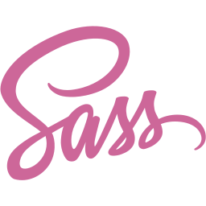

<!--

Montasim's Github Profile
Created on : 18/5/2021
Author : Mohammad Montasim -Al- Mamun Shuvo
Contact : montasimmamun@gmail.com
-----------------------------------------------------------------------
-----------------------------------------------------------------------

Thank you if you like this profile README!

BUT, please DO NOT copy this and create your profile based on it.

You can use it as a reference, and copy a part of it, but DO NOT copy
all of this and create your profile based on it.

It is very common that you forget to change some information and leave
mine in your profile. This has happened too many times.

Only when you know what you are copying should you paste it. So, again,
please DO NOT copy this and create your profile based on it.

---------------------------------------------------------------------
What's more, you can find other awesome profile READMEs at
https://github.com/abhisheknaiidu/awesome-github-profile-readme.
There could be a profile README that fits you better than this one.
---------------------------------------------------------------------

Wish you a good-looking profile README!

                            —— montasim (https://github.com/montasim)

-->

<!-- heading start -->
<h1 align="center" font> 🎲 Ｈｅｌｌｏ， Ｎｉｃｅ ｔｏ ｍｅｅｔ ｙｏｕ 🎓</h1>
<!-- heading end -->

 

<!-- start skills icons -->

  
  
  
  
  
  
  
  
  

<!-- end skills icons -->

 
 
 

<!-- start weather -->

<!-- end weather -->

## 👋 HI, I'M MONTASIM

<!-- start my summary  -->

I am a MERN stack web developer. I have some projects using MERN stack. I am familiar with React Native, TypeScript & Unit Testing. Fell free to reach me out.

<!-- end my summary  -->

  

<!-- Start 𝙲𝚘𝚗𝚗𝚎𝚌𝚝 𝚆𝚒𝚝𝚑 𝙼𝚎 Section -->
<!-- 𝙲𝚘𝚗𝚗𝚎𝚌𝚝 𝚆𝚒𝚝𝚑 𝙼𝚎 -->
<h2 align="right"> 📬 FIND ME ON SOCIAL MEDIA </h2>

  

<!-- Start Social Links -->
<table align="right">
    <thead align="center">
        <tr>
            <th>
                
            </th>
            <th>
                
            </th>
            <th>
                
            </th>
            <th>
                
            </th>
            <th>
                
            </th>
        </tr>
    </thead>
</table>
<!-- End Social Links -->

<!-- End 𝙲𝚘𝚗𝚗𝚎𝚌𝚝 𝚆𝚒𝚝𝚑 𝙼𝚎 Section -->

      

<!-- Start random jokes -->

💠 SOME RANDOM JOKES

 

      

<!-- End random jokes -->

 

<!-- Start My Github Stats -->
<h2 align="center"> 📊 MY GITHUB STATS </h2>
 

<!-- Start Montasim's github readme stats -->

  

      
      
  

  
  

      
  

  
    

        
    

<!-- End Montasim's github readme stats -->

<!-- start animated text -->

<!-- end animated text -->

 

<!--Start Footer-->

<!-- Start Wave Gif -->

<!-- End Wave Gif -->

<!--End Footer-->

<!--Start Links-->

[website]: https://montasim.github.io
[course]: http://vsCodeHero.com
[twitter]: https://twitter.com/montasimmamun
[youtube]: https://youtube.com/codeSTACKr
[instagram]: https://instagram.com/mr.montasim
[linkedin]: https://linkedin.com/in/montasim
[webdevplaylist]: https://www.youtube.com/playlist?list=PLkwxH9e_vrAJ0WbEsFA9W3I1W-g_BTsbt
[jsplaylist]: https://www.youtube.com/playlist?list=PLkwxH9e_vrALRJKu7wfXby3MKeflhTu6B
[cssplaylist]: https://www.youtube.com/playlist?list=PLkwxH9e_vrALSdvZuEh6gqQdmDoDIoqz4
[reactplaylist]: https://www.youtube.com/playlist?list=PLkwxH9e_vrAK4TdffpxKY3QGyHCpxFcQ0

<!--End Links-->
