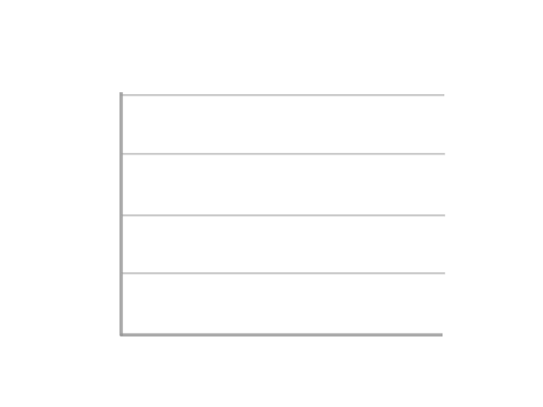

<h1 align="center" font>
    <font size="6"> 
        🎲 Ｈｅｌｌｏ， Ｎｉｃｅ ｔｏ ｍｅｅｔ ｙｏｕ 🎓
    </font>
</h1>
<!-- heading end -->

<br/>

<!-- start about me badges -->
<div align="center">
  
  
  
</div>
<!-- end about me badges -->

<br/>

<!-- start skills icons -->
<div align="center">
  
  
  
  
  
  
  
  
  
  
  
</div>
<!-- end skills icons -->

<br/>

<!-- start tools badge -->
<div align="center">
  
  
  
  
  
  
  
  
</div>
<!-- end tools badge -->

<br/>
<br/>
<br/>

<!-- start weather -->

<!-- end weather -->

<h2>
    👋 HI, I'M MONTASIM
</h2>

<br/>

<!-- start my summary  -->
<p> 
    <font size="3">
        Hello! My name is Mohammad Montasim -Al- Mamun Shuvo and I enjoy creating things that live on the internet. My interest in web development started back in 2017 when I was doing a university project — turns out this project taught me a lot about HTML & CSS!
    </font>
</p>

<p>
    <font size="3">
        Fast-forward to today, and I’ve had the privilege of working at an My MedicalHUB International Ltd., as a Junior Frontend Developer. My main focus these days is building accessible, inclusive products and digital experiences using MERN Stack.
    </font>
</p>

<p>
    <font size="3">
        So far, I've built some exciting full stack project.
    </font>
</p>

<br/>

<a href="https://drive.google.com/file/d/1r77NBlzi2QWCbmLTSJPH-V0O52Z1m1a0/view?usp=share_link"> 
    <font size="3">
        📄𝗠𝗬 𝗥𝗘𝗦𝗨𝗠𝗘
    </font>
</a>
<!-- end my summary  -->

<br/>
<br/>

<!-- start connect with me section -->
<h2 align="right" uppercase> 
    📬 FEEL FREE TO CONTACT ME ANYTIME 
</h2>

<br/>
<br/>

<!-- start social media links -->
<table align="right">
    <thead align="center">
        <tr>
            <th>
                <a href="https://www.linkedin.com/in/montasim">
                
                </a>
            </th>
            <th>
                <a href="https://www.github.com/montasim">
                
                </a>
            </th>
            <th>
                <a href="https://stackoverflow.com/users/20348607/montasim">
                
                </a>
            </th>
            <th>
                <a href="https://montasim-dev.web.app/">
                
                </a>
            </th>
            <th>
                <a href="mailto:montasimmamun@gmail.com">
                
                </a>
            </th>
            <th>
                <a href="https://www.facebook.com/montasimmamun/">
                
                </a>
            </th>
            <th>
                <a href="https://twitter.com/montasimmamun">
                
                </a>
            </th>
        </tr>
    </thead>
</table>
<!-- end social media links -->
<!-- end connect with me section -->

<br/>
<br/>
<br/>
<br/>
<br/>

<div>
<!-- start fun fact -->
<h2>
    💠 FUN FACTS
</h2>

<br/>
<br/>

<div align="center">
    
</div>
<!-- end random jokes -->

<br/>

<!-- start my github statistics section -->
<div align="center"> 
     MY GITHUB STATS 
</div>

<br/>

<!-- start github readme stats -->
<div align="center">
    
    
</div>

<br/>
<br/>

<div align="center">
    
</div>

<br/>
<br/>

<div align="center">
    
</div>

<br/>
<br/>

<div align="center">
    
</div>
<!-- End Montasim's github readme stats -->

<br/>

<!-- Start Wave Gif -->
<div align="center" width="100%">
    
</div>
<!-- End Wave Gif -->

<br/>
<br/>

<details>
    <summary>:zap: Recent GitHub Activity</summary>  
    <br/>
    <!--START_SECTION:activity-->
1. ❗️ Closed issue [#282](https://github.com/STRINGLABITSOLUTIONS/Bhojon/issues/282) in [STRINGLABITSOLUTIONS/Bhojon](https://github.com/STRINGLABITSOLUTIONS/Bhojon)
2. 🗣 Commented on [#282](https://github.com/STRINGLABITSOLUTIONS/Bhojon/issues/282) in [STRINGLABITSOLUTIONS/Bhojon](https://github.com/STRINGLABITSOLUTIONS/Bhojon)
3. 🗣 Commented on [#281](https://github.com/STRINGLABITSOLUTIONS/Bhojon/issues/281) in [STRINGLABITSOLUTIONS/Bhojon](https://github.com/STRINGLABITSOLUTIONS/Bhojon)
4. 🎉 Merged PR [#4](https://github.com/montasim/montasim-dev/pull/4) in [montasim/montasim-dev](https://github.com/montasim/montasim-dev)
5. 🎉 Merged PR [#1](https://github.com/montasim/montasim-dev/pull/1) in [montasim/montasim-dev](https://github.com/montasim/montasim-dev)
    <!--END_SECTION:activity-->
</details>

<details>
    <summary>:zap: Recent Development Stats</summary>
    <br/>
    <!--START_SECTION:waka-->

```text
No activity tracked
```

<!--END_SECTION:waka-->
</details>

<details>
    <summary>:zap: Github Metrics</summary>
    <br/>
    <div align="center">
        
    </div>
</details>

<details>
    <summary>:zap: Gist</summary>
    <br/>
    <div align="center">
        
    </div>
</details>

<details>
    <summary>📕 Latest Blog Posts</summary>
    <br/>
    <!-- BLOG-POST-LIST:START -->
    <!-- BLOG-POST-LIST:END -->
</details>

<details>
    <summary>Open source projects</summary>
    <br/>
    <table>
        <thead align="center">
            <tr border: none;>
            <td><b>🎁 Projects</b></td>
            <td><b>⭐ Stars</b></td>
            <td><b>📚 Forks</b></td>
            <td><b>🛎 Issues</b></td>
            <td><b>📬 Pull requests</b></td>
            <td><b>📬 Last Commits</b></td>
            </tr>
        </thead>
        <tbody>
            <tr>
                <td><a href="https://github.com/montasim/montasim"><b>montasim</b></a></td>
                <td></td>
                <td></td>
                <td></td>
                <td></td>
                <td></td>
            </tr>
            <tr>
                <td><a href="https://github.com/montasim/a-coders-diary"><b>a-coders-diary</b></a></td>
                <td></td>
                <td></td>
                <td></td>
                <td></td>
                <td></td>
            </tr>
            <tr>
                <td><a href="https://github.com/montasim/montasim-dev"><b>montasim-dev</b></a></td>
                <td></td>
                <td></td>
                <td></td>
                <td></td>
                <td></td>
            </tr>
        </tbody>
    </table>
</details>


