<!--

Montasim's Github Profile
Created on : 18/5/2021
Author : Mohammad Montasim -Al- Mamun Shuvo
Contact : montasimmamun@gmail.com
-----------------------------------------------------------------------
-----------------------------------------------------------------------

Thank you if you like this profile README!

BUT, please DO NOT copy this and create your profile based on it.

You can use it as a reference, and copy a part of it, but DO NOT copy
all of this and create your profile based on it.

It is very common that you forget to change some information and leave
mine in your profile. This has happened too many times.

Only when you know what you are copying should you paste it. So, again,
please DO NOT copy this and create your profile based on it.

---------------------------------------------------------------------
What's more, you can find other awesome profile READMEs at
https://github.com/abhisheknaiidu/awesome-github-profile-readme.
There could be a profile README that fits you better than this one.
---------------------------------------------------------------------

Wish you a good-looking profile README!

                                   —— montasim (https://github.com/montasim)

-->

<!-- heading start -->
<h1 align="center">🎲 Ｈｅｌｌｏ， Ｎｉｃｅ ｔｏ ｍｅｅｔ ｙｏｕ 🎓</h1>
<!-- heading end -->

<!-- Start Some Hints Icons About Montasim -->

    
    
    
    
    
    <a href="https://github.com/montasim/montasim/issues/new?template=Guestbook_entry.md&title=Adding+<username>+to+guestbook"></a>
    

<!-- End Some Hints Icons About Montasim -->

<!-- Start Programming Languages Icon -->

  
  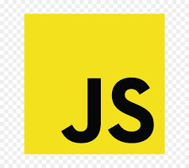
    
  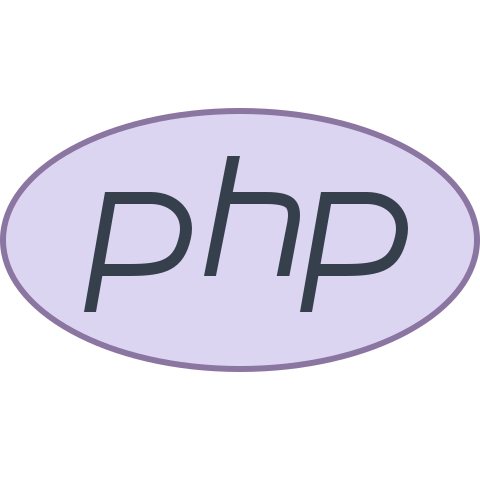     
  
  
  

<!-- End Programming Languages Icon -->

  

<!-- start weather -->

<!-- end weather -->

<!-- start my summary  -->

## 👋 ʜɪ, ɪ'ᴍ ᴍᴏɴᴛᴀꜱɪᴍ

ꜰʀᴏᴍ ᴀ ʏᴏᴜɴɢ ᴀɢᴇ, ɪ'ᴠᴇ ᴀʟᴡᴀʏꜱ ʜᴀᴅ ᴀ ꜱᴇɴꜱᴇ ᴏꜰ ᴍᴏᴛɪᴠᴀᴛɪᴏɴ ᴀɴᴅ ᴘᴀꜱꜱɪᴏɴ ᴅʀɪᴠɪɴɢ ᴍᴇ ꜰᴏʀᴡᴀʀᴅ. ᴡʜᴇᴛʜᴇʀ ɪᴛ ɪꜱ ᴇxᴘʟᴏʀɪɴɢ ᴜɴɪQᴜᴇ ᴏᴘᴘᴏʀᴛᴜɴɪᴛɪᴇꜱ, ʟᴇᴀʀɴɪɴɢ ᴀᴅᴅɪᴛɪᴏɴᴀʟ ꜱᴋɪʟʟꜱ, ᴏʀ ᴍᴇᴇᴛɪɴɢ ɴᴇᴡ ᴘᴇᴏᴘʟᴇ, ɪ ʙʀɪɴɢ ᴛʜᴇꜱᴇ ᴠᴀʟᴜᴇꜱ ᴛᴏ ᴇᴠᴇʀʏ ᴇxᴘᴇʀɪᴇɴᴄᴇ ᴛʜʀᴏᴜɢʜᴏᴜᴛ ᴍʏ ʟɪꜰᴇ ᴏɴ ᴀ ᴘᴇʀꜱᴏɴᴀʟ ᴀɴᴅ ᴘʀᴏꜰᴇꜱꜱɪᴏɴᴀʟ ʟᴇᴠᴇʟ. ɪ ʟᴏᴠᴇ ᴄᴏɴɴᴇᴄᴛɪɴɢ ᴡɪᴛʜ ᴅɪꜰꜰᴇʀᴇɴᴛ ᴘᴇᴏᴘʟᴇ ᴀʀᴏᴜɴᴅ ᴛʜᴇ ᴡᴏʀʟᴅ. ꜰᴇᴇʟ ꜰʀᴇᴇ ᴛᴏ ʀᴇᴀᴄʜ ᴏᴜᴛ ᴀɴᴅ ɪɴᴛʀᴏᴅᴜᴄᴇ ʏᴏᴜʀꜱᴇʟꜰ. ᴛᴏ ʟᴇᴀʀɴ ᴍᴏʀᴇ ᴀʙᴏᴜᴛ ᴍᴇ, ᴋᴇᴇᴘ ᴇxᴘʟᴏʀɪɴɢ ᴍʏ ꜱɪᴛᴇ ᴏʀ ʀᴇᴀᴄʜ ᴏᴜᴛ ᴅɪʀᴇᴄᴛʟʏ.

<!-- end my summary  -->

 

<!-- Start My Resume Section -->

<!-- Start Details -->

<b> 📰 ᴍʏ ʀᴇꜱᴜᴍᴇ </b>

  

<h2 align="center">
    <a href="https://github.com/montasim/DoNotDelete/raw/main/resume/Resume_of_Montasim.pdf"> 
        𝐃𝐨𝐰𝐧𝐥𝐨𝐚𝐝 𝐌𝐲 𝐑𝐞𝐬𝐮𝐦𝐞 
    </a>
</h2>

  

<!-- Start My Resume -->

<!-- Montasim's Photo -->

## Mohammad Montasim -Al- Mamun Shuvo

### Developer and Designer

 

<!-- Start Links -->
<table>
    <thead>
        <tr>
            <th>
                <b> Email </b>
            </th>
	        <th>
                <a href="montasimmamun@gmail.com"> montasimmamun@gmail.com</a>
            </th>
        </tr>
    </thead>
    <tbody>
        <tr>
            <td>
                <b> Portfolio </b>
            </td>
            <td> <a href="https://montasim.github.io"> montasim.github.io </a> </td>
        </tr>
        <tr>
            <td>
                <b> Mobile </b>
            </td>
            <td> <a href="+8801722815469"> +8801722815469 </a> </td>
        </tr>
        <tr>
            <td>
                <b> GitHub </b>
            </td>
            <td> <a href="https://github.com/montasim"> github.com/montasim </a> </td>
        </tr>
    </tbody>
</table>
<!-- End Links -->

  

<!-- Start Career Objective -->

## Career Objective:

Practical and versatile Software Engineer with significant experience in developing Websites and Web Applications. I can handle multiple tasks daily. I use a creative approach to solve problems. I am a dependable person who is great at time management. I am always energetic and eager to learn new skills.

<!-- End Career Objective -->

 

<!-- Start Career Summary -->

## Career Summary:

I am a developer who is working on an organization named CODEZ Info Tech. My responsibility here is to design and develop Websites and Web Applications. My goal is to work hard to make my educational and professional skills in a flawless workplace.

<!-- End Career Summary -->

 

<!-- Start Experience -->

## Experience:

<table align="center">
    <thead>
        <tr>
            <th>
                <b> Organization </b>
            </th>
	        <th>
                <b> CODEZ Info Tech </b>
            </th>
            <th>
                <b> Crystal It and Soft </b>
            </th>
        </tr>
    </thead>
    <tbody>
        <tr>
            <td>
                <b> Designation </b>
            </td>
            <td> Web Developer </td>
            <td> Web Developer </td>
        </tr>
        <tr>
            <td>
                <b> Duration </b>
            </td>
            <td> December 10, 2020 - Present </td>
            <td> August 2019 – September 2020 </td>
        </tr>
        <tr>
            <td>
                <b> Address </b>
            </td>
            <td> 3/359, Adarsha Nagar, Middle-Badda, Dhaka-1212 </td>
            <td> Chartola Mor, Rangpur </td>
        </tr>
        <tr>
            <td>
                <b> Responsibility </b>
            </td>
            <td> Design and Develop Websites and Web Applications </td>
            <td> Developed and maintained affiliate marketing website Crystal It and Soft, Rangpur </td>
        </tr>
        <tr>
            <td><b>  </b></td>
            <td>  UI/UX Design </td>
            <td> Wrote over 150 contents for those websites </td>
        </tr>
        <tr>
            <td><b>  </b></td>
            <td> Problem Solving </td>
            <td>  </td>
        </tr>
    </tbody>
</table>
<!-- End Experience -->

 

<!-- Start Academic Qualification Summery -->

## Academic Qualification:

<table align="center">
    <thead>
        <tr>
            <th>
                <b> Exam </b>
            </th>
	        <th>
                <b> Concentration / Major </b>
            </th>
            <th>
                <b> Institute </b>
            </th>
            <th>
                <b> Result </b>
            </th>
            <th>
                <b> Passing Year </b>
            </th>
        </tr>
    </thead>
    <tbody>
        <tr>
            <td> Bachelor of Science (B. Sc.) </td>
            <td> Computer Science & Engineering </td>
            <td> Bangladesh Army University of Science and Technology </td>
            <td> 2.96 </td>
            <td> 2021 </td>
        </tr>
        <tr>
            <td> HSC </td>
            <td> Science </td>
            <td> Carmichael College Rangpur </td>
            <td> 4.58 </td>
            <td> 2016 </td>
        </tr>
        <tr>
            <td> SSC </td>
            <td> Science </td>
            <td> Rangpur Zilla School </td>
            <td> 5.00 </td>
            <td> 2014 </td>
        </tr>
    </tbody>
</table>
<!-- End Academic Qualification Summery -->          
                                    
 

<!-- Start Undergraduate Thesis and Project -->

## Undergraduate Thesis and Project:

**Hand Pose Estimation in Single RGB Image with Multiview Bootstrapping.**

- Deep Learning, OpenCV
- Convolutional Neural Network (CNN)
- Python (TensorFlow, Matplotlib, Scikit-Learn, OpenCV, Media pipe)
<!-- End Undergraduate Thesis and Project -->

 

<!-- Start Career and Application Information -->

## Career and Application Information:

<table align="center">
    <tbody>
        <tr>
            <td>
                <b> Preferred Job Category </b>
            </td>
            <td> Engineer, IT, Telecommunication, Design, Creative </td>
        </tr>
        <tr>
            <td>
                <b> Looking For </b> 
            </td>
            <td> Entry Level Job </td>
        </tr>
        <tr>
            <td>
                <b> Available For </b>
            </td>
            <td> Full Time </td>
        </tr>
        <tr>
            <td>
                <b> Preferred District </b>
            </td>
            <td> Dhaka, Rangpur </td>
        </tr>
        <tr>
            <td>
                <b> Preferred Organization Types </b>
            </td>
            <td> Software Company </td>
        </tr>
    </tbody>
</table>
<!-- End Career and Application Information -->

 

<!-- Start Specialization -->

## Specialization: (8)

<table align="center">
    <tbody>
        <tr>
            <td> 
                <b> Programming Languages </b> 
            </td>
            <td> C, C++, JavaScript, SQL </td>
        </tr>
        <tr>
            <td> <b> Web Frameworks </b> </td>
            <td> Bootstrap, Tailwind CSS </td>
        </tr>
        <tr> 
            <td>
                <b> Web Technologies </b>
            </td>
            <td> HTML, CSS, Markdown </td> 
        </tr>
        <tr> 
            <td> 
                <b> Content Management System (CMS) </b>
            </td>
            <td> Word Press, Blogger </td> 
        </tr>
        <tr> 
            <td> 
                <b> Databases </b>
            </td>
            <td> SQL Server, MySQL, SQLite </td> 
        </tr>
        <tr>
            <td> 
                <b> Toolkits </b>
            </td>
            <td> LaTeX </td>
        </tr>
        <tr> 
            <td>
                <b> Version Control </b> 
            </td>
            <td> Git, GitHub </td>
        </tr>
        <tr> 
            <td>
                <b> Human Skills </b>
            </td>
            <td> Leadership, Time Management </td>
        </tr>
    </tbody>
</table>
<!-- End Specialization -->

 

<!-- Start Language Proficiency -->

## Language Proficiency: (3)

<table align="center">
    <thead>
        <tr>
            <th><b> Language </b></th>
	        <th><b> Reading </b></th>
            <th><b> Writing </b></th>
            <th><b> Speaking </b></th>
        </tr>
    </thead>
    <tbody>
        <tr>
            <td> English </td>
            <td> High </td>
            <td> High </td>
            <td> High </td>
        </tr>
        <tr>
            <td> Bangla </td>
            <td> High </td>
            <td> High </td>
            <td> High </td>
        </tr>
        <tr>
            <td> Hindi </td>
            <td> None </td>
            <td> None </td>
            <td> Basic </td>
        </tr>
    </tbody>
</table>
<!-- End Language Proficiency -->

 

<!-- Start Training, Participation and Certification -->

## Training, Participation and Certification: (9)

1. [𝙼𝚘𝚋𝚒𝚕𝚎 𝙶𝚊𝚖𝚎 𝙰𝚗𝚍 𝙰𝚙𝚙𝚕𝚒𝚌𝚊𝚝𝚒𝚘𝚗 𝙳𝚎𝚟𝚎𝚕𝚘𝚙𝚖𝚎𝚗𝚝 𝙵𝚘𝚛 𝙰𝚗𝚍𝚛𝚘𝚒𝚍 - 𝚊𝚝 𝙸𝙲𝚃 𝙳𝚒𝚟𝚒𝚜𝚒𝚘𝚗 𝚘𝚏 𝙱𝚊𝚗𝚐𝚕𝚊𝚍𝚎𝚜𝚑](#)
2. [𝙿𝙻𝙲 𝚃𝚛𝚊𝚒𝚗𝚒𝚗𝚐 𝙲𝚘𝚞𝚛𝚜𝚎 - 𝚊𝚝 𝙱𝙰𝚄𝚂𝚃](#)
3. [𝚃𝚑𝚎 𝙲𝚘𝚖𝚙𝚕𝚎𝚝𝚎 𝙲 𝙿𝚛𝚘𝚐𝚛𝚊𝚖𝚖𝚒𝚗𝚐 𝚃𝚞𝚝𝚘𝚛𝚒𝚊𝚕 - 𝚊𝚝 𝚄𝚍𝚎𝚖𝚢 𝚘𝚗𝚕𝚒𝚗𝚎 𝚌𝚘𝚞𝚛𝚜𝚎](https://www.udemy.com/certificate/UC-9SJEY17Z/)
4. [𝙲++ 𝙳𝚎𝚟𝚎𝚕𝚘𝚙𝚖𝚎𝚗𝚝 𝚃𝚞𝚝𝚘𝚛𝚒𝚊𝚕 𝚂𝚎𝚛𝚒𝚎𝚜, 𝚃𝚑𝚎 𝙲𝚘𝚖𝚙𝚕𝚎𝚝𝚎 𝙲𝚘𝚍𝚒𝚗𝚐 𝙶𝚞𝚒𝚍𝚎 - 𝚊𝚝 𝚄𝚍𝚎𝚖𝚢 𝚘𝚗𝚕𝚒𝚗𝚎 𝚌𝚘𝚞𝚛𝚜𝚎](https://www.udemy.com/certificate/UC-4c1e3560-c268-4c37-87c3-b3e1235b67f2/)
5. [𝙻𝚎𝚊𝚛𝚗 𝙲++ 𝙿𝚛𝚘𝚐𝚛𝚊𝚖𝚖𝚒𝚗𝚐 𝙼𝚒𝚗𝚒 𝙲𝚘𝚞𝚛𝚜𝚎, 𝙿𝚘𝚠𝚎𝚛 𝚘𝚏 𝙰𝚗𝚒𝚖𝚊𝚝𝚒𝚘𝚗 - 𝚊𝚝 𝚄𝚍𝚎𝚖𝚢 𝚘𝚗𝚕𝚒𝚗𝚎 𝚌𝚘𝚞𝚛𝚜𝚎](https://www.udemy.com/certificate/UC-57c8fb24-5d8a-450b-9001-76c2dfac993b/)
6. [𝙷𝚃𝙼𝙻𝟻 𝙲𝚘𝚍𝚒𝚗𝚐 𝚏𝚛𝚘𝚖 𝚂𝚌𝚛𝚊𝚝𝚌𝚑 - 𝙱𝚞𝚒𝚕𝚍 𝚈𝚘𝚞𝚛 𝙾𝚠𝚗 𝚆𝚎𝚋𝚜𝚒𝚝𝚎 - 𝚊𝚝 𝚄𝚍𝚎𝚖𝚢 𝚘𝚗𝚕𝚒𝚗𝚎 𝚌𝚘𝚞𝚛𝚜𝚎](https://www.udemy.com/certificate/UC-77OW1SDX/)
7. [𝙿𝚘𝚜𝚒𝚝𝚒𝚘𝚗 𝙴𝚕𝚎𝚖𝚎𝚗𝚝𝚜 𝚘𝚗 𝚊 𝙿𝚊𝚐𝚎 𝚠𝚒𝚝𝚑 𝙲𝚂𝚂 - 𝚊𝚝 𝙲𝚘𝚞𝚛𝚜𝚎𝚛𝚊 𝚘𝚗𝚕𝚒𝚗𝚎 𝚌𝚘𝚞𝚛𝚜𝚎](https://www.coursera.org/account/accomplishments/certificate/DKL6A3KTYL34)
8. [𝙶𝚒𝚝 + 𝙶𝚒𝚝𝙷𝚞𝚋 𝚏𝚘𝚛 𝙾𝚙𝚎𝚗 𝚂𝚘𝚞𝚛𝚌𝚎 𝙲𝚘𝚕𝚕𝚊𝚋𝚘𝚛𝚊𝚝𝚒𝚘𝚗 - 𝚊𝚝 𝙲𝚘𝚞𝚛𝚜𝚎𝚛𝚊 𝚘𝚗𝚕𝚒𝚗𝚎 𝚌𝚘𝚞𝚛𝚜𝚎](https://www.coursera.org/account/accomplishments/certificate/5XKX3V74MZA6)
9. [𝚄𝚜𝚎 𝙲𝚘𝚖𝚖𝚊𝚗𝚍𝚜 𝚊𝚗𝚍 𝙲𝚛𝚎𝚊𝚝𝚎 𝚊 𝚁𝚎𝚖𝚘𝚝𝚎 𝙶𝚒𝚝 𝚁𝚎𝚙𝚘𝚜𝚒𝚝𝚘𝚛𝚢 - 𝚊𝚝 𝙲𝚘𝚞𝚛𝚜𝚎𝚛𝚊 𝚘𝚗𝚕𝚒𝚗𝚎 𝚌𝚘𝚞𝚛𝚜𝚎](https://www.coursera.org/account/accomplishments/certificate/HHS3XUAFQWZU)
10. [𝙶𝚘𝚘𝚐𝚕𝚎 𝙰𝚍𝚟𝚊𝚗𝚌𝚎𝚍 𝚂𝚎𝚊𝚛𝚌𝚑: 𝙵𝚒𝚗𝚍 𝚂𝚝𝚞𝚏𝚏 𝙻𝚒𝚔𝚎 𝚊 𝙱𝚘𝚜𝚜 - 𝚊𝚝 𝚄𝚍𝚎𝚖𝚢 𝚘𝚗𝚕𝚒𝚗𝚎 𝚌𝚘𝚞𝚛𝚜𝚎](https://www.hackerrank.com/montasim)
11. [𝙲𝚘𝚖𝚖𝚊𝚗𝚍 𝙻𝚒𝚗𝚎 𝚒𝚗 𝙻𝚒𝚗𝚞𝚡 - 𝚊𝚝 𝙲𝚘𝚞𝚛𝚜𝚎𝚛𝚊 𝚘𝚗𝚕𝚒𝚗𝚎 𝚌𝚘𝚞𝚛𝚜𝚎](https://www.coursera.org/account/accomplishments/certificate/CC7F3ETBKK8U)
12. [𝙻𝚎𝚊𝚛𝚗 𝚆𝚒𝚗𝚍𝚘𝚠𝚜 𝙲𝚘𝚖𝚖𝚊𝚗𝚍 𝙻𝚒𝚗𝚎 - 𝚊𝚝 𝚄𝚍𝚎𝚖𝚢 𝚘𝚗𝚕𝚒𝚗𝚎 𝚌𝚘𝚞𝚛𝚜𝚎](https://www.udemy.com/certificate/UC-91b6cfe1-6f98-40ec-a1b1-2f5a1714f637/)
<!-- End Training, Participation and Certification -->

 

<!-- Start Extra Curricular Activities -->

## Extra Curricular Activities: (2)

1. Ex. Cadet, second best cadet of Mohasthan Regiment at Bangladesh National Cadet Corps (BNCC)
2. Event Organizer at Rangpur Zilla School
<!-- End Extra Curricular Activities -->

 

<!-- Start Personal Details -->

## Personal Details:

<table>
    <tbody>
        <tr>
            <td> <b> Father's Name </b> </td>
            <td> MD. Hafizar Rahman </td>
        </tr>
        <tr>
            <td> <b> Mother's Name </b> </td>
            <td> MST. Majida Begum </td>
        </tr>
        <tr>
            <td> <b> Date of Birth </b> </td>
            <td> December 16, 1998 </td>
        </tr>
        <tr>
            <td> <b> Nationality </b> </td>
            <td> Bangladeshi </td>
        </tr>
        <tr>
            <td> <b> Blood Group </b> </td>
            <td> B+ </td>
        </tr>
        <tr>
            <td> <b> Religion </b> </td>
            <td> Islam </td>
        </tr>
        <tr>
            <td> <b> Permanent Address </b> </td>
            <td> Balapara, 20 Mega Watt, Rangpur Sadar, Rangpur </td>
        </tr>
    </tbody>
</table>
<!-- End Personal Details -->    
 
 

<!-- Start Reference (s) -->

## Reference (s): (2)

<table align="center">
    <thead>
        <tr>
            <th><b></b></th>
	        <th><b> Reference: 01 </b></th>
            <th><b> Reference: 02 </b></th>
        </tr>
    </thead>
    <tbody>
        <tr>
            <td><b> Name </b></td>
            <td> Tareq Aziz </td>
            <td> Abu Saleh Musa Miah </td>
        </tr>
        <tr>
            <td><b> Organization </b></td>
            <td> CODEZ Info Tech </td>
            <td> Bangladesh Army University of Science and Technology (BAUST) </td>
        </tr>
        <tr>
            <td><b> Designation </b></td>
            <td> Data Engineer </td>
            <td> Lecturer </td>
        </tr>
        <tr>
            <td><b> Address </b></td>
            <td> 3/359, Adarsha Nagar, Middle-Badda, Dhaka-1212 </td>
            <td> Saidpur Cantonment, Saidpur, Bangladesh </td>
        </tr>
        <tr>
            <td><b> Mobile </b></td>
            <td> +8801947818375 </td>
            <td> +8801734264899 </td>
        </tr>
        <tr>
            <td><b> Email </b></td>
            <td> tareqitbuzz@gmail.com </td>
            <td> abusalehcse.ru@gmail.com </td>
        </tr>
        <tr>
            <td><b> Relation </b></td>
            <td> Colleague </td>
            <td> Teacher </td>
        </tr>
    </tbody>
</table>
<!-- End Reference (s) -->
<!-- End My Resume -->
 

<!-- End Details -->
<!-- End My Resume Section -->

<!-- Start My Experience Section -->

    <b> 📚 ᴍʏ ᴇxᴘᴇʀɪᴇɴᴄᴇ </b>

	
  

<!-- Start Experience -->

## Experience:

<table align="center">
    <thead>
        <tr>
            <th><b></b> Organization </th>
	        <th><b> CODEZ Info Tech </b></th>
            <th><b> Disabled Rehabilitation and Research Association (DRRA) </b></th>
        </tr>
    </thead>
    <tbody>
        <tr>
            <td><b> Designation </b></td>
            <td> Web Developer </td>
            <td> MIS Officer </td>
        </tr>
        <tr>
            <td><b> Duration </b></td>
            <td> December 10, 2020 - Present </td>
            <td> December 2021 – Present </td>
        </tr>
        <tr>
            <td><b> Address </b></td>
            <td> 3/359, Adarsha Nagar, Middle-Badda, Dhaka-1212 </td>
            <td> Ershadnagar, Tongi, Gazipur </td>
        </tr>
        <tr>
            <td><b> Responsibility </b></td>
            <td> Design and Develop Websites and Web Applications </td>
            <td> Monitor and Maintain MIS Data </td>
        </tr>
        <tr>
            <td><b>  </b></td>
            <td> UI/UX Design </td>
            <td> Create and Apply Efficient Work Process </td>
        </tr>
        <tr>
            <td><b>  </b></td>
            <td> Problem Solving </td>
            <td>  </td>
        </tr>
    </tbody>
</table>
<!-- End Experience -->

  

<!-- End My Experience Section -->

<!-- Start My Skills Section -->

    <b> 🧳 ᴍʏ ꜱᴋɪʟʟꜱ </b>

	
  

<!-- Start My Skills -->
<h2 align="center"><b> My Skills </b></h2>
<table align="center">
    <thead align="center">
        <tr>
            <th><b>Name \ Familiarity</b></th>
            <th><b>High</b></th>
            <th><b>Medium</b></th>
            <th><b>Low</b></th>
        </tr>
    </thead>
    <tbody>
        <tr>
            <td align="left">
                <b>Programming Languages</b>
            </td>
            <td align="center">
                
            </td>
            <td align="center">
                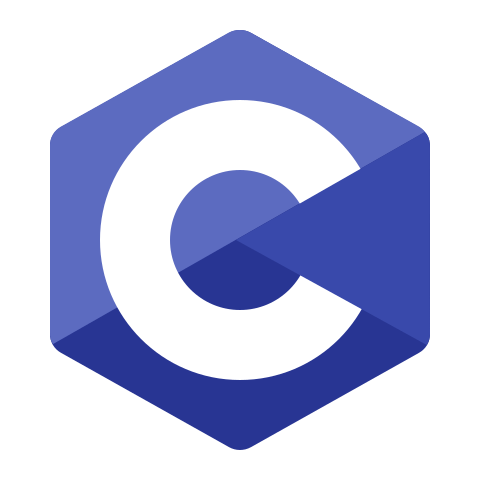 
                 
            </td>
            <td align="center">
                 
            </td>
        </tr>
    </tbody>
    <tbody>
        <tr>
            <td align="left">
                <b>Web Technologies</b>
            </td>
            <td align="center"> 
                 
                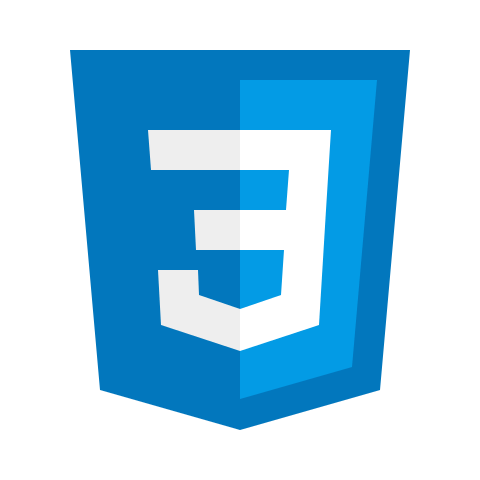 
            </td>
            <td align="center"> 
                 
            </td>
            <td align="center"> 
                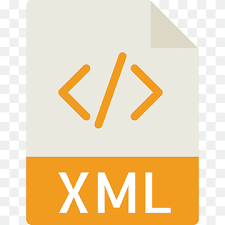
            </td>
        </tr>
    </tbody>
    <tbody>
        <tr>
            <td align="left">
                <b>Web Frameworks</b>
            </td>
            <td align="center"> 
                 
                 
            </td>
            <td align="center"> 
                 
            </td>
            <td align="center"> 
                
            </td>
        </tr>
    </tbody>
    <tbody>
        <tr>
            <td align="left">
                <b>Web Creation Platforms</b>
            </td>
            <td align="center"> 
                  
            </td>
            <td align="center"> 
                 
            </td>
            <td align="center"></td>
        </tr>
    </tbody>
    <tbody>
        <tr>
            <td align="left">
                <b>Database</b>
            </td>
            <td align="center"> 
                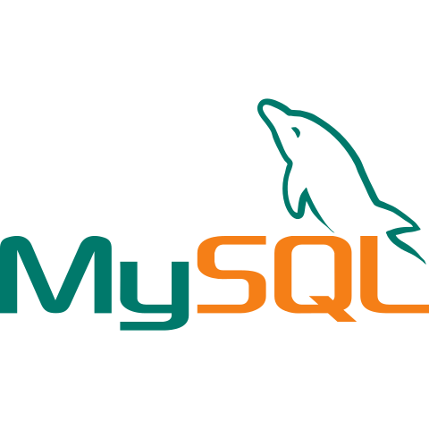 
            </td>
            <td align="center"> 
                 
            </td>
            <td align="center"></td>
        </tr>
    </tbody>
    <tbody>
        <tr>
            <td align="left">
                <b>Version Control</b>
            </td>
            <td align="center"> 
                 
                
            </td>
            <td align="left"></td>
            <td align="left"></td>
        </tr>
    </tbody>
    <tbody>
        <tr>
            <td align="left">
                <b>Operating System</b>
            </td>
            <td align="center"> 
                 
                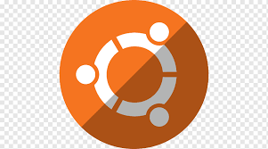 
            </td>
            <td align="center"> 
                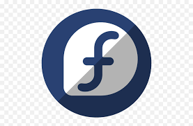 
                 
                
            </td>
            <td align="center"> 
                 
                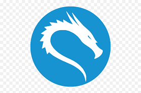 
            </td>
        </tr>
    </tbody>
    <tbody>
        <tr>
            <td align="left">
                <b>Languages</b>
            </td>
            <td align="left">English (Native), Bangla (Native)</td>
            <td align="left">Hindi</td>
            <td align="left">Arabic</td>
        </tr>
    </tbody>
    <tbody>
        <tr>
            <td align="left">
                <b>Other interests</b>
            </td>
            <td align="left">Reading Books</td>
            <td align="left">Playing Games, Watching Movies</td>
            <td align="left">Sports</td>
        </tr>
    </tbody>
</table>
 
<!-- End My Skills -->
  

<!-- End My Skills Section -->

<!-- Start 𝙲𝚘𝚗𝚗𝚎𝚌𝚝 𝚆𝚒𝚝𝚑 𝙼𝚎 Section -->
<!-- 𝙲𝚘𝚗𝚗𝚎𝚌𝚝 𝚆𝚒𝚝𝚑 𝙼𝚎 -->
<h2 align="right"> 📬 ꜰɪɴᴅ ᴍᴇ ᴏɴ ꜱᴏᴄɪᴀʟ ᴍᴇᴅɪᴀ </h2>

 

<!-- handshake gif -->

<!-- Start Social Links -->
<table align="right">
    <thead align="center">
        <tr>
            <th>
                
            </th>
            <th>
                
            </th>
            <th>
                <a href="https://stackoverflow.com/users/10429621/coderaid">
                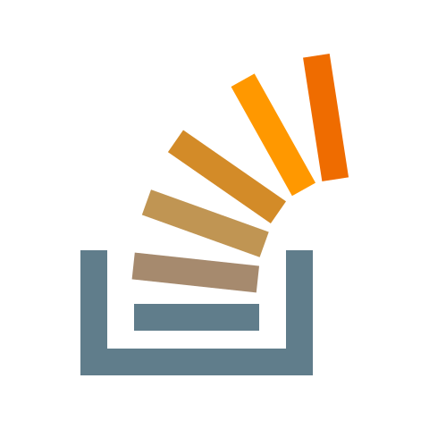
                </a>
            </th>
            <th>
                
            </th>
            <th>
                
            </th>
            <th>
                
            </th>
        </tr>
    </thead>
</table>
<!-- End Social Links -->
 
    

##

<!-- End 𝙲𝚘𝚗𝚗𝚎𝚌𝚝 𝚆𝚒𝚝𝚑 𝙼𝚎 Section -->

  

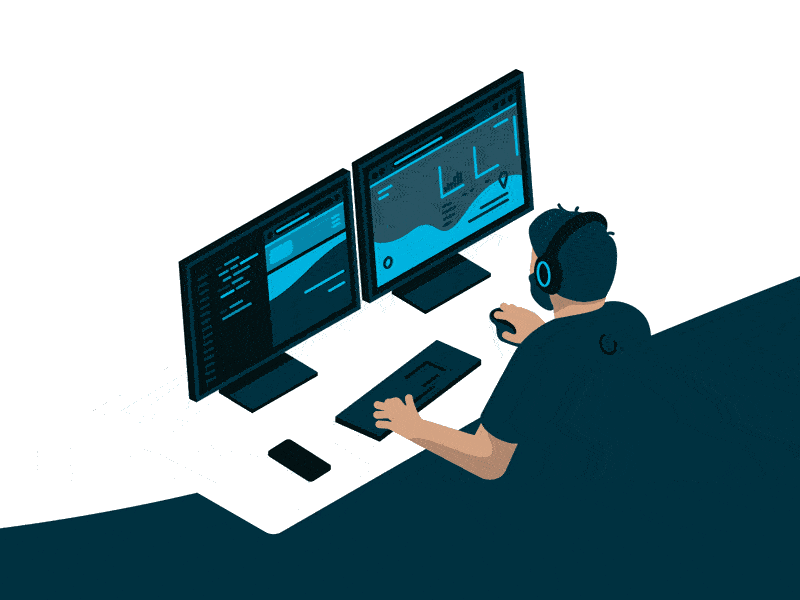

<!-- Start Some Words About Me -->

## 🌟 ꜱᴏᴍᴇ ᴡᴏʀᴅ ᴀʙᴏᴜᴛ ᴍᴇ

    &nbsp;&nbsp;&nbsp;&nbsp;&nbsp;&nbsp; &#x1F538; ꜰᴜʟʟ ᴘᴀꜱꜱɪᴏɴᴀᴛᴇ ꜱᴛᴀᴄᴋ ᴡᴇʙ ᴅᴇᴠᴇʟᴏᴘᴇʀ
     
    &nbsp;&nbsp;&nbsp;&nbsp;&nbsp;&nbsp; &#x1F538; ᴀʟᴡᴀʏꜱ ᴡɪʟʟɪɴɢ ᴛᴏ ʟᴇᴀʀɴ
     
    &nbsp;&nbsp;&nbsp;&nbsp;&nbsp;&nbsp; &#x1F538; ᴡᴏʀᴋ ᴀᴄʀᴏꜱꜱ ᴛᴇᴄʜɴᴏʟᴏɢɪᴇꜱ ᴀɴᴅ ᴅᴏᴍᴀɪɴ
     
    &nbsp;&nbsp;&nbsp;&nbsp;&nbsp;&nbsp; &#x1F538; ʟᴏᴠᴇ ᴛᴏ ᴇxᴘʟᴏʀᴇ ɴᴇᴡ ᴛᴇᴄʜɴᴏʟᴏɢɪᴇꜱ
     
    &nbsp;&nbsp;&nbsp;&nbsp;&nbsp;&nbsp; &#x1F538; ᴛᴏ ʟᴇᴀʀɴ ᴍᴏʀᴇ ᴋᴇᴇᴘ ᴇxᴘʟᴏʀɪɴɢ ᴍʏ ꜱɪᴛᴇ

<!-- End Some Words About Me -->

      

<!-- coder gif -->

<!-- Start Talking About Personal Stuffs -->

## 📙 ᴛᴀʟᴋɪɴɢ ᴀʙᴏᴜᴛ ᴘᴇʀꜱᴏɴᴀʟ ꜱᴛᴀꜰꜰ

    &nbsp;&nbsp;&nbsp;&nbsp; &#x1F539; ɪ’ᴍ ᴄᴜʀʀᴇɴᴛʟʏ ʟᴇᴀʀɴɪɴɢ ꜰᴜʟʟ ꜱᴛᴀᴄᴋ ᴅᴇᴠᴇʟᴏᴘᴍᴇɴᴛ
     
    &nbsp;&nbsp;&nbsp;&nbsp; &#x1F539; ᴍᴏꜱᴛ ᴏꜰ ᴍʏ ᴘʀᴏᴊᴇᴄᴛꜱ ᴀʀᴇ ᴀᴠᴀɪʟᴀʙʟᴇ ᴏɴ <a href="https://github.com/montasim">🅶🅸🆃🅷🆄🅱</a>
     
    &nbsp;&nbsp;&nbsp;&nbsp; &#x1F539; ᴀꜱᴋ ᴍᴇ ᴀʙᴏᴜᴛ ᴀɴʏᴛʜɪɴɢ <a href="mailto:montasimmamun@gmail.com"> ʜᴇʀᴇ </a> ɪ ᴀᴍ ʜᴀᴘᴘʏ ᴛᴏ ʜᴇʟᴘ
     
    &nbsp;&nbsp;&nbsp;&nbsp; &#x1F539; ꜰᴜɴ ꜰᴀᴄᴛ: ᴇQᴜᴀʟ ɪꜱ ɴᴏᴛ ᴀʟᴡᴀʏꜱ ᴇQᴜᴀʟ ɪɴ ᴊᴀᴠᴀꜱᴄʀɪᴘᴛ
     
    &nbsp;&nbsp;&nbsp;&nbsp; &#x1F539; ʜᴏᴡ ᴛᴏ ʀᴇᴀᴄʜ ᴍᴇ: <a href="mailto:montasimmamun@gmail.com"> 🅶🅼🅰🅸🅻 </a>
     
    &nbsp;&nbsp;&nbsp;&nbsp; &#x1F539; ᴄʜᴇᴄᴋᴏᴜᴛ ᴍʏ <a href="https://github.com/montasim/resume/blob/main/Resume_of_Montasim%20.pdf">🆁🅴🆂🆄🅼🅴 </a>

<!-- End Talking About Personal Stuffs -->

     

<!-- coder gif -->

<!-- Start My absolute favourite -->

## 🧠 ᴍʏ ᴀʙꜱᴏʟᴜᴛᴇ ꜰᴀᴠᴏᴜʀɪᴛᴇ

    &nbsp;&nbsp;&nbsp;&nbsp; &#x1F538; ɪ ʟᴏᴠᴇ ᴇxᴘʟᴏʀɪɴɢ ɴᴇᴡ ᴛᴇᴄʜ ᴀɴᴅ ʙᴜɪʟᴅɪɴɢ ᴄᴏᴏʟ ꜱᴛᴜꜰꜰꜱ
     
    &nbsp;&nbsp;&nbsp;&nbsp; &#x1F538; ʀᴇᴀᴅɪɴɢ & ᴡʀɪᴛɪɴɢ ᴛᴇᴄʜ ʙʟᴏɢꜱ ᴡʜᴇɴᴇᴠᴇʀ ᴘᴏꜱꜱɪʙʟᴇ
     
    &nbsp;&nbsp;&nbsp;&nbsp; &#x1F538; ᴘʀᴏʙʟᴇᴍ ꜱᴏʟᴠɪɴɢ, ᴍᴇᴇᴛᴜᴘꜱ & ᴛᴇᴄʜ ᴇᴠᴇɴᴛꜱ

<!-- End My absolute favourite -->

       

<!-- Start random jokes -->

## 💠 ꜱᴏᴍᴇ ʀᴀɴᴅᴏᴍ ᴊᴏᴋᴇꜱ

 

      
      

<!-- End random jokes -->

  

<!-- Start My Projects Section -->

    <b> &#x1F49B; ᴍʏ ᴘʀᴏᴊᴇᴄᴛꜱ </b>

	
  

<table align="center">
  <thead align="center">
    <tr border: none;>
      <td><b>🎁 Projects</b></td>
      <td><b>⭐ Stars</b></td>
      <td><b>📚 Forks</b></td>
      <td><b>🛎 Issues</b></td>
      <td><b>📬 Pull requests</b></td>
    </tr>
  </thead>
  <tbody>
    <tr>
      <td><a href="https://github.com/montasim/montasim.github.io"><b>Montasim's Blog</b></a></td>
      <td></td>
      <td></td>
      <td></td>
      <td></td>
    </tr>
	  <tr>
      <td><a href="https://github.com/montasim/phone-hunter"> <b> Phone Hunter </b> </a></td>
      <td></td>
      <td></td>
      <td></td>
      <td></td>
    </tr>
    <tr>
      <td><a href="https://github.com/montasim/the-sports-db"><b>The Sports DB</b></a></td>
      <td></td>
      <td></td>
      <td></td>
      <td></td>
    </tr>
  </tbody>
</table>

<!-- 

    
    
    
    
    
    

 -->

  

<!-- End My Projects Section -->

<!-- Start Certificates Section -->

    <b> 🏅 ᴄᴇʀᴛɪꜰɪᴄᴀᴛᴇꜱ </b>

	
  

<!-- Start Training, Participation and Certification -->

## Training, Participation and Certification:

1. [𝙼𝚘𝚋𝚒𝚕𝚎 𝙶𝚊𝚖𝚎 𝙰𝚗𝚍 𝙰𝚙𝚙𝚕𝚒𝚌𝚊𝚝𝚒𝚘𝚗 𝙳𝚎𝚟𝚎𝚕𝚘𝚙𝚖𝚎𝚗𝚝 𝙵𝚘𝚛 𝙰𝚗𝚍𝚛𝚘𝚒𝚍 - 𝚊𝚝 𝙸𝙲𝚃 𝙳𝚒𝚟𝚒𝚜𝚒𝚘𝚗 𝚘𝚏 𝙱𝚊𝚗𝚐𝚕𝚊𝚍𝚎𝚜𝚑](#)
2. [𝙿𝙻𝙲 𝚃𝚛𝚊𝚒𝚗𝚒𝚗𝚐 𝙲𝚘𝚞𝚛𝚜𝚎 - 𝚊𝚝 𝙱𝙰𝚄𝚂𝚃](#)
3. [𝚃𝚑𝚎 𝙲𝚘𝚖𝚙𝚕𝚎𝚝𝚎 𝙲 𝙿𝚛𝚘𝚐𝚛𝚊𝚖𝚖𝚒𝚗𝚐 𝚃𝚞𝚝𝚘𝚛𝚒𝚊𝚕 - 𝚊𝚝 𝚄𝚍𝚎𝚖𝚢 𝚘𝚗𝚕𝚒𝚗𝚎 𝚌𝚘𝚞𝚛𝚜𝚎](https://www.udemy.com/certificate/UC-9SJEY17Z/)
4. [𝙲++ 𝙳𝚎𝚟𝚎𝚕𝚘𝚙𝚖𝚎𝚗𝚝 𝚃𝚞𝚝𝚘𝚛𝚒𝚊𝚕 𝚂𝚎𝚛𝚒𝚎𝚜, 𝚃𝚑𝚎 𝙲𝚘𝚖𝚙𝚕𝚎𝚝𝚎 𝙲𝚘𝚍𝚒𝚗𝚐 𝙶𝚞𝚒𝚍𝚎 - 𝚊𝚝 𝚄𝚍𝚎𝚖𝚢 𝚘𝚗𝚕𝚒𝚗𝚎 𝚌𝚘𝚞𝚛𝚜𝚎](https://www.udemy.com/certificate/UC-4c1e3560-c268-4c37-87c3-b3e1235b67f2/)
5. [𝙻𝚎𝚊𝚛𝚗 𝙲++ 𝙿𝚛𝚘𝚐𝚛𝚊𝚖𝚖𝚒𝚗𝚐 𝙼𝚒𝚗𝚒 𝙲𝚘𝚞𝚛𝚜𝚎, 𝙿𝚘𝚠𝚎𝚛 𝚘𝚏 𝙰𝚗𝚒𝚖𝚊𝚝𝚒𝚘𝚗 - 𝚊𝚝 𝚄𝚍𝚎𝚖𝚢 𝚘𝚗𝚕𝚒𝚗𝚎 𝚌𝚘𝚞𝚛𝚜𝚎](https://www.udemy.com/certificate/UC-57c8fb24-5d8a-450b-9001-76c2dfac993b/)
6. [𝙷𝚃𝙼𝙻𝟻 𝙲𝚘𝚍𝚒𝚗𝚐 𝚏𝚛𝚘𝚖 𝚂𝚌𝚛𝚊𝚝𝚌𝚑 - 𝙱𝚞𝚒𝚕𝚍 𝚈𝚘𝚞𝚛 𝙾𝚠𝚗 𝚆𝚎𝚋𝚜𝚒𝚝𝚎 - 𝚊𝚝 𝚄𝚍𝚎𝚖𝚢 𝚘𝚗𝚕𝚒𝚗𝚎 𝚌𝚘𝚞𝚛𝚜𝚎](https://www.udemy.com/certificate/UC-77OW1SDX/)
7. [𝙿𝚘𝚜𝚒𝚝𝚒𝚘𝚗 𝙴𝚕𝚎𝚖𝚎𝚗𝚝𝚜 𝚘𝚗 𝚊 𝙿𝚊𝚐𝚎 𝚠𝚒𝚝𝚑 𝙲𝚂𝚂 - 𝚊𝚝 𝙲𝚘𝚞𝚛𝚜𝚎𝚛𝚊 𝚘𝚗𝚕𝚒𝚗𝚎 𝚌𝚘𝚞𝚛𝚜𝚎](https://www.coursera.org/account/accomplishments/certificate/DKL6A3KTYL34)
8. [𝙶𝚒𝚝 + 𝙶𝚒𝚝𝙷𝚞𝚋 𝚏𝚘𝚛 𝙾𝚙𝚎𝚗 𝚂𝚘𝚞𝚛𝚌𝚎 𝙲𝚘𝚕𝚕𝚊𝚋𝚘𝚛𝚊𝚝𝚒𝚘𝚗 - 𝚊𝚝 𝙲𝚘𝚞𝚛𝚜𝚎𝚛𝚊 𝚘𝚗𝚕𝚒𝚗𝚎 𝚌𝚘𝚞𝚛𝚜𝚎](https://www.coursera.org/account/accomplishments/certificate/5XKX3V74MZA6)
9. [𝚄𝚜𝚎 𝙲𝚘𝚖𝚖𝚊𝚗𝚍𝚜 𝚊𝚗𝚍 𝙲𝚛𝚎𝚊𝚝𝚎 𝚊 𝚁𝚎𝚖𝚘𝚝𝚎 𝙶𝚒𝚝 𝚁𝚎𝚙𝚘𝚜𝚒𝚝𝚘𝚛𝚢 - 𝚊𝚝 𝙲𝚘𝚞𝚛𝚜𝚎𝚛𝚊 𝚘𝚗𝚕𝚒𝚗𝚎 𝚌𝚘𝚞𝚛𝚜𝚎](https://www.coursera.org/account/accomplishments/certificate/HHS3XUAFQWZU)
10. [𝙶𝚘𝚘𝚐𝚕𝚎 𝙰𝚍𝚟𝚊𝚗𝚌𝚎𝚍 𝚂𝚎𝚊𝚛𝚌𝚑: 𝙵𝚒𝚗𝚍 𝚂𝚝𝚞𝚏𝚏 𝙻𝚒𝚔𝚎 𝚊 𝙱𝚘𝚜𝚜 - 𝚊𝚝 𝚄𝚍𝚎𝚖𝚢 𝚘𝚗𝚕𝚒𝚗𝚎 𝚌𝚘𝚞𝚛𝚜𝚎](https://www.hackerrank.com/montasim)
11. [𝙲𝚘𝚖𝚖𝚊𝚗𝚍 𝙻𝚒𝚗𝚎 𝚒𝚗 𝙻𝚒𝚗𝚞𝚡 - 𝚊𝚝 𝙲𝚘𝚞𝚛𝚜𝚎𝚛𝚊 𝚘𝚗𝚕𝚒𝚗𝚎 𝚌𝚘𝚞𝚛𝚜𝚎](https://www.coursera.org/account/accomplishments/certificate/CC7F3ETBKK8U)
12. [𝙻𝚎𝚊𝚛𝚗 𝚆𝚒𝚗𝚍𝚘𝚠𝚜 𝙲𝚘𝚖𝚖𝚊𝚗𝚍 𝙻𝚒𝚗𝚎 - 𝚊𝚝 𝚄𝚍𝚎𝚖𝚢 𝚘𝚗𝚕𝚒𝚗𝚎 𝚌𝚘𝚞𝚛𝚜𝚎](https://www.udemy.com/certificate/UC-91b6cfe1-6f98-40ec-a1b1-2f5a1714f637/)
<!-- End Training, Participation and Certification -->

  

<!-- End Certificates Section -->

<!-- Start My Followers Section -->

    <b> 💢 ᴍʏ ꜰᴏʟʟᴏᴡᴇʀꜱ </b>

	
  

### My Followers

<!--START_SECTION:top-followers-->
<table>
  <tr align="center">
    <td>
        
         
    </td>
    <td>
      <a href="https://github.com/donmartz">
        
         
    </td>
    <td>
        
         
    </td>
    <td>
        
         
    </td>
    <td>
        
         
    </td>
    <td>
        
         
    </td>
    <td>
        
         
    </td>
  </tr>
  <tr align="center">
    <td>
        
         
    </td>
    <td>
        
         
    </td>
    <td>
        
         
    </td>
    <td>
        
         
    </td>
    <td>
        
         
    </td>
    <td>
        
         
    </td>
    <td>
        
       
    </td>
  </tr>
</table>
<!--END_SECTION:top-followers-->

  

<!-- End My Followers Section -->

<!-- Start My Github Stats -->
<h2 align="center"> 📈 ᴍʏ ɢɪᴛʜᴜʙ ꜱᴛᴀᴛꜱ </h2>
 

<!-- Start Montasim's github readme stats -->

  

      
      
  

  
  

      
  

  
    

        
    

    

        
    

<!-- End Montasim's github readme stats -->

<!-- start animated text -->

<!-- end animated text -->

<!-- Start 𝙼𝚘𝚛𝚎 𝚂𝚝𝚞𝚏𝚏 𝙰𝚋𝚘𝚞𝚝 𝙼𝚎 Section -->

	<b> 💡 ᴍᴏʀᴇ ꜱᴛᴀꜰꜰ ᴀʙᴏᴜᴛ ᴍᴇ </b>

	
  

## 📣 What I do

I do Open Source. In fact, I do Open Source so much, that majority of my work on GitHub is free and open to everyone. I am really passionate about doing web development. It is in my opinion the best combination of logical programming and (sometimes) beautiful design.

  

<!-- start my specification section -->
<h2 align="center"><b> 💻 My Specifications </b></h2>

<table align="center">
    <thead align="center">
        <tr>
            <th><b>Name \ Familiarity</b></th>
            <th><b>High</b></th>
            <th><b>Medium</b></th>
            <th><b>Low</b></th>
        </tr>
    </thead>
    <tbody align="left">
        <tr>
            <td><b>Programming Languages</b></td>
            <td>Python</td>
            <td>C, C++, PHP</td>
            <td>Java, JavaScript</td>
        </tr>
        <tr>
            <td><b>Web Technologies</b></td>
            <td>HTML, CSS</td>
            <td>Markdown</td>
            <td>XML</td>
        </tr>
        <tr>
            <td><b>Web Frameworks</b></td>
            <td>Bootstrap, Django</td>
            <td>Flask</td>
            <td>TailWind CSS</td>
        </tr>
        <tr>
            <td><b>Web Creation Platforms</b></td>
            <td>WordPress, Blogger</td>
            <td>Wix</td>
            <td></td>
        </tr>
        <tr>
            <td><b>Database</b></td>
            <td>MySQL</td>
            <td>SqlLite</td>
            <td></td>
        </tr>
        <tr>
            <td><b>Version Control</b></td>
            <td>Git, Github</td>
            <td></td>
            <td></td>
        </tr>
        <tr>
            <td><b>Operating System</b></td>
            <td>Windows, Ubuntu</td>
            <td>Fedora, RedHat, Debian</td>
            <td>Linux Mint, Kali Linux</td>
        </tr>
        <tr>
            <td><b>Languages</b></td>
            <td>English (Native), Bangla (Native)</td>
            <td>Hindi</td>
            <td>Arabic</td>
        </tr>
        <tr>
            <td><b>Other interests</b></td>
            <td>Reading Books</td>
            <td>Playing Games, Watching Movies</td>
            <td>Sports</td>
        </tr>
    </tbody>
</table>
<!-- end my specification section -->

 

<!-- start my Work Experience -->
<h2 align="center"><b> ⌚ My Work Experience </b></h2>

<table align="center">
    <thead>
        <tr>
            <th><b>Job Name</b></th>
	        <th><b>Job Place</b></th>
            <th><b>Roles & responsibilities</b></th>
            <th><b>Duration</b></th>
            <th><b>Job Profile</b></th>
        </tr>
    </thead>
    <tbody>
        <tr>
            <td><b>Problem Solver</b></td>
            <td>HackerRank</td>
            <td>Problem Solver</td>
            <td>2018 - Present</td>
            <td><a href="https://www.hackerrank.com/montasim">hackerrank.com/montasim</a></td>
        </tr>
    </tbody>
</table>
<!-- end my Work Experience -->

 

<!-- Projects I'm the most proud of -->
<h2 align="center"><b> 📌 Projects I'm The Most Proud Of </b></h2>
<table align="center">
    <thead align="center">
        <tr>
            <th>
                <b>Name</b>
            </th>
	        <th>
                <b>Description</b>
            </th>
            <th>
                <b>Language</b>
            </th>
            <th>
                <b>Repo</b>
            </th>
        </tr>
    </thead>
    <tbody align="left">
        <tr>
            <td></td>
            <td></td>
            <td></td>
            <td></td>
        </tr>
        <tr>
            <td></td>
            <td></td>
            <td></td>
            <td></td>
        </tr>
        <tr>
            <td></td>
            <td></td>
            <td></td>
            <td></td>
        </tr>
        <tr>
            <td></td>
            <td></td>
            <td></td>
            <td></td>
        </tr>
    </tbody>
</table>
<!-- end Projects I'm the most proud of -->

 

<!-- My own dictionary  -->
<h2 align="center"><b> ⚠️ My Own Dictionary  </b></h2>
<table align="center">
    <thead align="center">
        <tr>
            <th>
                <b>Word / Abreviation</b>
            </th>
	        <th>
                <b>Meaning</b>
            </th>
            <th>
                <b>Note</b>
            </th>
        </tr>
    </thead>
    <tbody>
        <tr>
            <td></td>
            <td></td>
            <td></td>
        </tr>
    </tbody>
</table>
<!-- end My own dictionary  -->

 

[//]: # "Trainging and Participation heading"

## 🏅 Trainging and Participation

1. [𝙼𝚘𝚋𝚒𝚕𝚎 𝙶𝚊𝚖𝚎 𝙰𝚗𝚍 𝙰𝚙𝚙𝚕𝚒𝚌𝚊𝚝𝚒𝚘𝚗 𝙳𝚎𝚟𝚎𝚕𝚘𝚙𝚖𝚎𝚗𝚝 𝙵𝚘𝚛 𝙰𝚗𝚍𝚛𝚘𝚒𝚍 - 𝚊𝚝 𝙸𝙲𝚃 𝙳𝚒𝚟𝚒𝚜𝚒𝚘𝚗 𝚘𝚏 𝙱𝚊𝚗𝚐𝚕𝚊𝚍𝚎𝚜𝚑](#)
2. [𝙿𝙻𝙲 𝚃𝚛𝚊𝚒𝚗𝚒𝚗𝚐 𝙲𝚘𝚞𝚛𝚜𝚎 - 𝚊𝚝 𝙱𝙰𝚄𝚂𝚃](#)
3. [𝚃𝚑𝚎 𝙲𝚘𝚖𝚙𝚕𝚎𝚝𝚎 𝙲 𝙿𝚛𝚘𝚐𝚛𝚊𝚖𝚖𝚒𝚗𝚐 𝚃𝚞𝚝𝚘𝚛𝚒𝚊𝚕 - 𝚊𝚝 𝚄𝚍𝚎𝚖𝚢 𝚘𝚗𝚕𝚒𝚗𝚎 𝚌𝚘𝚞𝚛𝚜𝚎](https://www.udemy.com/certificate/UC-9SJEY17Z/)
4. [𝙲++ 𝙳𝚎𝚟𝚎𝚕𝚘𝚙𝚖𝚎𝚗𝚝 𝚃𝚞𝚝𝚘𝚛𝚒𝚊𝚕 𝚂𝚎𝚛𝚒𝚎𝚜, 𝚃𝚑𝚎 𝙲𝚘𝚖𝚙𝚕𝚎𝚝𝚎 𝙲𝚘𝚍𝚒𝚗𝚐 𝙶𝚞𝚒𝚍𝚎 - 𝚊𝚝 𝚄𝚍𝚎𝚖𝚢 𝚘𝚗𝚕𝚒𝚗𝚎 𝚌𝚘𝚞𝚛𝚜𝚎](https://www.udemy.com/certificate/UC-4c1e3560-c268-4c37-87c3-b3e1235b67f2/)
5. [𝙻𝚎𝚊𝚛𝚗 𝙲++ 𝙿𝚛𝚘𝚐𝚛𝚊𝚖𝚖𝚒𝚗𝚐 𝙼𝚒𝚗𝚒 𝙲𝚘𝚞𝚛𝚜𝚎, 𝙿𝚘𝚠𝚎𝚛 𝚘𝚏 𝙰𝚗𝚒𝚖𝚊𝚝𝚒𝚘𝚗 - 𝚊𝚝 𝚄𝚍𝚎𝚖𝚢 𝚘𝚗𝚕𝚒𝚗𝚎 𝚌𝚘𝚞𝚛𝚜𝚎](https://www.udemy.com/certificate/UC-57c8fb24-5d8a-450b-9001-76c2dfac993b/)
6. [𝙷𝚃𝙼𝙻𝟻 𝙲𝚘𝚍𝚒𝚗𝚐 𝚏𝚛𝚘𝚖 𝚂𝚌𝚛𝚊𝚝𝚌𝚑 - 𝙱𝚞𝚒𝚕𝚍 𝚈𝚘𝚞𝚛 𝙾𝚠𝚗 𝚆𝚎𝚋𝚜𝚒𝚝𝚎 - 𝚊𝚝 𝚄𝚍𝚎𝚖𝚢 𝚘𝚗𝚕𝚒𝚗𝚎 𝚌𝚘𝚞𝚛𝚜𝚎](https://www.udemy.com/certificate/UC-77OW1SDX/)
7. [𝙿𝚘𝚜𝚒𝚝𝚒𝚘𝚗 𝙴𝚕𝚎𝚖𝚎𝚗𝚝𝚜 𝚘𝚗 𝚊 𝙿𝚊𝚐𝚎 𝚠𝚒𝚝𝚑 𝙲𝚂𝚂 - 𝚊𝚝 𝙲𝚘𝚞𝚛𝚜𝚎𝚛𝚊 𝚘𝚗𝚕𝚒𝚗𝚎 𝚌𝚘𝚞𝚛𝚜𝚎](https://www.coursera.org/account/accomplishments/certificate/DKL6A3KTYL34)
8. [𝙶𝚒𝚝 + 𝙶𝚒𝚝𝙷𝚞𝚋 𝚏𝚘𝚛 𝙾𝚙𝚎𝚗 𝚂𝚘𝚞𝚛𝚌𝚎 𝙲𝚘𝚕𝚕𝚊𝚋𝚘𝚛𝚊𝚝𝚒𝚘𝚗 - 𝚊𝚝 𝙲𝚘𝚞𝚛𝚜𝚎𝚛𝚊 𝚘𝚗𝚕𝚒𝚗𝚎 𝚌𝚘𝚞𝚛𝚜𝚎](https://www.coursera.org/account/accomplishments/certificate/5XKX3V74MZA6)
9. [𝚄𝚜𝚎 𝙲𝚘𝚖𝚖𝚊𝚗𝚍𝚜 𝚊𝚗𝚍 𝙲𝚛𝚎𝚊𝚝𝚎 𝚊 𝚁𝚎𝚖𝚘𝚝𝚎 𝙶𝚒𝚝 𝚁𝚎𝚙𝚘𝚜𝚒𝚝𝚘𝚛𝚢 - 𝚊𝚝 𝙲𝚘𝚞𝚛𝚜𝚎𝚛𝚊 𝚘𝚗𝚕𝚒𝚗𝚎 𝚌𝚘𝚞𝚛𝚜𝚎](https://www.coursera.org/account/accomplishments/certificate/HHS3XUAFQWZU)
10. [𝙶𝚘𝚘𝚐𝚕𝚎 𝙰𝚍𝚟𝚊𝚗𝚌𝚎𝚍 𝚂𝚎𝚊𝚛𝚌𝚑: 𝙵𝚒𝚗𝚍 𝚂𝚝𝚞𝚏𝚏 𝙻𝚒𝚔𝚎 𝚊 𝙱𝚘𝚜𝚜 - 𝚊𝚝 𝚄𝚍𝚎𝚖𝚢 𝚘𝚗𝚕𝚒𝚗𝚎 𝚌𝚘𝚞𝚛𝚜𝚎](https://www.hackerrank.com/montasim)
11. [𝙲𝚘𝚖𝚖𝚊𝚗𝚍 𝙻𝚒𝚗𝚎 𝚒𝚗 𝙻𝚒𝚗𝚞𝚡 - 𝚊𝚝 𝙲𝚘𝚞𝚛𝚜𝚎𝚛𝚊 𝚘𝚗𝚕𝚒𝚗𝚎 𝚌𝚘𝚞𝚛𝚜𝚎](https://www.coursera.org/account/accomplishments/certificate/CC7F3ETBKK8U)
12. [𝙻𝚎𝚊𝚛𝚗 𝚆𝚒𝚗𝚍𝚘𝚠𝚜 𝙲𝚘𝚖𝚖𝚊𝚗𝚍 𝙻𝚒𝚗𝚎 - 𝚊𝚝 𝚄𝚍𝚎𝚖𝚢 𝚘𝚗𝚕𝚒𝚗𝚎 𝚌𝚘𝚞𝚛𝚜𝚎](https://www.udemy.com/certificate/UC-91b6cfe1-6f98-40ec-a1b1-2f5a1714f637/)

 

<!-- 𝚃𝚑𝚒𝚗𝚐𝚜 𝙸 𝚄𝚜𝚎 𝚃𝚘 𝙶𝚎𝚝 𝚂𝚝𝚞𝚏𝚏 𝙳𝚘𝚗𝚎 heading -->

## ⚙️ 𝚃𝚑𝚒𝚗𝚐𝚜 𝙸 𝚄𝚜𝚎

[//]: # "𝚃𝚑𝚒𝚗𝚐𝚜 𝙸 𝚄𝚜𝚎 𝚃𝚘 𝙶𝚎𝚝 𝚂𝚝𝚞𝚏𝚏 𝙳𝚘𝚗𝚎 notes"

- <b>𝐃𝐞𝐬𝐤𝐭𝐨𝐩:</b>
  - 𝚁𝚢𝚣𝚎𝚗 𝟽 𝟸𝟽𝟶𝟶𝚇
  - 𝙶𝚒𝚐𝚊𝚋𝚢𝚝𝚎 𝙰𝚘𝚛𝚞𝚜 𝙿𝚛𝚘 𝚆𝚒𝚏𝚒,
  - 𝟷𝟼𝙶𝙱 𝙳𝙳𝚁𝟺,
  - 𝟸𝟺𝟶𝙶𝙱 𝚂𝚂𝙳,
  - 𝟷𝚃𝙱 𝙷𝙳𝙳,
  - 𝚁𝙾𝙶-𝚂𝚃𝚁𝙸𝚇-𝚁𝚇𝟻𝟾𝟶-𝙾𝟾𝙶-𝙶𝙰𝙼𝙸𝙽𝙶
  - 𝚃𝚑𝚎𝚛𝚖𝚊𝚕𝚝𝚊𝚔𝚎 𝚃𝚘𝚞𝚐𝚑𝚙𝚘𝚠𝚎𝚛 𝙶𝙵𝟷 𝙰𝚁𝙶𝙱 𝟾𝟻𝟶𝚆 𝟾𝟶 𝙿𝚕𝚞𝚜 𝙶𝚘𝚕𝚍 𝙵𝚞𝚕𝚕𝚢 𝙼𝚘𝚍𝚞𝚕𝚊𝚛 𝙿𝚘𝚠𝚎𝚛 𝚂𝚞𝚙𝚙𝚕𝚢,
  - 𝚃𝚑𝚊𝚛𝚖𝚊𝚕𝚝𝚊𝚔𝚎 𝙲𝚘𝚘𝚕𝚒𝚗𝚐 𝙵𝚊𝚗
- <b>𝙻𝚊𝚙𝚝𝚘𝚙: </b>
  - 𝙰𝚂𝚄𝚂 𝚇𝟺𝟻𝟼𝚄𝚀 (𝙸𝚗𝚝𝚎𝚕® 𝙲𝚘𝚛𝚎™ 𝚒𝟻)
  - 𝟾𝙶𝙱 𝙳𝙳𝚁𝟺
  - 𝟷𝚃𝙱 𝙷𝙳𝙳
  - 𝙽𝚟𝚒𝚍𝚒𝚊 𝟿𝟺𝟶𝙼𝚇
- <b>𝐌𝐨𝐛𝐢𝐥𝐞: </b> 𝚂𝚊𝚖𝚜𝚞𝚗𝚐 𝙶𝚊𝚕𝚊𝚡𝚢 𝙰𝟻𝟶
- <b>𝐓𝐚𝐛𝐥𝐞𝐭: </b> 𝐇𝐮𝐚𝐰𝐞𝐢 𝐌𝐞𝐝𝐢𝐚𝐏𝐚𝐝 𝐓𝟕
- <b>𝐒𝐦𝐚𝐫𝐭𝐰𝐚𝐭𝐜𝐡: </b> 𝙷𝚊𝚢𝚕𝚞 𝚂𝚘𝚕𝚊𝚛 𝙻𝚂𝟶𝟻
- <b>𝙴𝚊𝚛𝚋𝚞𝚍𝚜: </b> 𝚄𝚒𝚒𝚜𝚒𝚒 𝚃𝚆𝚂𝟾𝟶𝟾 𝙳𝚄𝙰𝙻 𝙳𝚁𝙸𝚅𝙴𝚁 𝙰𝙸𝚁𝙿𝙾𝙳𝚂
- <b>𝙱𝚛𝚘𝚠𝚜𝚎𝚛: </b> 𝙶𝚘𝚘𝚐𝚕𝚎 𝙲𝚑𝚛𝚘𝚖𝚎
- <b>𝙲𝚘𝚍𝚎 𝙴𝚍𝚒𝚝𝚘𝚛:</b> 𝚅𝚒𝚜𝚞𝚊𝚕 𝚂𝚝𝚞𝚍𝚒𝚘 𝙲𝚘𝚍𝚎
- <b>𝙾𝚙𝚎𝚛𝚊𝚝𝚒𝚗𝚐 𝚂𝚢𝚜𝚝𝚎𝚖:</b> 𝚆𝚒𝚗𝚍𝚘𝚠𝚜 𝟷𝟶
- <b>𝚃𝚘 𝚂𝚝𝚊𝚢 𝚄𝚙𝚍𝚊𝚝𝚎𝚍:</b>

[🅻🅸🅽🅺🅴🅳🅸🅽]()
[🅶🅸🆃🅷🆄🅱]()
[🅶🅼🅰🅸🅻]()
[🆆🅴🅱🆂🅸🆃🅴]()
[🅵🅰🅲🅴🅱🅾🅾🅺]()

 

## 🔌 Website I Use Causualy

**My website has quite a few of them. Here's a list of the public ones.**

- [noobtrack.blogspot.com](https://noobtrack.blogspot.com/) - This is my own cracked apps download website.
- [download.trnck.dev](http://download.trnck.dev) - download some important
  assets, which I personally use
- [qr.trnck.dev](https://qr.trnck.dev) - create a QR code in 2 seconds

 

<!-- End 𝙼𝚘𝚛𝚎 𝚂𝚝𝚞𝚏𝚏 𝙰𝚋𝚘𝚞𝚝 𝙼𝚎 Section -->

<!-- Start 𝙼𝚢 𝚂𝚝𝚊𝚝𝚒𝚜𝚝𝚒𝚌𝚜 Section -->

    <b> 📌 ᴍʏ ꜱᴛᴀᴛɪꜱᴛɪᴄꜱ </b>

	
 

<h2 align="center"> Github Trophies </h2>

 

<!-- Github Trophies -->

 

<!-- Github Metrics -->

 

<!-- Wakatime stats -->

<!-- Stackoverflow Stats -->

  

<!-- website speed stats -->

  

<!-- End 𝙼𝚢 𝚂𝚝𝚊𝚝𝚒𝚜𝚝𝚒𝚌𝚜 Section -->

<!-- Start Special Thanks To Section -->

    <b> ⌛ ꜱᴘᴇᴄɪᴀʟ ᴛʜᴀɴᴋꜱ ᴛᴏ </b>

  

<table align="center">
    <thead align="center">
        <tr>
            <td> <b> Name </b> </td>
            <td> <b> Contribution </b> </td>
        </tr>
    </thead>
    <tbody>
        <tr>
            <td><a href="https://github.com/anuraghazra/github-readme-stats">anuraghazra</a> </td>
            <td> for his GitHub readme Stats </td>
        </tr>
        <!-- <tr>
            <td>
                
            </td>
            <td> Github gists </td>
        </tr> -->
        <tr>
            <td>
                <a href="https://lottiefiles.com/">lottiefiles</a> 
            </td>
            <td> for beautiful animatated gif collection </td>
        </tr>
        <tr>
            <td><a href="https://www.remove.bg/">remove.bg</a> </td>
            <td> for background removal </td>
        </tr>
        <tr>
            <td><a href="https://github-readme-quotes.herokuapp.com/">Dynamic Quotes</a> </td>
            <td> for Github  Readme </td>
        </tr>
        <tr>
            <td> <a href="https://lingojam.com/FancyLetters">lingojam.com</a> </td>
            <td> for beautiful fonts </td>
        </tr>
        <tr>
            <td> <a href="https://gifer.com/en/">gifer.com</a>  </td>
            <td> for transparent gif </td>
        </tr>
        <tr>
            <td> <a href="https://readme-typing-svg.herokuapp.com">Readme Typing SVG</a>  </td>
            <td> for colorful SVG text </td>
        </tr>
    </tbody>
</table>

<!-- End Special Thanks To Section -->

<!-- Start Find More On Social Media Section -->

    
 
        <b> 📛 ꜰɪɴᴅ ᴍᴏʀᴇ ᴏɴ ꜱᴏᴄɪᴀʟ ᴍᴇᴅɪᴀ </b> 
    

  

## StackOverflow Activity

<!-- STACKOVERFLOW:START -->
- [Answer by MONTASIM for Programming a button with javascript using outer files](https://stackoverflow.com/questions/71202556/programming-a-button-with-javascript-using-outer-files/71202707#71202707)
- [Answer by MONTASIM for I am trying to make all classes &lpar;sometags&rpar; turn pink once I call it in javascript it has to be onClickEvent](https://stackoverflow.com/questions/71193951/i-am-trying-to-make-all-classes-sometags-turn-pink-once-i-call-it-in-javascrip/71194646#71194646)
- [Two empty input field checking problem using JavaScript function](https://stackoverflow.com/questions/71178334/two-empty-input-field-checking-problem-using-javascript-function)
- [Answer by MONTASIM for Can You remove a blank background from an icon with CSS?](https://stackoverflow.com/questions/63090205/can-you-remove-a-blank-background-from-an-icon-with-css/63090439#63090439)
- [Answer by MONTASIM for Tailwind + Javascript](https://stackoverflow.com/questions/63043433/tailwind-javascript/63085360#63085360)
<!-- STACKOVERFLOW:END -->

  

## 📺 Latest YouTube Videos

<!-- YOUTUBE-VIDEOS-LIST:START -->

<!-- YOUTUBE-VIDEOS-LIST:END -->

  

## 📕 Latest Blog Posts

<!-- BLOG-POST-LIST:START -->

<!-- BLOG-POST-LIST:END -->

  

## :zap: Recent Activity

<!--START_SECTION:activity-->

<!--END_SECTION:activity-->

  

<!-- twitter post -->

  

## Medium Post

  

  

<!-- End Find More On Social Media Section -->

  

<!--Start Footer-->

<!-- Start Wave Gif -->

<!-- End Wave Gif -->

 

<!-- Copyright -->

 

<!-- start about this readme -->

<!-- end about this readme -->

<!--End Footer-->

<!--Start Links-->

[website]: https://montasim.github.io
[course]: http://vsCodeHero.com
[twitter]: https://twitter.com/montasimmamun
[youtube]: https://youtube.com/codeSTACKr
[instagram]: https://instagram.com/mr.montasim
[linkedin]: https://linkedin.com/in/montasim
[webdevplaylist]: https://www.youtube.com/playlist?list=PLkwxH9e_vrAJ0WbEsFA9W3I1W-g_BTsbt
[jsplaylist]: https://www.youtube.com/playlist?list=PLkwxH9e_vrALRJKu7wfXby3MKeflhTu6B
[cssplaylist]: https://www.youtube.com/playlist?list=PLkwxH9e_vrALSdvZuEh6gqQdmDoDIoqz4
[reactplaylist]: https://www.youtube.com/playlist?list=PLkwxH9e_vrAK4TdffpxKY3QGyHCpxFcQ0

<!--End Links-->
