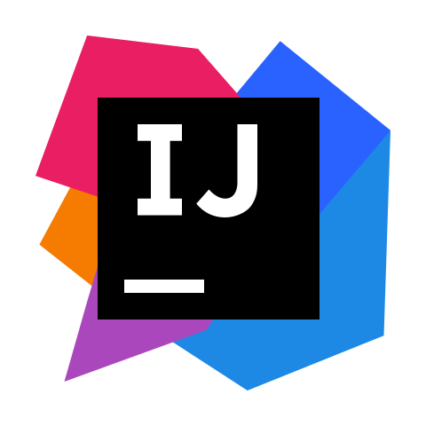
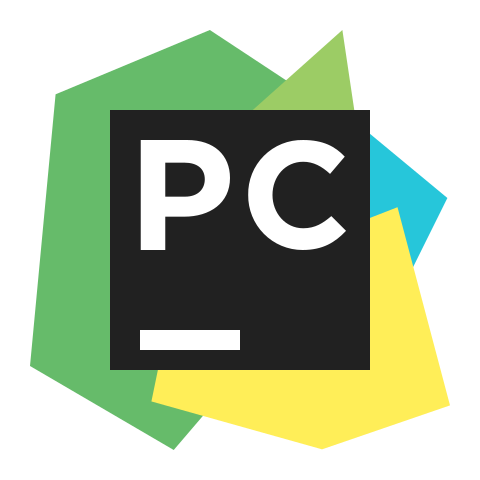
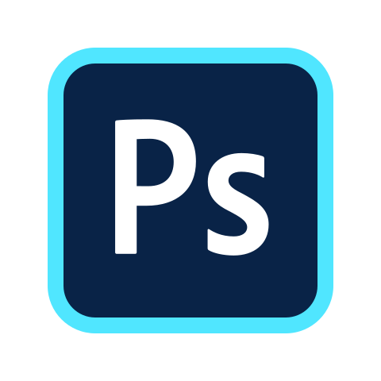

<!--

Montasim's Github Profile
Created on : 18/5/2021
Author :  Mohammad Montasim -Al- Mamun Shuvo
Contact :  montasimmamun@gmail.com

Thank you if you like this profile README!

BUT, please DO NOT copy this and create your profile based on it.

You can use it as a reference, and copy a part of it, but DO NOT copy
all of this and create your profile based on it.

It is very common that you forget to change some information and leave
mine in your profile. This has happened too many times.

Only when you know what you are copying should you paste it. So, again,
please DO NOT copy this and create your profile based on it.

What's more, you can find other awesome profile READMEs at
https://github.com/abhisheknaiidu/awesome-github-profile-readme. There
could be a profile README that fits you better than this one.

Wish you a good-looking profile README!

                                   —— montasim (https://github.com/montasim)

-->

<h1 align="center">🎲 Ｈｅｌｌｏ， Ｎｉｃｅ ｔｏ ｍｅｅｔ ｙｏｕ 🎓</h1>

<!-- Start Some Hints Icons About Montasim -->

    
    
    
    
    
    
    
    

<!-- End Some Hints Icons About Montasim -->

<!-- Start Programming Languages Icon -->

  
  
    
    
    
     
      
  
  
  
   
   
  
  
  
  
   
  
   

<!-- End Programming Languages Icon -->

  

  

<h2 align="left"> 👋 ʜɪ, ɪ'ᴍ ᴍᴏɴᴛᴀꜱɪᴍ </h2>

 𝙵𝚛𝚘𝚖 𝚊 𝚢𝚘𝚞𝚗𝚐 𝚊𝚐𝚎, 𝙸’𝚟𝚎 𝚊𝚕𝚠𝚊𝚢𝚜 𝚑𝚊𝚍 𝚊 𝚜𝚎𝚗𝚜𝚎 𝚘𝚏 𝚖𝚘𝚝𝚒𝚟𝚊𝚝𝚒𝚘𝚗 𝚊𝚗𝚍 𝚙𝚊𝚜𝚜𝚒𝚘𝚗 𝚍𝚛𝚒𝚟𝚒𝚗𝚐 𝚖𝚎 𝚏𝚘𝚛𝚠𝚊𝚛𝚍. 𝚆𝚑𝚎𝚝𝚑𝚎𝚛 𝚒𝚝’𝚜 𝚎𝚡𝚙𝚕𝚘𝚛𝚒𝚗𝚐 𝚞𝚗𝚒𝚚𝚞𝚎 𝚘𝚙𝚙𝚘𝚛𝚝𝚞𝚗𝚒𝚝𝚒𝚎𝚜, 𝚕𝚎𝚊𝚛𝚗𝚒𝚗𝚐 𝚊𝚍𝚍𝚒𝚝𝚒𝚘𝚗𝚊𝚕 𝚜𝚔𝚒𝚕𝚕𝚜, 𝚘𝚛 𝚖𝚎𝚎𝚝𝚒𝚗𝚐 𝚗𝚎𝚠 𝚙𝚎𝚘𝚙𝚕𝚎, 𝙸 𝚋𝚛𝚒𝚗𝚐 𝚝𝚑𝚎𝚜𝚎 𝚟𝚊𝚕𝚞𝚎𝚜 𝚝𝚘 𝚎𝚟𝚎𝚛𝚢 𝚎𝚡𝚙𝚎𝚛𝚒𝚎𝚗𝚌𝚎 𝚝𝚑𝚛𝚘𝚞𝚐𝚑𝚘𝚞𝚝 𝚖𝚢 𝚕𝚒𝚏𝚎 𝚘𝚗 𝚊 𝚙𝚎𝚛𝚜𝚘𝚗𝚊𝚕 𝚊𝚗𝚍 𝚙𝚛𝚘𝚏𝚎𝚜𝚜𝚒𝚘𝚗𝚊𝚕 𝚕𝚎𝚟𝚎𝚕. 𝙸 𝚕𝚘𝚟𝚎 𝚌𝚘𝚗𝚗𝚎𝚌𝚝𝚒𝚗𝚐 𝚠𝚒𝚝𝚑 𝚍𝚒𝚏𝚏𝚎𝚛𝚎𝚗𝚝 𝚙𝚎𝚘𝚙𝚕𝚎 𝚊𝚛𝚘𝚞𝚗𝚍 𝚝𝚑𝚎 𝚠𝚘𝚛𝚕𝚍. 𝙵𝚎𝚎𝚕 𝚏𝚛𝚎𝚎 𝚝𝚘 𝚛𝚎𝚊𝚌𝚑 𝚘𝚞𝚝 𝚊𝚗𝚍 𝚒𝚗𝚝𝚛𝚘𝚍𝚞𝚌𝚎 𝚢𝚘𝚞𝚛𝚜𝚎𝚕𝚏. 𝚃𝚘 𝚕𝚎𝚊𝚛𝚗 𝚖𝚘𝚛𝚎 𝚊𝚋𝚘𝚞𝚝 𝚖𝚎, 𝚔𝚎𝚎𝚙 𝚎𝚡𝚙𝚕𝚘𝚛𝚒𝚗𝚐 𝚖𝚢 𝚜𝚒𝚝𝚎 𝚘𝚛 𝚛𝚎𝚊𝚌𝚑 𝚘𝚞𝚝 𝚍𝚒𝚛𝚎𝚌𝚝𝚕𝚢.

<!-- Start My Resume Section -->
<!-- Start Details -->

<b> 📑 ᴍʏ ʀᴇꜱᴜᴍᴇ </b>

 
 
 

<h2 align="center"><a href="https://github.com/montasim/DoNotDelete/raw/main/resume/Resume_of_Montasim.pdf"> 𝐃𝐨𝐰𝐧𝐥𝐨𝐚𝐝 𝐌𝐲 𝐑𝐞𝐬𝐮𝐦𝐞 </a></h2>

 
 

<!-- Start My Resume -->
<!-- Montasim's Photo -->

<h2 align="left"> Mohammad Montasim -Al- Mamun Shuvo
  <h3> Developer and Designer </h3> </h2>
	
 

<!-- Start Links -->

<b> Email: </b> <a href="montasimmamun@gmail.com"> montasimmamun@gmail.com</a>
 
<b> Portfolio: </b> <a href="https://montasim.github.io"> montasim.github.io </a>
 
<b> Mobile: </b> <a href="+8801722815469"> +8801722815469 </a>
 
<b> GitHub: </b> <a href="https://github.com/montasim"> github.com/montasim </a>

<!-- End Links -->

 
 

<!-- Start Career Objective -->
<h2 align="left"> Career Objective: </h2>

   Practical and versatile Software Engineer with significant experience in developing Websites and Web Applications. I
can handle multiple tasks daily. I use a creative approach to solve problems. I am a dependable person who is great
at time management. I am always energetic and eager to learn new skills. 

<!-- End Career Objective -->

 
 

<!-- Start Career Objective -->
<h2 align="left"> Career Summary: </h2>

   I am a developer who is working on an organization named CODEZ Info Tech. My responsibility here is to design
and develop Websites and Web Applications. My goal is to work hard to make my educational and professional skills
in a flawless workplace. 

<!-- End Career Objective -->

 
 

<!-- Start Experience -->
<h2 align="left"> Experience: </h2>
<table align="center">
    <thead>
        <tr>
            <th align="left"><b></b> Company Name </th>
	        <th align="left"><b> CODEZ Info Tech </b></th>
            <th align="left"><b> Crystal It and Soft </b></th>
        </tr>
    </thead>
    <tbody>
        <tr>
            <td align="left"><b> Designation </b></td>
            <td align="left"> Web Developer </td>
            <td align="left"> Web Developer </td>
        </tr>
        <tr>
            <td align="left"><b> Duration </b></td>
            <td align="left"> December 10, 2020 - Present </td>
            <td align="left"> August 2019 – September 2020 </td>
        </tr>
        <tr>
            <td align="left"><b> Address </b></td>
            <td align="left"> 3/359, Adarsha Nagar, Middle-Badda, Dhaka-1212 </td>
            <td align="left"> Chartola Mor, Rangpur </td>
        </tr>
        <tr>
            <td align="left"><b> Responsibility </b></td>
            <td align="left"> Design and Develop Websites and Web Applications </td>
            <td align="left"> Developed and maintained affiliate marketing website Crystal It and Soft, Rangpur </td>
        </tr>
        <tr>
            <td align="left"><b>  </b></td>
            <td align="left">  UI/UX Design </td>
            <td align="left"> Wrote over 150 contents for those websites </td>
        </tr>
        <tr>
            <td align="left"><b>  </b></td>
            <td align="left"> Problem Solving </td>
            <td align="left">  </td>
        </tr>
    </tbody>
</table>
<!-- End Experience -->

 
 

<!-- Start Academic Qualification Summery -->
<h2 align="left"> Academic Qualification: </h2>
<table align="center">
    <thead>
        <tr>
            <th align="left"><b> Exam Title </b></th>
	        <th align="left"><b> Concentration / Major </b></th>
            <th align="left"><b> Institute </b></th>
            <th align="left"><b> Result </b></th>
            <th align="left"><b> Passing Year </b></th>
        </tr>
    </thead>
    <tbody>
        <tr>
            <td align="left"> Bachelor of Science (B. Sc.) </td>
            <td align="left"> Computer Science & Engineering </td>
            <td align="left"> Bangladesh Army University of Science and Technology </td>
            <td align="left"> 2.96 </td>
            <td align="left"> 2021 </td>
        </tr>
        <tr>
            <td align="left"> HSC </td>
            <td align="left"> Science </td>
            <td align="left"> Carmichael College Rangpur </td>
            <td align="left"> 4.58 </td>
            <td align="left"> 2016 </td>
        </tr>
        <tr>
            <td align="left"> SSC </td>
            <td align="left"> Science </td>
            <td align="left"> Rangpur Zilla School </td>
            <td align="left"> 5.00 </td>
            <td align="left"> 2014 </td>
        </tr>
    </tbody>
</table>
<!-- End Academic Qualification Summery -->          
                                    
 
 

<!-- Start Undergraduate Thesis and Project --> 
<h2 align="left"> Undergraduate Thesis and Project: </h2>

 <b> Hand Pose Estimation in Single RGB Image with Multiview Bootstrapping. </b>
  
- Deep Learning, OpenCV  
- Convolutional Neural Network (CNN)  
- Python (TensorFlow, Matplotlib, Scikit-Learn, OpenCV, Media pipe) 

<!-- End Undergraduate Thesis and Project --> 

 
 

<!-- Start Career and Application Information --> 
<h2 align="left"> Career and Application Information: </h2>

 Preferred Job Category : Engineer, IT, Telecommunication, Design, Creative 
 
Looking For : Entry Level Job 
 
Available For : Full Time 
 
Preferred District : Dhaka, Rangpur 
 
Preferred Organization Types : Software Company 

<!-- End Career and Application Information --> 

 
 

<!-- Start Specialization --> 
<h2 align="left"> Specialization: </h2>
<table align="center">
    <thead>
        <tr>
        <th align="center"><b> Fields of Specialization </b></th>
	    <th align="center"><b> Description </b></th>
        </tr>
    </thead>
    <tbody>
        <tr>
            <td align="left"> C Programming 
              C++ Programming 
              Java Programming 
              Python Programming 
              HTML5 & CSS3 
              Bootstrap, Tailwind CSS 
              Word Press, Blogger 
              SQLite 
              LaTeX 
              Git, GitHub 
              Leadership, Time Management 
            </td>
            <td align="left">
 01. Programming Languages: C, C++, JAVA, Python, PHP, SQL 
              02. Web Frameworks: Django, Flask, PyGame, Bootstrap, Tailwind CSS 
              03. Web Technologies: PHP, HTML, CSS, XML, Markdown 
              04. Content Management System (CMS): Word Press, Blogger 
              05. Databases: SQL Server, MySQL, SQLite 
              06. Toolkits: LaTeX 
              07. Version Control: Git, GitHub 
              08. Human Skills: Leadership, Time Management 
 
            </td>
        </tr>
    </tbody>
</table>
<!-- End Specialization --> 

 

<!-- Start Language Proficiency --> 
<h2 align="left"> Language Proficiency: </h2>
<table align="center">
    <thead>
        <tr>
            <th align="center"><b> Language </b></th>
	        <th align="center"><b> Reading </b></th>
            <th align="center"><b> Writing </b></th>
            <th align="center"><b> Speaking </b></th>
        </tr>
    </thead>
    <tbody>
        <tr>
            <td align="left"> English </td>
            <td align="left"> High </td>
            <td align="left"> High </td>
            <td align="left"> High </td>
        </tr>
        <tr>
            <td align="left"> Bangla </td>
            <td align="left"> High </td>
            <td align="left"> High </td>
            <td align="left"> High </td>
        </tr>
    </tbody>
</table>
<!-- End Language Proficiency --> 

 
 

<!-- Start Training, Participation and Certification --> 
<h2 align="left"> Training, Participation and Certification: </h2>

- <a href="#"> Mobile Game And Application Development For Android - at ICT Division of Bangladesh </a>
- <a href="#"> PLC Training Course - at BAUST </a>
- <a href="https://www.udemy.com/certificate/UC-9SJEY17Z/"> The Complete C Programming Tutorial - at Udemy online course </a>
- <a href="https://www.udemy.com/certificate/UC-4c1e3560-c268-4c37-87c3-b3e1235b67f2/"> C++ Development Tutorial Series - The Complete Coding Guide - at Udemy online course </a>
- <a href="https://www.udemy.com/certificate/UC-57c8fb24-5d8a-450b-9001-76c2dfac993b/"> Learn C++ Programming Mini Course - Power of Animation - at Udemy online course </a>
- <a href="https://www.udemy.com/certificate/UC-77OW1SDX/"> HTML5 Coding from Scratch - Build Your Own Website - at Udemy online course</a>
- <a href="https://www.coursera.org/account/accomplishments/certificate/DKL6A3KTYL34"> Position Elements on a Page with CSS - at Coursera online course</a>
- <a href="https://www.coursera.org/account/accomplishments/certificate/5XKX3V74MZA6"> Git + GitHub for Open Source Collaboration - at Coursera online course </a>
- <a href="https://www.coursera.org/account/accomplishments/certificate/HHS3XUAFQWZU"> Use Commands and Create a Remote Git Repository - at Coursera online course </a>
<!-- End Training, Participation and Certification --> 

 
 

<!-- Start Extra Curricular Activities -->
<h2 align="left"> Extra Curricular Activities: </h2>

 - Ex. Cadet, second best cadet of Mohasthan Regiment at Bangladesh National Cadet Corps (BNCC) 

 - Event Organizer at Rangpur Zilla School 

<!-- End Extra Curricular Activities -->    

 
 

<!-- Start Personal Details -->
<h2 align="left"> Personal Details: </h2>

 <b> Father's Name : MD. Hafizar Rahman </b>  
  
<b> Mother's Name : MST. Majida Begum </b> 
  
<b> Date of Birth : December 16, 1998 </b>  
  
<b> Nationality : Bangladeshi </b>  
  
<b> Blood Group : B+ </b>  
  
<b> Religion : Islam </b>  
  
<b> Permanent Address : Balapara, 20 Mega Watt, Rangpur Sadar, Rangpur </b> 

<!-- End Personal Details -->    
 
 
 

<!-- Start Reference (s) -->
<h2 align="left"> Reference (s): </h2>
<table align="center">
    <thead>
        <tr>
            <th align="left"><b></b></th>
	        <th align="left"><b> Reference: 01 </b></th>
            <th align="left"><b> Reference: 02 </b></th>
        </tr>
    </thead>
    <tbody>
        <tr>
            <td align="left"><b> Name </b></td>
            <td align="left"> Tareq Aziz </td>
            <td align="left"> Abu Saleh Musa Miah </td>
        </tr>
        <tr>
            <td align="left"><b> Organization </b></td>
            <td align="left"> CODEZ Info Tech </td>
            <td align="left"> Bangladesh Army University of Science and Technology (BAUST) </td>
        </tr>
        <tr>
            <td align="left"><b> Designation </b></td>
            <td align="left"> Data Engineer </td>
            <td align="left"> Lecturer </td>
        </tr>
        <tr>
            <td align="left"><b> Address </b></td>
            <td align="left"> 3/359, Adarsha Nagar, Middle-Badda, Dhaka-1212 </td>
            <td align="left"> Saidpur Cantonment, Saidpur, Bangladesh </td>
        </tr>
        <tr>
            <td align="left"><b> Mobile </b></td>
            <td align="left"> +8801947818375 </td>
            <td align="left"> +8801734264899 </td>
        </tr>
        <tr>
            <td align="left"><b> Email </b></td>
            <td align="left"> tareqitbuzz@gmail.com </td>
            <td align="left"> abusalehcse.ru@gmail.com </td>
        </tr>
        <tr>
            <td align="left"><b> Relation </b></td>
            <td align="left"> Colleague </td>
            <td align="left"> Teacher </td>
        </tr>
    </tbody>
</table>
<!-- End Reference (s) -->
<!-- End My Resume -->
 

<!-- End Details -->
<!-- End My Resume Section -->

<!-- Start My Experience Section -->  

    <b> ✨ ᴍʏ ᴇxᴘᴇʀɪᴇɴᴄᴇ </b>

	
  

<!-- Start Experience -->
<h2 align="left"> Experience: </h2>
<table align="center">
    <thead>
        <tr>
            <th align="left"><b></b> Company Name </th>
	        <th align="left"><b> CODEZ Info Tech </b></th>
            <th align="left"><b> Crystal It and Soft </b></th>
        </tr>
    </thead>
    <tbody>
        <tr>
            <td align="left"><b> Designation </b></td>
            <td align="left"> Web Developer </td>
            <td align="left"> Web Developer </td>
        </tr>
        <tr>
            <td align="left"><b> Duration </b></td>
            <td align="left"> December 10, 2020 - Present </td>
            <td align="left"> August 2019 – September 2020 </td>
        </tr>
        <tr>
            <td align="left"><b> Address </b></td>
            <td align="left"> 3/359, Adarsha Nagar, Middle-Badda, Dhaka-1212 </td>
            <td align="left"> Chartola Mor, Rangpur </td>
        </tr>
        <tr>
            <td align="left"><b> Responsibility </b></td>
            <td align="left"> Design and Develop Websites and Web Applications </td>
            <td align="left"> Developed and maintained affiliate marketing website </td>
        </tr>
        <tr>
            <td align="left"><b>  </b></td>
            <td align="left">  UI/UX Design </td>
            <td align="left"> Wrote over 150 contents for those websites </td>
        </tr>
        <tr>
            <td align="left"><b>  </b></td>
            <td align="left"> Problem Solving </td>
            <td align="left">  </td>
        </tr>
    </tbody>
</table>
<!-- End Experience -->

  

<!-- End My Experience Section -->  

<!-- Start My Skills Section -->  

    <b> 🔍 ᴍʏ ꜱᴋɪʟʟꜱ </b>

	
  

<!-- Start My Skills -->
<h2 align="center"><b> My Skills </b></h2>
<table align="center">
    <thead>
        <tr>
            <th align="center"><b>Name \ Familiarity</b></th>
            <th align="center"><b>High</b></th>
            <th align="center"><b>Medium</b></th>
            <th align="center"><b>Low</b></th>
        </tr>
    </thead>
    <tbody>
        <tr>
            <td align="left"><b>Programming Languages</b></td>
            <td align="center"></td>
            <td align="center">  </td>
            <td align="center"> </td>
        </tr>
    </tbody>
    <tbody>
        <tr>
            <td align="left"><b>Web Technologies</b></td>
            <td align="center">   </td>
            <td align="center">  </td>
            <td align="center">  </td>
        </tr>
    </tbody>
    <tbody>
        <tr>
            <td align="left"><b>Web Frameworks</b></td>
            <td align="center">   </td>
            <td align="center">  </td>
            <td align="center">  </td>
        </tr>
    </tbody>
    <tbody>
        <tr>
            <td align="left"><b>Web Creation Platforms</b></td>
            <td align="center">   </td>
            <td align="center">  </td>
            <td align="center"></td>
        </tr>
    </tbody><tbody>
        <tr>
            <td align="left"><b>Database</b></td>
            <td align="center">  </td>
            <td align="center">  </td>
            <td align="center"></td>
        </tr>
    </tbody>
    <tbody>
        <tr>
            <td align="left"><b>Version Control</b></td>
            <td align="center">  </td>
            <td align="left"></td>
            <td align="left"></td>
        </tr>
    </tbody>
    <tbody>
        <tr>
            <td align="left"><b>Operating System</b></td>
            <td align="center">   </td>
            <td align="center">   </td>
            <td align="center">   </td>
        </tr>
    </tbody>
    <tbody>
        <tr>
            <td align="left"><b>Languages</b></td>
            <td align="left">English (Native), Bangla (Native)</td>
            <td align="left">Hindi</td>
            <td align="left">Arabic</td>
        </tr>
    </tbody>
    <tbody>
        <tr>
            <td align="left"><b>Other interests</b></td>
            <td align="left">Reading Books</td>
            <td align="left">Playing Games, Watching Movies</td>
            <td align="left">Sports</td>
        </tr>
    </tbody>
</table>
 
<!-- End My Skills -->
  

<!-- End My Skills Section --> 

<!-- Start 𝙲𝚘𝚗𝚗𝚎𝚌𝚝 𝚆𝚒𝚝𝚑 𝙼𝚎 Section --> 
<!-- 𝙲𝚘𝚗𝚗𝚎𝚌𝚝 𝚆𝚒𝚝𝚑 𝙼𝚎 -->
<h2 align="right"> 🔺 ꜰɪɴᴅ ᴍᴇ ᴏɴ ꜱᴏᴄɪᴀʟ ᴍᴇᴅɪᴀ </h2>

 

<!-- handshake gif -->

  

<!-- Start Social Links -->
<table align="right">
    <thead>
        <tr>
            <th align="center"></th>
	    <th align="center"></th>
            <th align="center"></th>
            <th align="center"></th>
            <th align="center"></th>
            <th align="center"></th>
            <th align="center"></th>
            <th align="center"></th>
        </tr>
    </thead>
</table>
<!-- End Social Links -->
 
    
<!-- End 𝙲𝚘𝚗𝚗𝚎𝚌𝚝 𝚆𝚒𝚝𝚑 𝙼𝚎 Section -->

  

<!-- Start Some Words About Me -->
<h2> ✍ ꜱᴏᴍᴇ ᴡᴏʀᴅ ᴀʙᴏᴜᴛ ᴍᴇ </h2>

&nbsp;&nbsp;&nbsp;&nbsp;&nbsp;&nbsp; ♦ Ａ 𝚙𝚊𝚜𝚜𝚒𝚘𝚗𝚊𝚝𝚎 𝙵𝚞𝚕𝚕𝚜𝚝𝚊𝚌𝚔 𝚍𝚎𝚟𝚎𝚕𝚘𝚙𝚎𝚛 𝚏𝚛𝚘𝚖 𝙱𝚊𝚗𝚐𝚕𝚊𝚍𝚎𝚜𝚑.
 
&nbsp;&nbsp;&nbsp;&nbsp;&nbsp;&nbsp; ♦ A 𝚙𝚊𝚜𝚜𝚒𝚘𝚗𝚊𝚝𝚎 𝚕𝚎𝚊𝚛𝚗𝚎𝚛 𝚠𝚑𝚘'𝚜 𝚊𝚕𝚠𝚊𝚢𝚜 𝚠𝚒𝚕𝚕𝚒𝚗𝚐 𝚝𝚘 𝚕𝚎𝚊𝚛𝚗.
 
&nbsp;&nbsp;&nbsp;&nbsp;&nbsp;&nbsp; ♦ W𝚘𝚛𝚔 𝚊𝚌𝚛𝚘𝚜𝚜 𝚝𝚎𝚌𝚑𝚗𝚘𝚕𝚘𝚐𝚒𝚎𝚜 𝚊𝚗𝚍 𝚍𝚘𝚖𝚊𝚒𝚗𝚜.
 
&nbsp;&nbsp;&nbsp;&nbsp;&nbsp;&nbsp; ♦ L𝚘𝚟𝚎 𝚝𝚘 𝚎𝚡𝚙𝚕𝚘𝚛𝚎 𝚗𝚎𝚠 𝚝𝚎𝚌𝚑𝚗𝚘𝚕𝚘𝚐𝚒𝚎𝚜.
 
&nbsp;&nbsp;&nbsp;&nbsp;&nbsp;&nbsp; ♦ 𝚃𝚘 𝚕𝚎𝚊𝚛𝚗 𝚖𝚘𝚛𝚎 𝚊𝚋𝚘𝚞𝚝 𝚖𝚎, 𝚔𝚎𝚎𝚙 𝚎𝚡𝚙𝚕𝚘𝚛𝚒𝚗𝚐 𝚖𝚢 𝚜𝚒𝚝𝚎.
<!-- End Some Words About Me -->

      

<!-- coder gif -->

<!-- Start Talking About Personal Stuffs -->
<h2 align="left">💥 ᴛᴀʟᴋɪɴɢ ᴀʙᴏᴜᴛ ᴘᴇʀꜱᴏɴᴀʟ ꜱᴛᴀꜰꜰ </h2>

&nbsp;&nbsp;&nbsp;&nbsp; ♦ ɪ’ᴍ ᴄᴜʀʀᴇɴᴛʟʏ ʟᴇᴀʀɴɪɴɢ ꜰᴜʟʟ ꜱᴛᴀᴄᴋ ᴅᴇᴠᴇʟᴏᴘᴍᴇɴᴛ.
 
&nbsp;&nbsp;&nbsp;&nbsp; ♦ ᴍᴏꜱᴛ ᴏꜰ ᴍʏ ᴘʀᴏᴊᴇᴄᴛꜱ ᴀʀᴇ ᴀᴠᴀɪʟᴀʙʟᴇ ᴏɴ [🅶🅸🆃🅷🆄🅱](https://github.com/montasim).
 
&nbsp;&nbsp;&nbsp;&nbsp; ♦ ᴀꜱᴋ ᴍᴇ ᴀʙᴏᴜᴛ ᴀɴʏᴛʜɪɴɢ [ʜᴇʀᴇ](ʜᴛᴛᴘꜱ:ᴍᴀɪʟᴛᴏ:ᴍᴏɴᴛᴀꜱɪᴍᴍᴀᴍᴜɴ@ɢᴍᴀɪʟ.ᴄᴏᴍ)! ɪ ᴀᴍ ʜᴀᴘᴘʏ ᴛᴏ ʜᴇʟᴘ.
 
&nbsp;&nbsp;&nbsp;&nbsp; ♦ ꜰᴜɴ ꜰᴀᴄᴛ: ᴇQᴜᴀʟ ɪꜱ ɴᴏᴛ ᴀʟᴡᴀʏꜱ ᴇQᴜᴀʟ ɪɴ ᴊᴀᴠᴀꜱᴄʀɪᴘᴛ.
 
&nbsp;&nbsp;&nbsp;&nbsp; ♦ ʜᴏᴡ ᴛᴏ ʀᴇᴀᴄʜ ᴍᴇ: [🅶🅼🅰🅸🅻.](mailto:montasimmamun@gmail.com)
 
&nbsp;&nbsp;&nbsp;&nbsp; ♦ ᴄʜᴇᴄᴋᴏᴜᴛ ᴍʏ [🆁🅴🆂🆄🅼🅴](https://github.com/montasim/resume/blob/main/Resume_of_Montasim%20.pdf).
<!-- End Talking About Personal Stuffs -->
	
     

<!-- coder gif -->

<!-- Start Talking About Personal Stuffs -->
<h2> 💮 ᴍʏ ᴀʙꜱᴏʟᴜᴛᴇ ꜰᴀᴠᴏᴜʀɪᴛᴇ </h2>

&nbsp;&nbsp;&nbsp;&nbsp; ♦ ɪ ʟᴏᴠᴇ ᴇxᴘʟᴏʀɪɴɢ ɴᴇᴡ ᴛᴇᴄʜ ᴀɴᴅ ʙᴜɪʟᴅɪɴɢ ᴄᴏᴏʟ ꜱᴛᴜꜰꜰꜱ. 
 
&nbsp;&nbsp;&nbsp;&nbsp; ♦ ʀᴇᴀᴅɪɴɢ & ᴡʀɪᴛɪɴɢ ᴛᴇᴄʜ ʙʟᴏɢꜱ ᴡʜᴇɴᴇᴠᴇʀ ᴘᴏꜱꜱɪʙʟᴇ. 
 
&nbsp;&nbsp;&nbsp;&nbsp; ♦ ᴘʀᴏʙʟᴇᴍ ꜱᴏʟᴠɪɴɢ, ᴍᴇᴇᴛᴜᴘꜱ & ᴛᴇᴄʜ ᴇᴠᴇɴᴛꜱ. 
 
<!-- End Talking About Personal Stuffs -->

       

<!-- Start My Github Stats -->
<h2 align="left"> 💠 ꜱᴏᴍᴇ ʀᴀɴᴅᴏᴍ ᴊᴏᴋᴇꜱ </h2>
 
<!-- Start Montasim's github readme stats -->

      
      

  

<!-- Start My Projects Section -->  

    <b> 💛 ᴍʏ ᴘʀᴏᴊᴇᴄᴛꜱ </b>

	
  

  

<!-- End My Projects Section --> 

<!-- Start Certificates Section -->  

    <b> 🏅 ᴄᴇʀᴛɪꜰɪᴄᴀᴛᴇꜱ </b>

	
  

<!-- Start Training, Participation and Certification --> 
<h2 align="left"> Training, Participation and Certification: </h2>

- <a href="#"> Mobile Game And Application Development For Android - at ICT Division of Bangladesh </a>
- <a href="#"> PLC Training Course - at BAUST </a>
- <a href="https://www.udemy.com/certificate/UC-9SJEY17Z/"> The Complete C Programming Tutorial - at Udemy online course </a>
- <a href="https://www.udemy.com/certificate/UC-4c1e3560-c268-4c37-87c3-b3e1235b67f2/"> C++ Development Tutorial Series - The Complete Coding Guide - at Udemy online course </a>
- <a href="https://www.udemy.com/certificate/UC-57c8fb24-5d8a-450b-9001-76c2dfac993b/"> Learn C++ Programming Mini Course - Power of Animation - at Udemy online course </a>
- <a href="https://www.udemy.com/certificate/UC-77OW1SDX/"> HTML5 Coding from Scratch - Build Your Own Website - at Udemy online course</a>
- <a href="https://www.coursera.org/account/accomplishments/certificate/DKL6A3KTYL34"> Position Elements on a Page with CSS - at Coursera online course</a>
- <a href="https://www.coursera.org/account/accomplishments/certificate/5XKX3V74MZA6"> Git + GitHub for Open Source Collaboration - at Coursera online course </a>
- <a href="https://www.coursera.org/account/accomplishments/certificate/HHS3XUAFQWZU"> Use Commands and Create a Remote Git Repository - at Coursera online course </a>
<!-- End Training, Participation and Certification --> 

  

<!-- End Certificates Section --> 

<!-- Start My Followers Section -->  

    <b> 💢 ᴍʏ ꜰᴏʟʟᴏᴡᴇʀꜱ </b>

	
  

### My Followers

<!--START_SECTION:top-followers-->
<table>
  <tr>
    <td align="center">
        
       
    </td>
    <td align="center">
      <a href="https://github.com/donmartz">
        
       
    </td>
    <td align="center">
        
       
    </td>
    <td align="center">
        
       
    </td>
    <td align="center">
        
       
    </td>
    <td align="center">
        
       
    </td>
    <td align="center">
        
       
    </td>
  </tr>
  <tr>
    <td align="center">
        
       
    </td>
    <td align="center">
        
       
    </td>
    <td align="center">
        
       
    </td>
    <td align="center">
        
       
    </td>
    <td align="center">
        
       
    </td>
    <td align="center">
        
       
    </td>
    <td align="center">
        
       
    </td>
  </tr>
</table>
<!--END_SECTION:top-followers-->

  

<!-- End My Followers Section --> 

<!-- Start My Github Stats -->
<h2 align="center">💦 ᴍʏ ɢɪᴛʜᴜʙ ꜱᴛᴀᴛꜱ </h2>
 

<!-- Start Montasim's github readme stats -->

  

      
    </a>
      
    </a>
  

           
  

      
    </a>
  

     
  

<!-- End Montasim's github readme stats -->

<!-- Start 𝙼𝚘𝚛𝚎 𝚂𝚝𝚞𝚏𝚏 𝙰𝚋𝚘𝚞𝚝 𝙼𝚎 Section -->

	<b> 💡 ᴍᴏʀᴇ ꜱᴛᴀꜰꜰ ᴀʙᴏᴜᴛ ᴍᴇ </b>

	
 
 

<h2 align="left"> 📣 What I do </h2>

	I do Open Source. In fact, I do Open Source so much, that majority of my work on
	GitHub is free and open to everyone. I am really passionate about doing web
	development. It is in my opinion the best combination of logical programming and
	(sometimes) beautiful design.

 
 

<!-- My Specifications section -->
<h2 align="center"><b> 💻 My Specifications </b></h2>
<table align="center">
    <thead>
        <tr>
            <th align="center"><b>Name \ Familiarity</b></th>
            <th align="center"><b>High</b></th>
            <th align="center"><b>Medium</b></th>
            <th align="center"><b>Low</b></th>
        </tr>
    </thead>
    <tbody>
        <tr>
            <td align="left"><b>Programming Languages</b></td>
            <td align="left">Python</td>
            <td align="left">C, C++, PHP</td>
            <td align="left">Java, JavaScript</td>
        </tr>
    </tbody>
    <tbody>
        <tr>
            <td align="left"><b>Web Technologies</b></td>
            <td align="left">HTML, CSS</td>
            <td align="left">Markdown</td>
            <td align="left">XML</td>
        </tr>
    </tbody>
    <tbody>
        <tr>
            <td align="left"><b>Web Frameworks</b></td>
            <td align="left">Bootstrap, Django</td>
            <td align="left">Flask</td>
            <td align="left">TailWind CSS</td>
        </tr>
    </tbody>
    <tbody>
        <tr>
            <td align="left"><b>Web Creation Platforms</b></td>
            <td align="left">WordPress, Blogger</td>
            <td align="left">Wix</td>
            <td align="left"></td>
        </tr>
    </tbody><tbody>
        <tr>
            <td align="left"><b>Database</b></td>
            <td align="left">MySQL</td>
            <td align="left">SqlLite</td>
            <td align="left"></td>
        </tr>
    </tbody>
    <tbody>
        <tr>
            <td align="left"><b>Version Control</b></td>
            <td align="left">Git, Github</td>
            <td align="left"></td>
            <td align="left"></td>
        </tr>
    </tbody>
    <tbody>
        <tr>
            <td align="left"><b>Operating System</b></td>
            <td align="left">Windows, Ubuntu</td>
            <td align="left">Fedora, RedHat, Debian</td>
            <td align="left">Linux Mint, Kali Linux</td>
        </tr>
    </tbody>
    <tbody>
        <tr>
            <td align="left"><b>Languages</b></td>
            <td align="left">English (Native), Bangla (Native)</td>
            <td align="left">Hindi</td>
            <td align="left">Arabic</td>
        </tr>
    </tbody>
    <tbody>
        <tr>
            <td align="left"><b>Other interests</b></td>
            <td align="left">Reading Books</td>
            <td align="left">Playing Games, Watching Movies</td>
            <td align="left">Sports</td>
        </tr>
    </tbody>
</table>
 
<!-- end work experience section -->

 
 

<!-- My Work Experience -->
<h2 align="center"><b> ⌚ My Work Experience </b></h2>
<table align="center">
    <thead>
        <tr>
            <th align="center"><b>Job Name</b></th>
	    <th align="center"><b>Job Place</b></th>
            <th align="center"><b>Roles & responsibilities</b></th>
            <th align="center"><b>Duration</b></th>
            <th align="center"><b>Job Profile</b></th>
        </tr>
    </thead>
    <tbody>
        <tr>
            <td align="left"><b>Problem Solver</b></td>
            <td align="left">HackerRank</td>
            <td align="left">Problem Solver</td>
            <td align="left">2018 - Present</td>
            <td align="left"><a href="https://www.hackerrank.com/montasim">hackerrank.com/montasim</a></td>
        </tr>
    </tbody>
</table>
 
<!-- end My Work Experience -->

 
 

<!-- Projects I'm the most proud of -->
<h2 align="center"><b> 📌 Projects I'm The Most Proud Of </b></h2>
<table align="center">
    <thead>
        <tr>
            <th align="center"><b>Name</b></th>
	    <th align="center"><b>Description</b></th>
            <th align="center"><b>Language</b></th>
            <th align="center"><b>Repo</b></th>
        </tr>
    </thead>
    <tbody>
        <tr>
            <td align="left"></td>
            <td align="left"></td>
            <td align="left"></td>
            <td align="left"></td>
        </tr>
    </tbody>
    <tbody>
        <tr>
            <td align="left"></td>
            <td align="left"></td>
            <td align="left"></td>
            <td align="left"></td>
        </tr>
    </tbody>
    <tbody>
        <tr>
            <td align="left"></td>
            <td align="left"></td>
            <td align="left"></td>
            <td align="left"></td>
        </tr>
    </tbody>
    <tbody>
        <tr>
            <td align="left"></td>
            <td align="left"></td>
            <td align="left"></td>
            <td align="left"></td>
        </tr>
    </tbody>
</table>
 
<!-- end Projects I'm the most proud of -->

 
 

<!-- My own dictionary  -->
<h2 align="center"><b> ⚠️ My Own Dictionary  </b></h2>
<table align="center">
    <thead>
        <tr>
            <th align="center"><b>Word / Abreviation</b></th>
	    <th align="center"><b>Meaning</b></th>
            <th align="center"><b>Note</b></th>
        </tr>
    </thead>
    <tbody>
        <tr>
            <td align="left"></td>
            <td align="left"></td>
            <td align="left"></td>
        </tr>
    </tbody>
</table>
 
<!-- end My own dictionary  -->

 
 

[//]: # "Trainging and Participation heading"

<h2 align="left"> 🏅 Trainging and Participation </h2>

[//]: # "Trainging and Participation summery"

- <a href="#">𝙼𝚘𝚋𝚒𝚕𝚎 𝙶𝚊𝚖𝚎 𝙰𝚗𝚍 𝙰𝚙𝚙𝚕𝚒𝚌𝚊𝚝𝚒𝚘𝚗 𝙳𝚎𝚟𝚎𝚕𝚘𝚙𝚖𝚎𝚗𝚝 𝙵𝚘𝚛 𝙰𝚗𝚍𝚛𝚘𝚒𝚍 - 𝚊𝚝 𝙸𝙲𝚃 𝙳𝚒𝚟𝚒𝚜𝚒𝚘𝚗 𝚘𝚏 𝙱𝚊𝚗𝚐𝚕𝚊𝚍𝚎𝚜𝚑</a>
- <a href="#">𝙿𝙻𝙲 𝚃𝚛𝚊𝚒𝚗𝚒𝚗𝚐 𝙲𝚘𝚞𝚛𝚜𝚎 - 𝚊𝚝 𝙱𝙰𝚄𝚂𝚃</a>
- <a href="https://www.udemy.com/certificate/UC-9SJEY17Z/">𝚃𝚑𝚎 𝙲𝚘𝚖𝚙𝚕𝚎𝚝𝚎 𝙲 𝙿𝚛𝚘𝚐𝚛𝚊𝚖𝚖𝚒𝚗𝚐 𝚃𝚞𝚝𝚘𝚛𝚒𝚊𝚕 - 𝚊𝚝 𝚄𝚍𝚎𝚖𝚢 𝚘𝚗𝚕𝚒𝚗𝚎 𝚌𝚘𝚞𝚛𝚜𝚎</a>
- <a href="https://www.udemy.com/certificate/UC-4c1e3560-c268-4c37-87c3-b3e1235b67f2/">𝙲++ 𝙳𝚎𝚟𝚎𝚕𝚘𝚙𝚖𝚎𝚗𝚝 𝚃𝚞𝚝𝚘𝚛𝚒𝚊𝚕 𝚂𝚎𝚛𝚒𝚎𝚜, 𝚃𝚑𝚎 𝙲𝚘𝚖𝚙𝚕𝚎𝚝𝚎 𝙲𝚘𝚍𝚒𝚗𝚐 𝙶𝚞𝚒𝚍𝚎 - 𝚊𝚝 𝚄𝚍𝚎𝚖𝚢 𝚘𝚗𝚕𝚒𝚗𝚎 𝚌𝚘𝚞𝚛𝚜𝚎</a>
- <a href="https://www.udemy.com/certificate/UC-57c8fb24-5d8a-450b-9001-76c2dfac993b/">𝙻𝚎𝚊𝚛𝚗 𝙲++ 𝙿𝚛𝚘𝚐𝚛𝚊𝚖𝚖𝚒𝚗𝚐 𝙼𝚒𝚗𝚒 𝙲𝚘𝚞𝚛𝚜𝚎, 𝙿𝚘𝚠𝚎𝚛 𝚘𝚏 𝙰𝚗𝚒𝚖𝚊𝚝𝚒𝚘𝚗 - 𝚊𝚝 𝚄𝚍𝚎𝚖𝚢 𝚘𝚗𝚕𝚒𝚗𝚎 𝚌𝚘𝚞𝚛𝚜𝚎</a>
- <a href="https://www.udemy.com/certificate/UC-77OW1SDX/">𝙷𝚃𝙼𝙻𝟻 𝙲𝚘𝚍𝚒𝚗𝚐 𝚏𝚛𝚘𝚖 𝚂𝚌𝚛𝚊𝚝𝚌𝚑 - 𝙱𝚞𝚒𝚕𝚍 𝚈𝚘𝚞𝚛 𝙾𝚠𝚗 𝚆𝚎𝚋𝚜𝚒𝚝𝚎 - 𝚊𝚝 𝚄𝚍𝚎𝚖𝚢 𝚘𝚗𝚕𝚒𝚗𝚎 𝚌𝚘𝚞𝚛𝚜𝚎</a>
- <a href="https://www.coursera.org/account/accomplishments/certificate/DKL6A3KTYL34">𝙿𝚘𝚜𝚒𝚝𝚒𝚘𝚗 𝙴𝚕𝚎𝚖𝚎𝚗𝚝𝚜 𝚘𝚗 𝚊 𝙿𝚊𝚐𝚎 𝚠𝚒𝚝𝚑 𝙲𝚂𝚂 - 𝚊𝚝 𝙲𝚘𝚞𝚛𝚜𝚎𝚛𝚊 𝚘𝚗𝚕𝚒𝚗𝚎 𝚌𝚘𝚞𝚛𝚜𝚎</a>
- <a href="https://www.coursera.org/account/accomplishments/certificate/5XKX3V74MZA6">𝙶𝚒𝚝 + 𝙶𝚒𝚝𝙷𝚞𝚋 𝚏𝚘𝚛 𝙾𝚙𝚎𝚗 𝚂𝚘𝚞𝚛𝚌𝚎 𝙲𝚘𝚕𝚕𝚊𝚋𝚘𝚛𝚊𝚝𝚒𝚘𝚗 - 𝚊𝚝 𝙲𝚘𝚞𝚛𝚜𝚎𝚛𝚊 𝚘𝚗𝚕𝚒𝚗𝚎 𝚌𝚘𝚞𝚛𝚜𝚎</a>
- <a href="https://www.coursera.org/account/accomplishments/certificate/HHS3XUAFQWZU">𝚄𝚜𝚎 𝙲𝚘𝚖𝚖𝚊𝚗𝚍𝚜 𝚊𝚗𝚍 𝙲𝚛𝚎𝚊𝚝𝚎 𝚊 𝚁𝚎𝚖𝚘𝚝𝚎 𝙶𝚒𝚝 𝚁𝚎𝚙𝚘𝚜𝚒𝚝𝚘𝚛𝚢 - 𝚊𝚝 𝙲𝚘𝚞𝚛𝚜𝚎𝚛𝚊 𝚘𝚗𝚕𝚒𝚗𝚎 𝚌𝚘𝚞𝚛𝚜𝚎</a>
- <a href="https://www.hackerrank.com/montasim">𝙶𝚘𝚘𝚐𝚕𝚎 𝙰𝚍𝚟𝚊𝚗𝚌𝚎𝚍 𝚂𝚎𝚊𝚛𝚌𝚑: 𝙵𝚒𝚗𝚍 𝚂𝚝𝚞𝚏𝚏 𝙻𝚒𝚔𝚎 𝚊 𝙱𝚘𝚜𝚜 - 𝚊𝚝 𝚄𝚍𝚎𝚖𝚢 𝚘𝚗𝚕𝚒𝚗𝚎 𝚌𝚘𝚞𝚛𝚜𝚎</a>
- <a href="https://www.coursera.org/account/accomplishments/certificate/CC7F3ETBKK8U">𝙲𝚘𝚖𝚖𝚊𝚗𝚍 𝙻𝚒𝚗𝚎 𝚒𝚗 𝙻𝚒𝚗𝚞𝚡 - 𝚊𝚝 𝙲𝚘𝚞𝚛𝚜𝚎𝚛𝚊 𝚘𝚗𝚕𝚒𝚗𝚎 𝚌𝚘𝚞𝚛𝚜𝚎</a>
- <a href="https://www.udemy.com/certificate/UC-91b6cfe1-6f98-40ec-a1b1-2f5a1714f637/">𝙻𝚎𝚊𝚛𝚗 𝚆𝚒𝚗𝚍𝚘𝚠𝚜 𝙲𝚘𝚖𝚖𝚊𝚗𝚍 𝙻𝚒𝚗𝚎 - 𝚊𝚝 𝚄𝚍𝚎𝚖𝚢 𝚘𝚗𝚕𝚒𝚗𝚎 𝚌𝚘𝚞𝚛𝚜𝚎</a>

 
 

<!-- 𝚃𝚑𝚒𝚗𝚐𝚜 𝙸 𝚄𝚜𝚎 𝚃𝚘 𝙶𝚎𝚝 𝚂𝚝𝚞𝚏𝚏 𝙳𝚘𝚗𝚎 heading -->

<h2 align="left"> ⚙️ 𝚃𝚑𝚒𝚗𝚐𝚜 𝙸 𝚄𝚜𝚎 </h2>

[//]: # "𝚃𝚑𝚒𝚗𝚐𝚜 𝙸 𝚄𝚜𝚎 𝚃𝚘 𝙶𝚎𝚝 𝚂𝚝𝚞𝚏𝚏 𝙳𝚘𝚗𝚎 notes"

- <b>𝐃𝐞𝐬𝐤𝐭𝐨𝐩: </b> 𝚁𝚢𝚣𝚎𝚗 𝟽 𝟸𝟽𝟶𝟶𝚇, 𝙶𝚒𝚐𝚊𝚋𝚢𝚝𝚎 𝙰𝚘𝚛𝚞𝚜 𝙿𝚛𝚘 𝚆𝚒𝚏𝚒, 𝟷𝟼𝙶𝙱 𝙳𝙳𝚁𝟺, 𝟸𝟺𝟶𝙶𝙱 𝚂𝚂𝙳, 𝟷𝚃𝙱 𝙷𝙳𝙳, 𝚁𝙾𝙶-𝚂𝚃𝚁𝙸𝚇-𝚁𝚇𝟻𝟾𝟶-𝙾𝟾𝙶-𝙶𝙰𝙼𝙸𝙽𝙶, 𝚃𝚑𝚎𝚛𝚖𝚊𝚕𝚝𝚊𝚔𝚎 𝚃𝚘𝚞𝚐𝚑𝚙𝚘𝚠𝚎𝚛 𝙶𝙵𝟷 𝙰𝚁𝙶𝙱 𝟾𝟻𝟶𝚆 𝟾𝟶 𝙿𝚕𝚞𝚜 𝙶𝚘𝚕𝚍 𝙵𝚞𝚕𝚕𝚢 𝙼𝚘𝚍𝚞𝚕𝚊𝚛 𝙿𝚘𝚠𝚎𝚛 𝚂𝚞𝚙𝚙𝚕𝚢, 𝚃𝚑𝚊𝚛𝚖𝚊𝚕𝚝𝚊𝚔𝚎 𝙲𝚘𝚘𝚕𝚒𝚗𝚐 𝙵𝚊𝚗
- <b>𝙻𝚊𝚙𝚝𝚘𝚙: </b> 𝙰𝚂𝚄𝚂 𝚇𝟺𝟻𝟼𝚄𝚀 (𝙸𝚗𝚝𝚎𝚕® 𝙲𝚘𝚛𝚎™ 𝚒𝟻), 𝟾𝙶𝙱 𝙳𝙳𝚁𝟺, 𝟷𝚃𝙱 𝙷𝙳𝙳, 𝙽𝚟𝚒𝚍𝚒𝚊 𝟿𝟺𝟶𝙼𝚇
- <b>𝐌𝐨𝐛𝐢𝐥𝐞: </b> 𝚂𝚊𝚖𝚜𝚞𝚗𝚐 𝙶𝚊𝚕𝚊𝚡𝚢 𝙰𝟻𝟶
- <b>𝐓𝐚𝐛𝐥𝐞𝐭: </b> 𝐇𝐮𝐚𝐰𝐞𝐢 𝐌𝐞𝐝𝐢𝐚𝐏𝐚𝐝 𝐓𝟕
- <b>𝐒𝐦𝐚𝐫𝐭𝐰𝐚𝐭𝐜𝐡: </b> 𝙷𝚊𝚢𝚕𝚞 𝚂𝚘𝚕𝚊𝚛 𝙻𝚂𝟶𝟻
- <b>𝙴𝚊𝚛𝚋𝚞𝚍𝚜: </b> 𝚄𝚒𝚒𝚜𝚒𝚒 𝚃𝚆𝚂𝟾𝟶𝟾 𝙳𝚄𝙰𝙻 𝙳𝚁𝙸𝚅𝙴𝚁 𝙰𝙸𝚁𝙿𝙾𝙳𝚂
- <b>𝙱𝚛𝚘𝚠𝚜𝚎𝚛: </b> 𝙶𝚘𝚘𝚐𝚕𝚎 𝙲𝚑𝚛𝚘𝚖𝚎
- <b>𝙲𝚘𝚍𝚎 𝙴𝚍𝚒𝚝𝚘𝚛:</b> 𝚅𝚒𝚜𝚞𝚊𝚕 𝚂𝚝𝚞𝚍𝚒𝚘 𝙲𝚘𝚍𝚎
- <b>𝙾𝚙𝚎𝚛𝚊𝚝𝚒𝚗𝚐 𝚂𝚢𝚜𝚝𝚎𝚖:</b> 𝚆𝚒𝚗𝚍𝚘𝚠𝚜 𝟷𝟶
- <b>𝚃𝚘 𝚂𝚝𝚊𝚢 𝚄𝚙𝚍𝚊𝚝𝚎𝚍:</b> <a href=""> 🅻🅸🅽🅺🅴🅳🅸🅽 </a><a href=""> 🅶🅸🆃🅷🆄🅱 </a><a href=""> 🅶🅼🅰🅸🅻 </a><a href=""> 🆆🅴🅱🆂🅸🆃🅴 </a><a href=""> 🅵🅰🅲🅴🅱🅾🅾🅺 </a>
</a>

 
 

<h2 align="left"> 🔌 Website I Use Causualy </h2>

<b> My website has quite a few of them. Here's a list of the public ones. </b>

- [noobtrack.blogspot.com](https://noobtrack.blogspot.com/) - This is my own cracked apps download website.
- [download.trnck.dev](http://download.trnck.dev) - download some important
  assets, which I personally use
- [qr.trnck.dev](https://qr.trnck.dev) - create a QR code in 2 seconds

 
 

<!-- End 𝙼𝚘𝚛𝚎 𝚂𝚝𝚞𝚏𝚏 𝙰𝚋𝚘𝚞𝚝 𝙼𝚎 Section -->

<!-- Start 𝙼𝚢 𝚂𝚝𝚊𝚝𝚒𝚜𝚝𝚒𝚌𝚜 Section --> 

    <b> 📌 ᴍʏ ꜱᴛᴀᴛɪꜱᴛɪᴄꜱ </b>

	
 

<h2 align="center"> Github Trophies </h2>  

 

<!-- Github Trophies -->

  

<!-- GitHub Readme Streak Stats - https://github.com/DenverCoder1/github-readme-streak-stats -->

  
  
🔥 Get streak stats for your profile at <a href="https://git.io/streak-stats">git.io/streak-stats</a>

<!-- Github Metrics --> 

  

 

<!-- End 𝙼𝚢 𝚂𝚝𝚊𝚝𝚒𝚜𝚝𝚒𝚌𝚜 Section --> 

<!-- Start Special Thanks To Section -->  

    <b> ⌛ ꜱᴘᴇᴄɪᴀʟ ᴛʜᴀɴᴋꜱ ᴛᴏ </b>

  

<table>
<tr>
<td>

<h3 align="center"> My latest posts </h3>

    <a href="https://github.com/anuraghazra/github-readme-stats">anuraghazra</a> for his GitHub readme Stats
     
    <a href="https://lottiefiles.com/">lottiefiles</a> for beautiful animatated gif collection
     
    <a href="https://www.remove.bg/">remove.bg</a> for background removal
     
    <a href="https://lingojam.com/FancyLetters">lingojam.com</a> for beautiful fonts
     
    <a href="https://gifer.com/en/">lingojam.com</a> for transparent gif

</td>
<td width="40%" valign="top">

<h3 align="center"> Miscellaneous </h3>

<!-- https://github.com/lifeparticle/Gist-Count -->

</td>
</tr>
</table>

<!-- End Special Thanks To Section --> 

<!-- Start Find More On Social Media Section -->

  
 📛 ꜰɪɴᴅ ᴍᴏʀᴇ ᴏɴ ꜱᴏᴄɪᴀʟ ᴍᴇᴅɪᴀ 

   

<!-- Start Twitter Section -->  
<b> ⌛ Twitter </b>

<!-- End Twitter Section -->

 

<!-- End Find More On Social Media Section -->

  

<!--Start Footer-->

<!-- Wave svg --> 

  

 
<!-- Copyright --> 

<!--End Footer-->

<!--Start Links-->
[website]: https://montasim.github.io
[course]: http://vsCodeHero.com
[twitter]: https://twitter.com/montasimmamun
[youtube]: https://youtube.com/codeSTACKr
[instagram]: https://instagram.com/mr.montasim
[linkedin]: https://linkedin.com/in/montasim
[webdevplaylist]: https://www.youtube.com/playlist?list=PLkwxH9e_vrAJ0WbEsFA9W3I1W-g_BTsbt
[jsplaylist]: https://www.youtube.com/playlist?list=PLkwxH9e_vrALRJKu7wfXby3MKeflhTu6B
[cssplaylist]: https://www.youtube.com/playlist?list=PLkwxH9e_vrALSdvZuEh6gqQdmDoDIoqz4
[reactplaylist]: https://www.youtube.com/playlist?list=PLkwxH9e_vrAK4TdffpxKY3QGyHCpxFcQ0
<!--End Links-->
