[//]: # "Montasim's Github Profile"
[//]: # "Created on : 18/5/2021"
[//]: # "Author :  Mohammad Montasim -Al- Mamun Shuvo"
[//]: # "Contact :  montasimmamun@gmail.com"

<h1 align="center">🎲 Ｈｅｌｌｏ， Ｎｉｃｅ ｔｏ ｍｅｅｔ ｙｏｕ 🎓</h1>

<!-- Start Some Hints Icons About Montasim -->

    
    
    
    
    

<!-- End Some Hints Icons About Montasim -->

<!-- Start Programming Languages Icon -->

  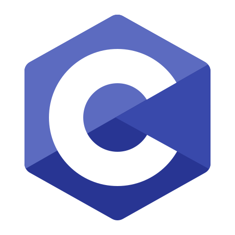
  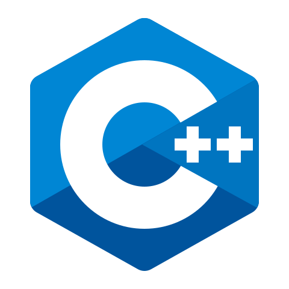
  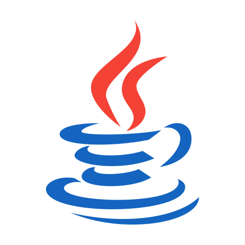  
  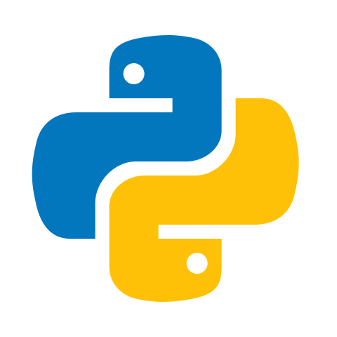  
  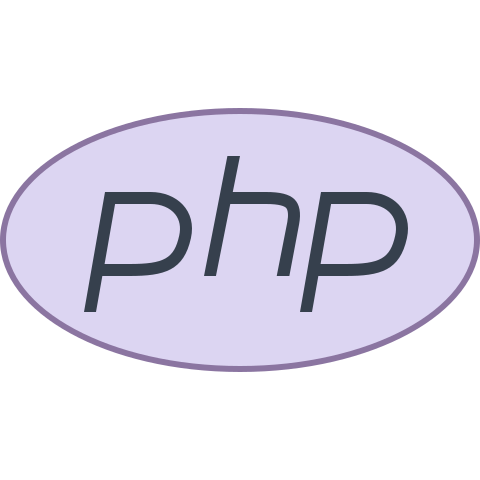  
     
  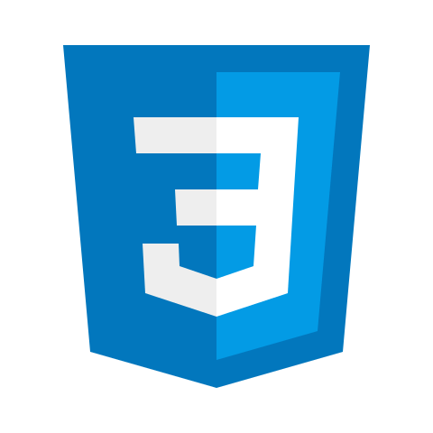    
  
  
  
   
   
  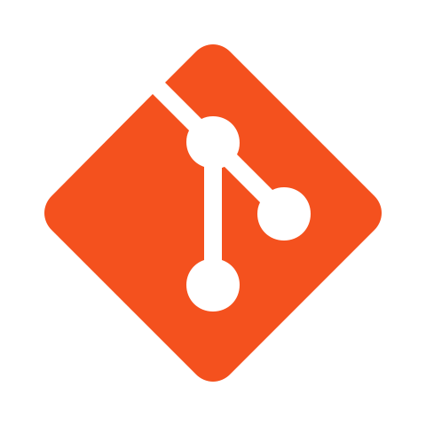
  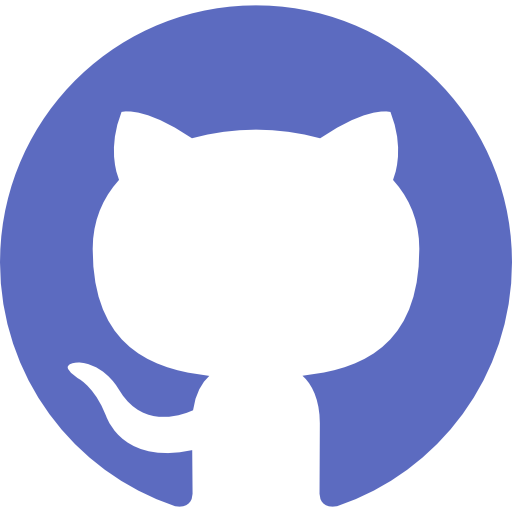
  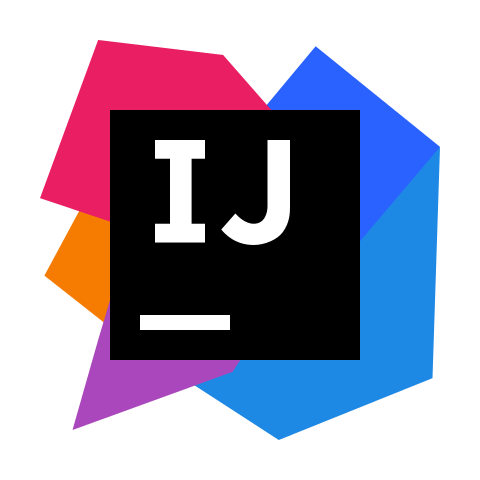
  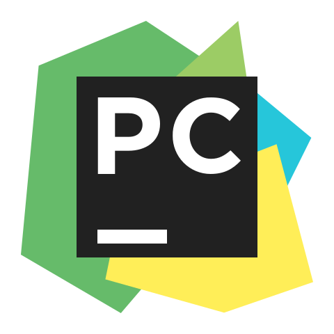
   
  
  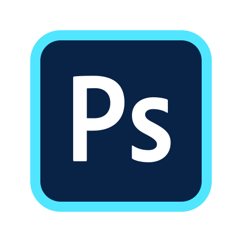 

<!-- End Programming Languages Icon -->

 

<!-- A guy is programming gif -->
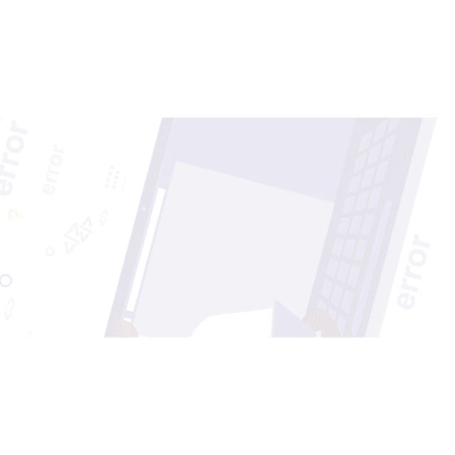

 

<h2 align="left">✍ 𝐒𝐨𝐦𝐞 𝐖𝐨𝐫𝐝 𝐀𝐛𝐨𝐮𝐭 𝐌𝐞</h2>

 

   Practical and versatile Software Engineer with significant experience in developing software and websites. I can handle multiple tasks daily. I use a creative approach to solve problems. I am a dependable person who is great at time management. I am always energetic and eager to learn new skills. 

 

<!-- Start My Resume Section -->
<!-- Start Details -->

<b> 📑  My Resume </b>

 
 
 

<h2 align="center"><a href="https://github.com/montasim/DoNotDelete/raw/main/resume/Resume_of_Montasim.pdf"> Ｄｏｗｎｌｏａｄ Ｍｙ Ｒｅｓｕｍｅ </a></h2>

 
 

<!-- Start My Resume -->
<!-- Montasim's Photo -->

<h2 align="left"> Mohammad Montasim -Al- Mamun Shuvo
  <h3> Developer and Designer </h3> </h2>
	
 

<!-- Start Links -->

<b> Address: </b> Address: Balapara, 20 Mega Watt, Rangpur Sadar, Rangpur, Bangladesh
 
<b> Email: </b> <a href="montasimmamun@gmail.com"> montasimmamun@gmail.com</a>
 
<b> Portfolio: </b> <a href="https://montasim.github.io"> montasim.github.io </a>
 
<b> Mobile: </b> <a href="+8801722815469"> +8801722815469 </a>
 
<b> GitHub: </b> <a href="https://github.com/montasim"> github.com/montasim </a>

<!-- End Links -->

 
 

<!-- Start Career Objective -->
<h2 align="left"> Career Objective: </h2>

   Practical and versatile Software Engineer with significant experience in developing software and websites. I can handle multiple tasks daily. I use a creative approach to solve problems. I am a dependable person who is great at time management. I am always energetic and eager to learn new skills. 

<!-- End Career Objective -->

 
 

<!-- Start Academic Qualification Summery -->
<h2 align="left"> Academic Qualification: </h2>
<table align="center">
    <thead>
        <tr>
            <th align="left"><b> Exam Title </b></th>
	        <th align="left"><b> Concentration / Major </b></th>
            <th align="left"><b> Institute </b></th>
            <th align="left"><b> Result </b></th>
            <th align="left"><b> Passing Year </b></th>
        </tr>
    </thead>
    <tbody>
        <tr>
            <td align="left"> Bachelor of Science (B. Sc.) </td>
            <td align="left"> Computer Science & Engineering </td>
            <td align="left"> Bangladesh Army University of Science and Technology </td>
            <td align="left"> 2.96 </td>
            <td align="left"> 2021 </td>
        </tr>
        <tr>
            <td align="left"> HSC </td>
            <td align="left"> Science </td>
            <td align="left"> Carmichael College Rangpur </td>
            <td align="left"> 4.58 </td>
            <td align="left"> 2016 </td>
        </tr>
        <tr>
            <td align="left"> SSC </td>
            <td align="left"> Science </td>
            <td align="left"> Rangpur Zilla School </td>
            <td align="left"> 5.00 </td>
            <td align="left"> 2014 </td>
        </tr>
    </tbody>
</table>
<!-- End Academic Qualification Summery -->          
                                    
 
 

<!-- Start Undergraduate Thesis and Project --> 
<h2 align="left"> Undergraduate Thesis and Project: </h2>

 Hand pose estimation in single RGB image with Multiview Bootstrapping. 
 

- Deep Learning, OpenCV, Convolutional Neural Network (CNN), Python 

<!-- End Undergraduate Thesis and Project --> 

 
 

<!-- Start Career and Application Information --> 
<h2 align="left"> Career and Application Information: </h2>

 Preferred Job Category : Engineer, IT, Telecommunication, Design, Creative 
 
Looking For : Entry Level Job 
 
Available For : Full Time 
 
Preferred District : Dhaka, Rangpur 
 
Preferred Organization Types : Software Company 

<!-- End Career and Application Information --> 

 
 

<!-- Start Specialization --> 
<h2 align="left"> Specialization: </h2>
<table align="center">
    <thead>
        <tr>
        <th align="center"><b> Fields of Specialization </b></th>
	    <th align="center"><b> Description </b></th>
        </tr>
    </thead>
    <tbody>
        <tr>
            <td align="left"> C Programming 
              C++ Programming 
              Java Programming 
              Python Programming 
              HTML5 & CSS3 
              Bootstrap, Tailwind CSS 
              Word Press, Blogger 
              SQLite 
              LaTeX 
              Git, GitHub 
              Leadership, Time Management 
            </td>
            <td align="left">
 01. Programming Languages: C, C++, JAVA, Python, PHP, SQL 
              02. Web Frameworks: Django, Flask, PyGame, Bootstrap, Tailwind CSS 
              03. Web Technologies: PHP, HTML, CSS, XML, Markdown 
              04. Content Management System (CMS): Word Press, Blogger 
              05. Databases: SQL Server, MySQL, SQLite 
              06. Toolkits: LaTeX 
              07. Version Control: Git, GitHub 
              08. Soft Skills: Leadership, Time Management 
 
            </td>
        </tr>
    </tbody>
</table>
<!-- End Specialization --> 

 

<!-- Start Language Proficiency --> 
<h2 align="left"> Language Proficiency: </h2>
<table align="center">
    <thead>
        <tr>
            <th align="center"><b> Language </b></th>
	        <th align="center"><b> Reading </b></th>
            <th align="center"><b> Writing </b></th>
            <th align="center"><b> Speaking </b></th>
        </tr>
    </thead>
    <tbody>
        <tr>
            <td align="left"> English </td>
            <td align="left"> High </td>
            <td align="left"> High </td>
            <td align="left"> High </td>
        </tr>
        <tr>
            <td align="left"> Bangla </td>
            <td align="left"> High </td>
            <td align="left"> High </td>
            <td align="left"> High </td>
        </tr>
    </tbody>
</table>
<!-- End Language Proficiency --> 

 
 

<!-- Start Training, Participation and Certification --> 
<h2 align="left"> Training, Participation and Certification: </h2>

[//]: # "Trainging and Participation summery"

- <a href="#"> Mobile Game And Application Development For Android - at ICT Division of Bangladesh </a>
- <a href="#"> PLC Training Course - at BAUST </a>
- <a href="https://www.udemy.com/certificate/UC-9SJEY17Z/"> The Complete C Programming Tutorial - at Udemy online course </a>
- <a href="https://www.udemy.com/certificate/UC-4c1e3560-c268-4c37-87c3-b3e1235b67f2/"> C++ Development Tutorial Series - The Complete Coding Guide - at Udemy online course </a>
- <a href="https://www.udemy.com/certificate/UC-57c8fb24-5d8a-450b-9001-76c2dfac993b/"> Learn C++ Programming Mini Course - Power of Animation - at Udemy online course </a>
- <a href="https://www.udemy.com/certificate/UC-77OW1SDX/"> HTML5 Coding from Scratch - Build Your Own Website - at Udemy online course</a>
- <a href="https://www.coursera.org/account/accomplishments/certificate/DKL6A3KTYL34"> Position Elements on a Page with CSS - at Coursera online course</a>
- <a href="https://www.coursera.org/account/accomplishments/certificate/5XKX3V74MZA6"> Git + GitHub for Open Source Collaboration - at Coursera online course </a>
- <a href="https://www.coursera.org/account/accomplishments/certificate/HHS3XUAFQWZU"> Use Commands and Create a Remote Git Repository - at Coursera online course </a>
<!-- End Training, Participation and Certification --> 

 
 

<!-- Start Extra Curricular Activities -->
<h2 align="left"> Extra Curricular Activities: </h2>

- <h3> Ex. Cadet, second best cadet of Mohasthan Regiment at Bangladesh National Cadet Corps (BNCC) </h3>
   
- <h3> Event Organizer at Rangpur Zilla School </h3>
<!-- End Extra Curricular Activities -->    

 
 

<!-- Start Personal Details -->
<h2 align="left"> Personal Details: </h2>

- <h3> Father's Name : MD. Hafizar Rahman </h3>
- <h3> Mother's Name : MST. Majida Begum Date of
- <h3> Birth : December 16, 1998 
- <h3> Nationality : Bangladeshi 
- <h3> Blood Group : B+ 
- <h3> Religion : Islam 
- <h3> Permanent Address : Balapara, 20 Mega Watt, Rangpur Sadar, Rangpur </h3>
<!-- End Personal Details -->    
 
 
 

<!-- Start Reference (s) -->
<h2 align="left"> Reference (s): </h2>
<table align="center">
    <thead>
        <tr>
            <th align="left"><b></b></th>
	        <th align="left"><b> Reference: 01 </b></th>
            <th align="left"><b> Reference: 02 </b></th>
        </tr>
    </thead>
    <tbody>
        <tr>
            <td align="left"><b> Name </b></td>
            <td align="left"> Professor Dr. Md. Mamunur Rashid </td>
            <td align="left"> Abu Saleh Musa Miah </td>
        </tr>
        <tr>
            <td align="left"><b> Organization </b></td>
            <td align="left"> BAUST </td>
            <td align="left"> BAUST </td>
        </tr>
        <tr>
            <td align="left"><b> Designation </b></td>
            <td align="left"> Dean, Faculty of ECE </td>
            <td align="left"> Lecturer </td>
        </tr>
        <tr>
            <td align="left"><b> Address </b></td>
            <td align="left"> Saidpur Cantonment, Saidpur, Bangladesh </td>
            <td align="left"> Saidpur Cantonment, Saidpur, Bangladesh </td>
        </tr>
        <tr>
            <td align="left"><b> Mobile </b></td>
            <td align="left">  +8801769675558 </td>
            <td align="left"> +8801734264899 </td>
        </tr>
        <tr>
            <td align="left"><b> Email </b></td>
            <td align="left"> hdcse@baust.edu.bd </td>
            <td align="left"> abusalehcse.ru@gmail.com </td>
        </tr>
        <tr>
            <td align="left"><b> Relation </b></td>
            <td align="left"> Academic </td>
            <td align="left"> Academic </td>
        </tr>
    </tbody>
</table>
<!-- End Reference (s) -->
<!-- End My Resume -->                 

<!-- End Details -->
<!-- End My Resume Section -->

<!-- Start 𝙲𝚘𝚗𝚗𝚎𝚌𝚝 𝚆𝚒𝚝𝚑 𝙼𝚎 Section --> 

    <b>📩  𝙲𝚘𝚗𝚗𝚎𝚌𝚝 𝚆𝚒𝚝𝚑 𝙼𝚎</b>

	
 
 

<!-- 𝙲𝚘𝚗𝚗𝚎𝚌𝚝 𝚆𝚒𝚝𝚑 𝙼𝚎 -->
<h2 align="right"><b> 🔸 Ｆｉｎｄ Ｍｅ Ｏｎ Ｓｏｃｉａｌ Ｍｅｄｉａ  </b></h2>

<!-- handshake gif -->

 
 
 
 

<!-- Start Social Links -->
<table align="right">
    <thead>
        <tr>
            <th align="center"></th>
	    <th align="center"></th>
            <th align="center"><a href="https://stackoverflow.com/users/10429621/coderaid">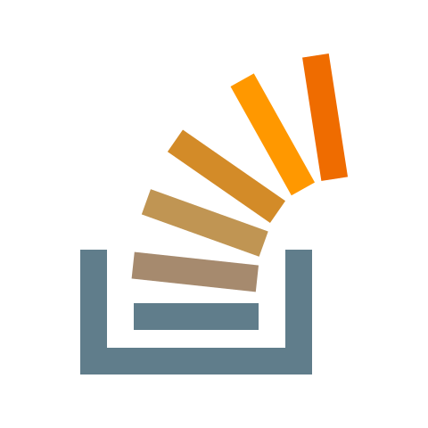</a></th>
            <th align="center"></th>
            <th align="center"></th>
            <th align="center"></th>
            <th align="center"></th>
            <th align="center"></th>
        </tr>
    </thead>
</table>
<!-- End Social Links -->
 
 
 
 
 

<!-- End 𝙲𝚘𝚗𝚗𝚎𝚌𝚝 𝚆𝚒𝚝𝚑 𝙼𝚎 Section --> 

 

<!-- Start Talking About Personal Stuffs -->
<!-- Webpage scrolling gif -->

 

<h2 align="left">💥 𝐓𝐚𝐥𝐤𝐢𝐧𝐠 𝐀𝐛𝐨𝐮𝐭 𝐏𝐞𝐫𝐬𝐨𝐧𝐚𝐥 𝐒𝐭𝐮𝐟𝐟𝐬</h2>

-  ɪ ᴀᴍ ᴀ ᴘʀᴏɢʀᴀᴍᴍᴇʀ, ᴅᴇᴠᴇʟᴏᴘᴇʀ, ᴡʀɪᴛᴇʀ, ᴀɴᴅ ʟᴇᴀʀɴᴇʀ.
-  ɪ ʟᴏᴠᴇ ᴛᴏ ꜱᴏʟᴠᴇ ᴄᴏᴅɪɴɢ ᴘʀᴏʙʟᴇᴍꜱ.
-  ɪ ᴜꜱᴜᴀʟʟʏ ᴡᴏʀᴋ ᴏɴ ᴠᴀʀɪᴏᴜꜱ ᴛʜɪɴɢꜱ.
-  ɪ ʟᴇᴀʀɴ ᴇᴠᴇʀʏᴛʜɪɴɢ ɪ ꜰɪɴᴅ ɪɴᴛᴇʀᴇꜱᴛɪɴɢ.
-  ᴀꜱᴋ ᴍᴇ ᴀʙᴏᴜᴛ ᴀɴʏᴛʜɪɴɢ. ɪ ᴀᴍ ʜᴀᴘᴘʏ ᴛᴏ ʜᴇʟᴘ.
<!-- End Talking About Personal Stuffs -->

 
 

<!-- Start My Absolute Favourites -->
<!-- Scrolling in laptop gif -->

 
 

<h2 align="left">⚡ 𝐌𝐲 𝐀𝐛𝐬𝐨𝐥𝐮𝐭𝐞 𝐅𝐚𝐯𝐨𝐫𝐢𝐭𝐞𝐬</h2>

- 𝙸 𝚕𝚒𝚔𝚎 𝚙𝚕𝚊𝚢𝚒𝚗𝚐 𝚐𝚊𝚖𝚎𝚜.
- 𝚂𝚙𝚎𝚗𝚍 𝚊 𝚍𝚊𝚢 𝚝𝚘 𝚏𝚒𝚗𝚍 𝚊 𝚙𝚛𝚘𝚋𝚕𝚎𝚖 𝚊𝚗𝚍 𝚝𝚑𝚎𝚗 𝚏𝚒𝚡 𝚒𝚝 𝚠𝚒𝚝𝚑 𝚕𝚎𝚜𝚜 𝚎𝚏𝚏𝚘𝚛𝚝 𝚝𝚑𝚊𝚗 𝚏𝚒𝚗𝚍𝚒𝚗𝚐.
- 𝙸 𝚕𝚘𝚟𝚎 𝚛𝚎𝚊𝚍𝚒𝚗𝚐 𝚋𝚘𝚘𝚔𝚜.
<!-- End My Absolute Favourites -->

 
 
 
 
 

<!-- Start My Github Stats -->
<h2 align="center">💦 𝐌𝐲 𝐆𝐢𝐭𝐇𝐮𝐛 𝐒𝐭𝐚𝐭𝐬</h2>

 

<!-- Start Montasim's github readme stats -->

  
  
  
  

<!-- End Montasim's github readme stats -->

 
 

<h3 align="center">😊 𝙸 𝚕𝚘𝚟𝚎 𝚌𝚘𝚗𝚗𝚎𝚌𝚝𝚒𝚗𝚐 𝚠𝚒𝚝𝚑 𝚍𝚒𝚏𝚏𝚎𝚛𝚎𝚗𝚝 𝚙𝚎𝚘𝚙𝚕𝚎 𝚊𝚛𝚘𝚞𝚗𝚍 𝚝𝚑𝚎 𝚠𝚘𝚛𝚕𝚍. 𝙵𝚎𝚎𝚕 𝚏𝚛𝚎𝚎 𝚝𝚘 𝚛𝚎𝚊𝚌𝚑 𝚘𝚞𝚝 𝚊𝚗𝚍 𝚒𝚗𝚝𝚛𝚘𝚍𝚞𝚌𝚎 𝚢𝚘𝚞𝚛𝚜𝚎𝚕𝚏. (𝙳𝚘𝚗'𝚝 𝚓𝚞𝚜𝚝 𝚜𝚊𝚢 𝚑𝚒, 𝚝𝚎𝚕𝚕 𝚖𝚎 𝚊𝚋𝚘𝚞𝚝 𝚢𝚘𝚞𝚛𝚜𝚎𝚕𝚏.)  💜</h3>

 

<!-- Working server gif -->

  

<h3 align="center">𝚂𝚑𝚘𝚠 𝚜𝚘𝚖𝚎  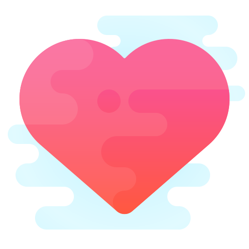 𝚋𝚢 𝚜𝚝𝚊𝚛𝚛𝚒𝚗𝚐 𝚜𝚘𝚖𝚎 𝚘𝚏 𝚝𝚑𝚎 𝚛𝚎𝚙𝚘𝚜𝚒𝚝𝚘𝚛𝚒𝚎𝚜. 𝙵𝚎𝚎𝚕 𝚏𝚛𝚎𝚎 𝚝𝚘 𝚐𝚒𝚟𝚎 𝚈𝚘𝚞𝚛 𝚂𝚞𝚐𝚐𝚎𝚜𝚝𝚒𝚘𝚗𝚜, 𝙸𝚜𝚜𝚞𝚎𝚜 𝚘𝚛 𝙿𝚁𝚜.</h3>

 
 

<!-- Start 𝙼𝚘𝚛𝚎 𝚂𝚝𝚞𝚏𝚏 𝙰𝚋𝚘𝚞𝚝 𝙼𝚎 Section -->

	<b> 💡 𝙼𝚘𝚛𝚎 𝚂𝚝𝚞𝚏𝚏 𝙰𝚋𝚘𝚞𝚝 𝙼𝚎 </b>

	
 
 
	
[//]: # "Man developing web gif"

 
 
 
 
 

<h2 align="left"> 📣 What I do </h2>

	I do Open Source. In fact, I do Open Source so much, that majority of my work on
	GitHub is free and open to everyone. I am really passionate about doing web
	development. It is in my opinion the best combination of logical programming and
	(sometimes) beautiful design.

 
 
 
 
 
 

<!-- My Specifications section -->
<h2 align="center"><b> 💻 My Specifications </b></h2>
<table align="center">
    <thead>
        <tr>
            <th align="center"><b>Name \ Familiarity</b></th>
            <th align="center"><b>High</b></th>
            <th align="center"><b>Medium</b></th>
            <th align="center"><b>Low</b></th>
        </tr>
    </thead>
    <tbody>
        <tr>
            <td align="left"><b>Programming Languages</b></td>
            <td align="left">Python</td>
            <td align="left">C, C++, PHP</td>
            <td align="left">Java, JavaScript</td>
        </tr>
    </tbody>
    <tbody>
        <tr>
            <td align="left"><b>Web Technologies</b></td>
            <td align="left">HTML, CSS</td>
            <td align="left">Markdown</td>
            <td align="left">XML</td>
        </tr>
    </tbody>
    <tbody>
        <tr>
            <td align="left"><b>Web Frameworks</b></td>
            <td align="left">Bootstrap, Django</td>
            <td align="left">Flask</td>
            <td align="left">TailWind CSS</td>
        </tr>
    </tbody>
    <tbody>
        <tr>
            <td align="left"><b>Web Creation Platforms</b></td>
            <td align="left">WordPress, Blogger</td>
            <td align="left">Wix</td>
            <td align="left"></td>
        </tr>
    </tbody><tbody>
        <tr>
            <td align="left"><b>Database</b></td>
            <td align="left">MySQL</td>
            <td align="left">SqlLite</td>
            <td align="left"></td>
        </tr>
    </tbody>
    <tbody>
        <tr>
            <td align="left"><b>Version Control</b></td>
            <td align="left">Git, Github</td>
            <td align="left"></td>
            <td align="left"></td>
        </tr>
    </tbody>
    <tbody>
        <tr>
            <td align="left"><b>Operating System</b></td>
            <td align="left">Windows, Ubuntu</td>
            <td align="left">Fedora, RedHat, Debian</td>
            <td align="left">Linux Mint, Kali Linux</td>
        </tr>
    </tbody>
    <tbody>
        <tr>
            <td align="left"><b>Languages</b></td>
            <td align="left">English (Native), Bangla (Native)</td>
            <td align="left">Hindi</td>
            <td align="left">Arabic</td>
        </tr>
    </tbody>
    <tbody>
        <tr>
            <td align="left"><b>Other interests</b></td>
            <td align="left">Reading Books</td>
            <td align="left">Playing Games, Watching Movies</td>
            <td align="left">Sports</td>
        </tr>
    </tbody>
</table>
 
<!-- end work experience section -->

 

[//]: # "Development process gif"

  

 
 

<!-- My Work Experience -->
<h2 align="center"><b> ⌚ My Work Experience </b></h2>
<table align="center">
    <thead>
        <tr>
            <th align="center"><b>Job Name</b></th>
	    <th align="center"><b>Job Place</b></th>
            <th align="center"><b>Roles & responsibilities</b></th>
            <th align="center"><b>Duration</b></th>
            <th align="center"><b>Job Profile</b></th>
        </tr>
    </thead>
    <tbody>
        <tr>
            <td align="left"><b>Problem Solver</b></td>
            <td align="left">HackerRank</td>
            <td align="left">Problem Solver</td>
            <td align="left">2018 - Present</td>
            <td align="left"><a href="https://www.hackerrank.com/montasim">hackerrank.com/montasim</a></td>
        </tr>
    </tbody>
</table>
 
<!-- end My Work Experience -->

 

[//]: # "Laptop app development gif"

  

 
 

<!-- Projects I'm the most proud of -->
<h2 align="center"><b> 📌 Projects I'm The Most Proud Of </b></h2>
<table align="center">
    <thead>
        <tr>
            <th align="center"><b>Name</b></th>
	    <th align="center"><b>Description</b></th>
            <th align="center"><b>Language</b></th>
            <th align="center"><b>Repo</b></th>
        </tr>
    </thead>
    <tbody>
        <tr>
            <td align="left"></td>
            <td align="left"></td>
            <td align="left"></td>
            <td align="left"></td>
        </tr>
    </tbody>
    <tbody>
        <tr>
            <td align="left"></td>
            <td align="left"></td>
            <td align="left"></td>
            <td align="left"></td>
        </tr>
    </tbody>
    <tbody>
        <tr>
            <td align="left"></td>
            <td align="left"></td>
            <td align="left"></td>
            <td align="left"></td>
        </tr>
    </tbody>
    <tbody>
        <tr>
            <td align="left"></td>
            <td align="left"></td>
            <td align="left"></td>
            <td align="left"></td>
        </tr>
    </tbody>
</table>
 
<!-- end Projects I'm the most proud of -->

 

<!-- My own dictionary  -->
<h2 align="center"><b> ⚠️ My Own Dictionary  </b></h2>
<table align="center">
    <thead>
        <tr>
            <th align="center"><b>Word / Abreviation</b></th>
	    <th align="center"><b>Meaning</b></th>
            <th align="center"><b>Note</b></th>
        </tr>
    </thead>
    <tbody>
        <tr>
            <td align="left"></td>
            <td align="left"></td>
            <td align="left"></td>
        </tr>
    </tbody>
</table>
 
<!-- end My own dictionary  -->

 
 

[//]: # "Trainging and Participation heading"

<h2 align="left"> 🏅 Trainging and Participation </h2>

[//]: # "Trainging and Participation summery"

- <a href="#">𝙼𝚘𝚋𝚒𝚕𝚎 𝙶𝚊𝚖𝚎 𝙰𝚗𝚍 𝙰𝚙𝚙𝚕𝚒𝚌𝚊𝚝𝚒𝚘𝚗 𝙳𝚎𝚟𝚎𝚕𝚘𝚙𝚖𝚎𝚗𝚝 𝙵𝚘𝚛 𝙰𝚗𝚍𝚛𝚘𝚒𝚍 - 𝚊𝚝 𝙸𝙲𝚃 𝙳𝚒𝚟𝚒𝚜𝚒𝚘𝚗 𝚘𝚏 𝙱𝚊𝚗𝚐𝚕𝚊𝚍𝚎𝚜𝚑</a>
- <a href="#">𝙿𝙻𝙲 𝚃𝚛𝚊𝚒𝚗𝚒𝚗𝚐 𝙲𝚘𝚞𝚛𝚜𝚎 - 𝚊𝚝 𝙱𝙰𝚄𝚂𝚃</a>
- <a href="https://www.udemy.com/certificate/UC-9SJEY17Z/">𝚃𝚑𝚎 𝙲𝚘𝚖𝚙𝚕𝚎𝚝𝚎 𝙲 𝙿𝚛𝚘𝚐𝚛𝚊𝚖𝚖𝚒𝚗𝚐 𝚃𝚞𝚝𝚘𝚛𝚒𝚊𝚕 - 𝚊𝚝 𝚄𝚍𝚎𝚖𝚢 𝚘𝚗𝚕𝚒𝚗𝚎 𝚌𝚘𝚞𝚛𝚜𝚎</a>
- <a href="https://www.udemy.com/certificate/UC-4c1e3560-c268-4c37-87c3-b3e1235b67f2/">𝙲++ 𝙳𝚎𝚟𝚎𝚕𝚘𝚙𝚖𝚎𝚗𝚝 𝚃𝚞𝚝𝚘𝚛𝚒𝚊𝚕 𝚂𝚎𝚛𝚒𝚎𝚜, 𝚃𝚑𝚎 𝙲𝚘𝚖𝚙𝚕𝚎𝚝𝚎 𝙲𝚘𝚍𝚒𝚗𝚐 𝙶𝚞𝚒𝚍𝚎 - 𝚊𝚝 𝚄𝚍𝚎𝚖𝚢 𝚘𝚗𝚕𝚒𝚗𝚎 𝚌𝚘𝚞𝚛𝚜𝚎</a>
- <a href="https://www.udemy.com/certificate/UC-57c8fb24-5d8a-450b-9001-76c2dfac993b/">𝙻𝚎𝚊𝚛𝚗 𝙲++ 𝙿𝚛𝚘𝚐𝚛𝚊𝚖𝚖𝚒𝚗𝚐 𝙼𝚒𝚗𝚒 𝙲𝚘𝚞𝚛𝚜𝚎, 𝙿𝚘𝚠𝚎𝚛 𝚘𝚏 𝙰𝚗𝚒𝚖𝚊𝚝𝚒𝚘𝚗 - 𝚊𝚝 𝚄𝚍𝚎𝚖𝚢 𝚘𝚗𝚕𝚒𝚗𝚎 𝚌𝚘𝚞𝚛𝚜𝚎</a>
- <a href="https://www.udemy.com/certificate/UC-77OW1SDX/">𝙷𝚃𝙼𝙻𝟻 𝙲𝚘𝚍𝚒𝚗𝚐 𝚏𝚛𝚘𝚖 𝚂𝚌𝚛𝚊𝚝𝚌𝚑 - 𝙱𝚞𝚒𝚕𝚍 𝚈𝚘𝚞𝚛 𝙾𝚠𝚗 𝚆𝚎𝚋𝚜𝚒𝚝𝚎 - 𝚊𝚝 𝚄𝚍𝚎𝚖𝚢 𝚘𝚗𝚕𝚒𝚗𝚎 𝚌𝚘𝚞𝚛𝚜𝚎</a>
- <a href="https://www.coursera.org/account/accomplishments/certificate/DKL6A3KTYL34">𝙿𝚘𝚜𝚒𝚝𝚒𝚘𝚗 𝙴𝚕𝚎𝚖𝚎𝚗𝚝𝚜 𝚘𝚗 𝚊 𝙿𝚊𝚐𝚎 𝚠𝚒𝚝𝚑 𝙲𝚂𝚂 - 𝚊𝚝 𝙲𝚘𝚞𝚛𝚜𝚎𝚛𝚊 𝚘𝚗𝚕𝚒𝚗𝚎 𝚌𝚘𝚞𝚛𝚜𝚎</a>
- <a href="https://www.coursera.org/account/accomplishments/certificate/5XKX3V74MZA6">𝙶𝚒𝚝 + 𝙶𝚒𝚝𝙷𝚞𝚋 𝚏𝚘𝚛 𝙾𝚙𝚎𝚗 𝚂𝚘𝚞𝚛𝚌𝚎 𝙲𝚘𝚕𝚕𝚊𝚋𝚘𝚛𝚊𝚝𝚒𝚘𝚗 - 𝚊𝚝 𝙲𝚘𝚞𝚛𝚜𝚎𝚛𝚊 𝚘𝚗𝚕𝚒𝚗𝚎 𝚌𝚘𝚞𝚛𝚜𝚎</a>
- <a href="https://www.coursera.org/account/accomplishments/certificate/HHS3XUAFQWZU">𝚄𝚜𝚎 𝙲𝚘𝚖𝚖𝚊𝚗𝚍𝚜 𝚊𝚗𝚍 𝙲𝚛𝚎𝚊𝚝𝚎 𝚊 𝚁𝚎𝚖𝚘𝚝𝚎 𝙶𝚒𝚝 𝚁𝚎𝚙𝚘𝚜𝚒𝚝𝚘𝚛𝚢 - 𝚊𝚝 𝙲𝚘𝚞𝚛𝚜𝚎𝚛𝚊 𝚘𝚗𝚕𝚒𝚗𝚎 𝚌𝚘𝚞𝚛𝚜𝚎</a>
- <a href="https://www.hackerrank.com/montasim">𝙶𝚘𝚘𝚐𝚕𝚎 𝙰𝚍𝚟𝚊𝚗𝚌𝚎𝚍 𝚂𝚎𝚊𝚛𝚌𝚑: 𝙵𝚒𝚗𝚍 𝚂𝚝𝚞𝚏𝚏 𝙻𝚒𝚔𝚎 𝚊 𝙱𝚘𝚜𝚜 - 𝚊𝚝 𝚄𝚍𝚎𝚖𝚢 𝚘𝚗𝚕𝚒𝚗𝚎 𝚌𝚘𝚞𝚛𝚜𝚎</a>
- <a href="https://www.coursera.org/account/accomplishments/certificate/CC7F3ETBKK8U">𝙲𝚘𝚖𝚖𝚊𝚗𝚍 𝙻𝚒𝚗𝚎 𝚒𝚗 𝙻𝚒𝚗𝚞𝚡 - 𝚊𝚝 𝙲𝚘𝚞𝚛𝚜𝚎𝚛𝚊 𝚘𝚗𝚕𝚒𝚗𝚎 𝚌𝚘𝚞𝚛𝚜𝚎</a>
- <a href="https://www.udemy.com/certificate/UC-91b6cfe1-6f98-40ec-a1b1-2f5a1714f637/">𝙻𝚎𝚊𝚛𝚗 𝚆𝚒𝚗𝚍𝚘𝚠𝚜 𝙲𝚘𝚖𝚖𝚊𝚗𝚍 𝙻𝚒𝚗𝚎 - 𝚊𝚝 𝚄𝚍𝚎𝚖𝚢 𝚘𝚗𝚕𝚒𝚗𝚎 𝚌𝚘𝚞𝚛𝚜𝚎</a>

 
 

<!-- Office Yoga gif -->

 
 
 

<!-- 𝚃𝚑𝚒𝚗𝚐𝚜 𝙸 𝚄𝚜𝚎 𝚃𝚘 𝙶𝚎𝚝 𝚂𝚝𝚞𝚏𝚏 𝙳𝚘𝚗𝚎 heading -->

<h2 align="left"> ⚙️ 𝚃𝚑𝚒𝚗𝚐𝚜 𝙸 𝚄𝚜𝚎 </h2>

[//]: # "𝚃𝚑𝚒𝚗𝚐𝚜 𝙸 𝚄𝚜𝚎 𝚃𝚘 𝙶𝚎𝚝 𝚂𝚝𝚞𝚏𝚏 𝙳𝚘𝚗𝚎 notes"

- <b>𝙻𝚊𝚙𝚝𝚘𝚙: </b> 𝙰𝚂𝚄𝚂 𝚇𝟺𝟻𝟼𝚄𝚀 (𝙸𝚗𝚝𝚎𝚕® 𝙲𝚘𝚛𝚎™ 𝚒𝟻)
- <b>𝙱𝚛𝚘𝚠𝚜𝚎𝚛: </b> 𝙶𝚘𝚘𝚐𝚕𝚎 𝙲𝚑𝚛𝚘𝚖𝚎
- <b>𝙲𝚘𝚍𝚎 𝙴𝚍𝚒𝚝𝚘𝚛:</b> 𝚅𝚒𝚜𝚞𝚊𝚕 𝚂𝚝𝚞𝚍𝚒𝚘 𝙲𝚘𝚍𝚎
- <b>𝙾𝚙𝚎𝚛𝚊𝚝𝚒𝚗𝚐 𝚂𝚢𝚜𝚝𝚎𝚖:</b> 𝚆𝚒𝚗𝚍𝚘𝚠𝚜 𝟷𝟶
- <b>𝚃𝚘 𝚂𝚝𝚊𝚢 𝚄𝚙𝚍𝚊𝚝𝚎𝚍:</b> <a href="https://www.linkedin.com/in/montasim">𝙻𝚒𝚗𝚔𝚎𝚍𝙸𝚗</a>, <a href="https://www.github.com/montasim">𝙶𝚒𝚝𝙷𝚞𝚋</a>

 
 
 
 
 

<!-- dancing heart gif -->

 
 
 
 

<h2 align="left"> 🔌 Website I Use Causualy </h2>

<b> My website has quite a few of them. Here's a list of the public ones. </b>

- [noobtrack.blogspot.com](https://noobtrack.blogspot.com/) - This is my own cracked apps download website.
- [download.trnck.dev](http://download.trnck.dev) - download some important
  assets, which I personally use
- [qr.trnck.dev](https://qr.trnck.dev) - create a QR code in 2 seconds

 
 
 
 
 
 
 
 

<!-- gitwar profile score -->

    

 
 

<!-- More --> 
<!-- Start More Section -->  

    <b> More </b>

	
 
 

[//]: # "hello world gif"

    

 
 

<!-- End More Section --> 

<!-- End 𝙼𝚘𝚛𝚎 𝚂𝚝𝚞𝚏𝚏 𝙰𝚋𝚘𝚞𝚝 𝙼𝚎 Section -->

<!-- Start 𝙼𝚢 𝚂𝚝𝚊𝚝𝚒𝚜𝚝𝚒𝚌𝚜 Section --> 

    <b> 📌 𝙼𝚢 𝚂𝚝𝚊𝚝𝚒𝚜𝚝𝚒𝚌𝚜 </b>

	
 

<h2 align="center"> Github Trophies </h2>  

 

<!-- Github Trophies -->

  

<!-- Github Readme Streak -->

  

<!-- Github Metrics --> 

  

 

<!-- End 𝙼𝚢 𝚂𝚝𝚊𝚝𝚒𝚜𝚝𝚒𝚌𝚜 Section --> 

 
 
 

<!-- Wave svg --> 

  

 
 

<!-- Copyright --> 

    &copy; ᴍᴀᴅᴇ ʙʏ <a href="https://montasim.github.io/" target="_blank"> ᴇɴɢɪɴᴇᴇʀ Ｍｏｎｔａｓｉｍ</a>

 

