<!--
    Mohammad Montasim Al Mamun Shuvo — GitHub Profile README
    Hand-crafted SVGs with dual-theme support via <picture> + prefers-color-scheme.
    No generators. No shields.io. No stat cards.
-->

<!-- Hero Section -->
<picture>
  <source media="(prefers-color-scheme: dark)" srcset="assets/hero-dark.svg" />
  <source media="(prefers-color-scheme: light)" srcset="assets/hero-light.svg" />
  
</picture>

  

<!-- Contact & Social Badges -->

  <a href="https://montasim.vercel.app"><picture><source media="(prefers-color-scheme: dark)" srcset="assets/badge-portfolio-dark.svg" /><source media="(prefers-color-scheme: light)" srcset="assets/badge-portfolio-light.svg" /></picture></a><a href="https://www.linkedin.com/in/montasim"><picture><source media="(prefers-color-scheme: dark)" srcset="assets/badge-linkedin-dark.svg" /><source media="(prefers-color-scheme: light)" srcset="assets/badge-linkedin-light.svg" /></picture></a><a href="mailto:montasimmamun@gmail.com"><picture><source media="(prefers-color-scheme: dark)" srcset="assets/badge-email-dark.svg" /><source media="(prefers-color-scheme: light)" srcset="assets/badge-email-light.svg" /></picture></a><a href="https://drive.google.com/file/d/1v0RP3PyBB6KdsfXhonIHJXU-wgAUSIRT/view?usp=sharing"><picture><source media="(prefers-color-scheme: dark)" srcset="assets/badge-resume-dark.svg" /><source media="(prefers-color-scheme: light)" srcset="assets/badge-resume-light.svg" /></picture></a>

  

<!-- What I Build Section -->
<picture>
  <source media="(prefers-color-scheme: dark)" srcset="assets/heading-whatibuild-dark.svg" />
  <source media="(prefers-color-scheme: light)" srcset="assets/heading-whatibuild-light.svg" />
  
</picture>
<picture>
  <source media="(prefers-color-scheme: dark)" srcset="assets/divider-dark.svg" />
  <source media="(prefers-color-scheme: light)" srcset="assets/divider-light.svg" />
  
</picture>

I build web platforms that scale. With over [4+ years of experience](https://montasim.vercel.app/#experience), I specialize in building multi-tenant **SaaS** platforms that handle real-time video, biometric assessments, and high-stakes interactions — without breaking. I don't just build features; I design deterministic systems where every state transition is intentional, and every feature toggle is tenant-aware.

**Key highlights:** Boosted React app performance by **40%** and achieved **Lighthouse 90+** scores by eliminating legacy libraries and building custom components. Reduced cloud infrastructure costs by **70%** by migrating **Azure** VMs to App Service with automated **CI/CD** pipelines. Built a real-time **computer vision** pipeline (MediaPipe) with **95%+** production accuracy, featuring adaptive frame rates and multi-person detection.

I design for worst-case scenarios — building [scalable SaaS systems](https://montasim.vercel.app/#skills) with predictable state transitions, resilient lifecycles, and reliable asynchronous workflows. Check out my [projects](https://montasim.vercel.app/#projects) to see it in action.

  

<!-- Featured Work Section -->
<picture>
  <source media="(prefers-color-scheme: dark)" srcset="assets/heading-featuredwork-dark.svg" />
  <source media="(prefers-color-scheme: light)" srcset="assets/heading-featuredwork-light.svg" />
  
</picture>
<picture>
  <source media="(prefers-color-scheme: dark)" srcset="assets/divider-dark.svg" />
  <source media="(prefers-color-scheme: light)" srcset="assets/divider-light.svg" />
  
</picture>

<!-- Project 1: PostCraft -->
<picture>
  <source media="(prefers-color-scheme: dark)" srcset="assets/project-postcraft-dark.svg" />
  <source media="(prefers-color-scheme: light)" srcset="assets/project-postcraft-light.svg" />
  
</picture>

  <a href="https://aipostcraft.vercel.app"><picture><source media="(prefers-color-scheme: dark)" srcset="assets/badge-livedemo-dark.svg" /><source media="(prefers-color-scheme: light)" srcset="assets/badge-livedemo-light.svg" /></picture></a><a href="https://github.com/montasim/linkedIQ"><picture><source media="(prefers-color-scheme: dark)" srcset="assets/badge-source-dark.svg" /><source media="(prefers-color-scheme: light)" srcset="assets/badge-source-light.svg" /></picture></a>

 

<!-- Project 2: DevTools -->
<picture>
  <source media="(prefers-color-scheme: dark)" srcset="assets/project-devtools-dark.svg" />
  <source media="(prefers-color-scheme: light)" srcset="assets/project-devtools-light.svg" />
  
</picture>

  <a href="https://devtoolsn.vercel.app"><picture><source media="(prefers-color-scheme: dark)" srcset="assets/badge-livedemo-dark.svg" /><source media="(prefers-color-scheme: light)" srcset="assets/badge-livedemo-light.svg" /></picture></a><a href="https://github.com/montasim"><picture><source media="(prefers-color-scheme: dark)" srcset="assets/badge-source-dark.svg" /><source media="(prefers-color-scheme: light)" srcset="assets/badge-source-light.svg" /></picture></a>

 

<!-- Project 3: MyMedicalHub -->
<picture>
  <source media="(prefers-color-scheme: dark)" srcset="assets/project-mmh-dark.svg" />
  <source media="(prefers-color-scheme: light)" srcset="assets/project-mmh-light.svg" />
  
</picture>

  <a href="https://montasim.vercel.app/#projects">
    <picture>
      <source media="(prefers-color-scheme: dark)" srcset="assets/link-portfolio-dark.svg" />
      <source media="(prefers-color-scheme: light)" srcset="assets/link-portfolio-light.svg" />
      
    </picture>
  </a>

  

<!-- Tech Stack Section -->
<picture>
  <source media="(prefers-color-scheme: dark)" srcset="assets/heading-techstack-dark.svg" />
  <source media="(prefers-color-scheme: light)" srcset="assets/heading-techstack-light.svg" />
  
</picture>
<picture>
  <source media="(prefers-color-scheme: dark)" srcset="assets/divider-dark.svg" />
  <source media="(prefers-color-scheme: light)" srcset="assets/divider-light.svg" />
  
</picture>

  <!-- Languages -->
  <picture>
    <source media="(prefers-color-scheme: dark)" srcset="assets/stack_badges/category-languages.svg" />
    <source media="(prefers-color-scheme: light)" srcset="assets/stack_badges/category-languages-light.svg" />
  </picture>
   
  <picture>
    <source media="(prefers-color-scheme: dark)" srcset="assets/stack_badges/badge-typescript.svg" />
    <source media="(prefers-color-scheme: light)" srcset="assets/stack_badges/badge-typescript-light.svg" />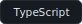
  </picture>
  <picture>
    <source media="(prefers-color-scheme: dark)" srcset="assets/stack_badges/badge-javascript.svg" />
    <source media="(prefers-color-scheme: light)" srcset="assets/stack_badges/badge-javascript-light.svg" />
    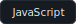
  </picture>
  <picture>
    <source media="(prefers-color-scheme: dark)" srcset="assets/stack_badges/badge-sql.svg" />
    <source media="(prefers-color-scheme: light)" srcset="assets/stack_badges/badge-sql-light.svg" />
    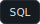
  </picture>
  
    

  <!-- Frontend -->
  <picture>
    <source media="(prefers-color-scheme: dark)" srcset="assets/stack_badges/category-frontend.svg" />
    <source media="(prefers-color-scheme: light)" srcset="assets/stack_badges/category-frontend-light.svg" />
    
  </picture>
   
  <picture>
    <source media="(prefers-color-scheme: dark)" srcset="assets/stack_badges/badge-react.svg" />
    <source media="(prefers-color-scheme: light)" srcset="assets/stack_badges/badge-react-light.svg" />
    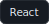
  </picture>
  <picture>
    <source media="(prefers-color-scheme: dark)" srcset="assets/stack_badges/badge-next-js.svg" />
    <source media="(prefers-color-scheme: light)" srcset="assets/stack_badges/badge-next-js-light.svg" />
    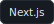
  </picture>
  <picture>
    <source media="(prefers-color-scheme: dark)" srcset="assets/stack_badges/badge-redux-toolkit.svg" />
    <source media="(prefers-color-scheme: light)" srcset="assets/stack_badges/badge-redux-toolkit-light.svg" />
    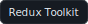
  </picture>
  <picture>
    <source media="(prefers-color-scheme: dark)" srcset="assets/stack_badges/badge-tailwind-css.svg" />
    <source media="(prefers-color-scheme: light)" srcset="assets/stack_badges/badge-tailwind-css-light.svg" />
    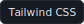
  </picture>
  <picture>
    <source media="(prefers-color-scheme: dark)" srcset="assets/stack_badges/badge-webrtc.svg" />
    <source media="(prefers-color-scheme: light)" srcset="assets/stack_badges/badge-webrtc-light.svg" />
    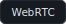
  </picture>

    

  <!-- Backend & Data -->
  <picture>
    <source media="(prefers-color-scheme: dark)" srcset="assets/stack_badges/category-backend.svg" />
    <source media="(prefers-color-scheme: light)" srcset="assets/stack_badges/category-backend-light.svg" />
    
  </picture>
   
  <picture>
    <source media="(prefers-color-scheme: dark)" srcset="assets/stack_badges/badge-node-js.svg" />
    <source media="(prefers-color-scheme: light)" srcset="assets/stack_badges/badge-node-js-light.svg" />
    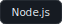
  </picture>
  <picture>
    <source media="(prefers-color-scheme: dark)" srcset="assets/stack_badges/badge-express.svg" />
    <source media="(prefers-color-scheme: light)" srcset="assets/stack_badges/badge-express-light.svg" />
    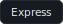
  </picture>
  <picture>
    <source media="(prefers-color-scheme: dark)" srcset="assets/stack_badges/badge-rest-apis.svg" />
    <source media="(prefers-color-scheme: light)" srcset="assets/stack_badges/badge-rest-apis-light.svg" />
    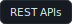
  </picture>
  <picture>
    <source media="(prefers-color-scheme: dark)" srcset="assets/stack_badges/badge-socket-io.svg" />
    <source media="(prefers-color-scheme: light)" srcset="assets/stack_badges/badge-socket-io-light.svg" />
    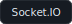
  </picture>
  <picture>
    <source media="(prefers-color-scheme: dark)" srcset="assets/stack_badges/badge-postgresql.svg" />
    <source media="(prefers-color-scheme: light)" srcset="assets/stack_badges/badge-postgresql-light.svg" />
    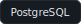
  </picture>
  <picture>
    <source media="(prefers-color-scheme: dark)" srcset="assets/stack_badges/badge-mongodb.svg" />
    <source media="(prefers-color-scheme: light)" srcset="assets/stack_badges/badge-mongodb-light.svg" />
    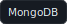
  </picture>
  <picture>
    <source media="(prefers-color-scheme: dark)" srcset="assets/stack_badges/badge-prisma.svg" />
    <source media="(prefers-color-scheme: light)" srcset="assets/stack_badges/badge-prisma-light.svg" />
    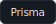
  </picture>

    

  <!-- Cloud & DevOps -->
  <picture>
    <source media="(prefers-color-scheme: dark)" srcset="assets/stack_badges/category-cloud.svg" />
    <source media="(prefers-color-scheme: light)" srcset="assets/stack_badges/category-cloud-light.svg" />
    
  </picture>
   
  <picture>
    <source media="(prefers-color-scheme: dark)" srcset="assets/stack_badges/badge-azure.svg" />
    <source media="(prefers-color-scheme: light)" srcset="assets/stack_badges/badge-azure-light.svg" />
    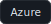
  </picture>
  <picture>
    <source media="(prefers-color-scheme: dark)" srcset="assets/stack_badges/badge-aws-s3.svg" />
    <source media="(prefers-color-scheme: light)" srcset="assets/stack_badges/badge-aws-s3-light.svg" />
    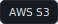
  </picture>
  <picture>
    <source media="(prefers-color-scheme: dark)" srcset="assets/stack_badges/badge-docker.svg" />
    <source media="(prefers-color-scheme: light)" srcset="assets/stack_badges/badge-docker-light.svg" />
    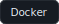
  </picture>
  <picture>
    <source media="(prefers-color-scheme: dark)" srcset="assets/stack_badges/badge-github-actions.svg" />
    <source media="(prefers-color-scheme: light)" srcset="assets/stack_badges/badge-github-actions-light.svg" />
    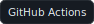
  </picture>
  <picture>
    <source media="(prefers-color-scheme: dark)" srcset="assets/stack_badges/badge-ci-cd.svg" />
    <source media="(prefers-color-scheme: light)" srcset="assets/stack_badges/badge-ci-cd-light.svg" />
    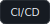
  </picture>

    

  <!-- Architecture -->
  <picture>
    <source media="(prefers-color-scheme: dark)" srcset="assets/stack_badges/category-architecture.svg" />
    <source media="(prefers-color-scheme: light)" srcset="assets/stack_badges/category-architecture-light.svg" />
    
  </picture>
   
  <picture>
    <source media="(prefers-color-scheme: dark)" srcset="assets/stack_badges/badge-system-design.svg" />
    <source media="(prefers-color-scheme: light)" srcset="assets/stack_badges/badge-system-design-light.svg" />
    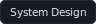
  </picture>
  <picture>
    <source media="(prefers-color-scheme: dark)" srcset="assets/stack_badges/badge-microservices.svg" />
    <source media="(prefers-color-scheme: light)" srcset="assets/stack_badges/badge-microservices-light.svg" />
    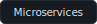
  </picture>
  <picture>
    <source media="(prefers-color-scheme: dark)" srcset="assets/stack_badges/badge-mediapipe.svg" />
    <source media="(prefers-color-scheme: light)" srcset="assets/stack_badges/badge-mediapipe-light.svg" />
    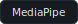
  </picture>
  <picture>
    <source media="(prefers-color-scheme: dark)" srcset="assets/stack_badges/badge-fsm.svg" />
    <source media="(prefers-color-scheme: light)" srcset="assets/stack_badges/badge-fsm-light.svg" />
    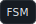
  </picture>
  <picture>
    <source media="(prefers-color-scheme: dark)" srcset="assets/stack_badges/badge-sso-oauth.svg" />
    <source media="(prefers-color-scheme: light)" srcset="assets/stack_badges/badge-sso-oauth-light.svg" />
    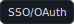
  </picture>

    

  <!-- Testing & Tools -->
  <picture>
    <source media="(prefers-color-scheme: dark)" srcset="assets/stack_badges/category-testing.svg" />
    <source media="(prefers-color-scheme: light)" srcset="assets/stack_badges/category-testing-light.svg" />
    
  </picture>
   
  <picture>
    <source media="(prefers-color-scheme: dark)" srcset="assets/stack_badges/badge-jest.svg" />
    <source media="(prefers-color-scheme: light)" srcset="assets/stack_badges/badge-jest-light.svg" />
    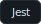
  </picture>
  <picture>
    <source media="(prefers-color-scheme: dark)" srcset="assets/stack_badges/badge-testing-library.svg" />
    <source media="(prefers-color-scheme: light)" srcset="assets/stack_badges/badge-testing-library-light.svg" />
    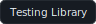
  </picture>
  <picture>
    <source media="(prefers-color-scheme: dark)" srcset="assets/stack_badges/badge-lighthouse.svg" />
    <source media="(prefers-color-scheme: light)" srcset="assets/stack_badges/badge-lighthouse-light.svg" />
    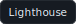
  </picture>
  <picture>
    <source media="(prefers-color-scheme: dark)" srcset="assets/stack_badges/badge-git.svg" />
    <source media="(prefers-color-scheme: light)" srcset="assets/stack_badges/badge-git-light.svg" />
    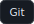
  </picture>

  

<!-- How I Work Section -->
<picture>
  <source media="(prefers-color-scheme: dark)" srcset="assets/heading-howiwork-dark.svg" />
  <source media="(prefers-color-scheme: light)" srcset="assets/heading-howiwork-light.svg" />
  
</picture>
<picture>
  <source media="(prefers-color-scheme: dark)" srcset="assets/divider-dark.svg" />
  <source media="(prefers-color-scheme: light)" srcset="assets/divider-light.svg" />
  
</picture>

<picture>
  <source media="(prefers-color-scheme: dark)" srcset="assets/howiwork-dark.svg" />
  <source media="(prefers-color-scheme: light)" srcset="assets/howiwork-light.svg" />
  
</picture>

  

<!-- Footer -->

<picture>
  <source media="(prefers-color-scheme: dark)" srcset="assets/footer-dark.svg" />
  <source media="(prefers-color-scheme: light)" srcset="assets/footer-light.svg" />
  
</picture>

