<!--
    Mohammad Montasim Al Mamun Shuvo — GitHub Profile README
    Hand-crafted SVGs with dual-theme support via <picture> + prefers-color-scheme.
    No generators. No shields.io. No stat cards.
-->

<!-- Hero Section -->
<picture>
  <source media="(prefers-color-scheme: dark)" srcset="assets/hero-dark.svg" />
  <source media="(prefers-color-scheme: light)" srcset="assets/hero-light.svg" />
  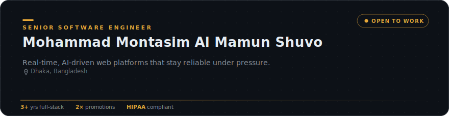
</picture>

  

<!-- Contact & Social Badges -->

  <a href="https://montasim.vercel.app"><picture>
    <source media="(prefers-color-scheme: dark)" srcset="assets/badge-portfolio-dark.svg" />
    <source media="(prefers-color-scheme: light)" srcset="assets/badge-portfolio-light.svg" />
    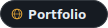
  </picture></a><a href="https://www.linkedin.com/in/montasim"><picture>
    <source media="(prefers-color-scheme: dark)" srcset="assets/badge-linkedin-dark.svg" />
    <source media="(prefers-color-scheme: light)" srcset="assets/badge-linkedin-light.svg" />
    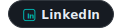
  </picture></a><a href="mailto:montasimmamun@gmail.com"><picture>
    <source media="(prefers-color-scheme: dark)" srcset="assets/badge-email-dark.svg" />
    <source media="(prefers-color-scheme: light)" srcset="assets/badge-email-light.svg" />
    
  </picture></a><a href="https://drive.google.com/file/d/1v0RP3PyBB6KdsfXhonIHJXU-wgAUSIRT/view?usp=sharing"><picture>
    <source media="(prefers-color-scheme: dark)" srcset="assets/badge-resume-dark.svg" />
    <source media="(prefers-color-scheme: light)" srcset="assets/badge-resume-light.svg" />
    
  </picture></a>

  

<!-- What I Build Section -->
<picture>
  <source media="(prefers-color-scheme: dark)" srcset="assets/heading-whatibuild-dark.svg" />
  <source media="(prefers-color-scheme: light)" srcset="assets/heading-whatibuild-light.svg" />
  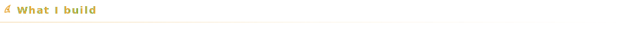
</picture>

<picture>
  <source media="(prefers-color-scheme: dark)" srcset="assets/bio-dark.svg" />
  <source media="(prefers-color-scheme: light)" srcset="assets/bio-light.svg" />
  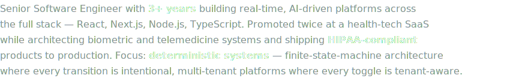
</picture>

  

<!-- Featured Work Section -->
<picture>
  <source media="(prefers-color-scheme: dark)" srcset="assets/heading-featuredwork-dark.svg" />
  <source media="(prefers-color-scheme: light)" srcset="assets/heading-featuredwork-light.svg" />
  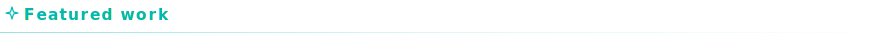
</picture>

<!-- Project 1: PostCraft -->
<picture>
  <source media="(prefers-color-scheme: dark)" srcset="assets/project-postcraft-dark.svg" />
  <source media="(prefers-color-scheme: light)" srcset="assets/project-postcraft-light.svg" />
  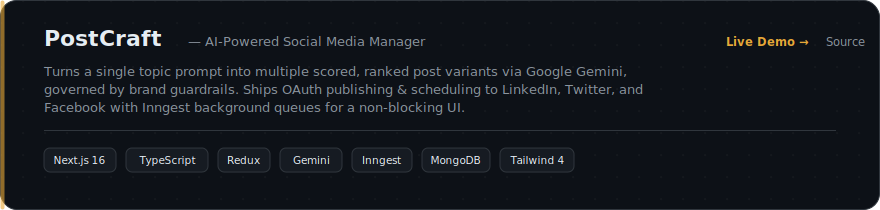
</picture>

  <a href="https://aipostcraft.vercel.app"><picture>
    <source media="(prefers-color-scheme: dark)" srcset="assets/badge-livedemo-dark.svg" />
    <source media="(prefers-color-scheme: light)" srcset="assets/badge-livedemo-light.svg" />
    
  </picture></a><a href="https://github.com/montasim/linkedIQ"><picture>
    <source media="(prefers-color-scheme: dark)" srcset="assets/badge-source-dark.svg" />
    <source media="(prefers-color-scheme: light)" srcset="assets/badge-source-light.svg" />
    
  </picture></a>

 

<!-- Project 2: DevTools -->
<picture>
  <source media="(prefers-color-scheme: dark)" srcset="assets/project-devtools-dark.svg" />
  <source media="(prefers-color-scheme: light)" srcset="assets/project-devtools-light.svg" />
  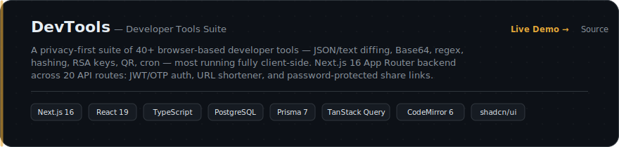
</picture>

  <a href="https://devtoolsn.vercel.app"><picture>
    <source media="(prefers-color-scheme: dark)" srcset="assets/badge-livedemo-dark.svg" />
    <source media="(prefers-color-scheme: light)" srcset="assets/badge-livedemo-light.svg" />
    
  </picture></a><a href="https://github.com/montasim"><picture>
    <source media="(prefers-color-scheme: dark)" srcset="assets/badge-source-dark.svg" />
    <source media="(prefers-color-scheme: light)" srcset="assets/badge-source-light.svg" />
    
  </picture></a>

 

<!-- Project 3: MyMedicalHub -->
<picture>
  <source media="(prefers-color-scheme: dark)" srcset="assets/project-mmh-dark.svg" />
  <source media="(prefers-color-scheme: light)" srcset="assets/project-mmh-light.svg" />
  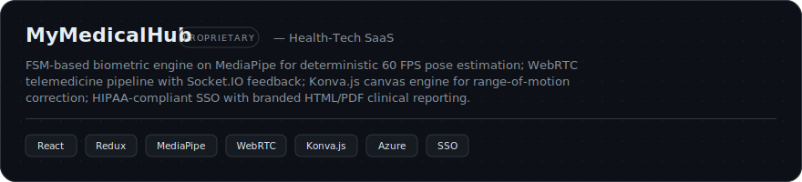
</picture>

  <a href="https://montasim.vercel.app/#projects"><picture>
    <source media="(prefers-color-scheme: dark)" srcset="assets/link-portfolio-dark.svg" />
    <source media="(prefers-color-scheme: light)" srcset="assets/link-portfolio-light.svg" />
    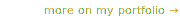
  </picture></a>

  

<!-- Tech Stack Section -->
<picture>
  <source media="(prefers-color-scheme: dark)" srcset="assets/heading-techstack-dark.svg" />
  <source media="(prefers-color-scheme: light)" srcset="assets/heading-techstack-light.svg" />
  
</picture>

<picture>
  <source media="(prefers-color-scheme: dark)" srcset="assets/stack-dark.svg" />
  <source media="(prefers-color-scheme: light)" srcset="assets/stack-light.svg" />
  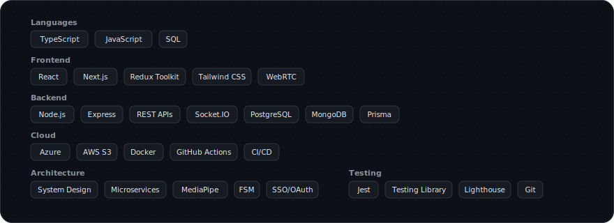
</picture>

  

<!-- How I Work Section -->
<picture>
  <source media="(prefers-color-scheme: dark)" srcset="assets/heading-howiwork-dark.svg" />
  <source media="(prefers-color-scheme: light)" srcset="assets/heading-howiwork-light.svg" />
  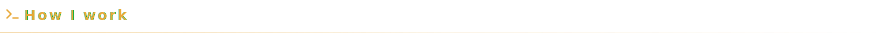
</picture>

<picture>
  <source media="(prefers-color-scheme: dark)" srcset="assets/howiwork-dark.svg" />
  <source media="(prefers-color-scheme: light)" srcset="assets/howiwork-light.svg" />
  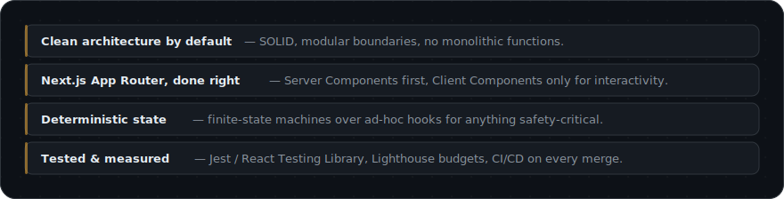
</picture>

  

<!-- Footer -->

<picture>
  <source media="(prefers-color-scheme: dark)" srcset="assets/footer-dark.svg" />
  <source media="(prefers-color-scheme: light)" srcset="assets/footer-light.svg" />
  
</picture>

