<!--
    Montasim's Github Profile
    Created on : 18/5/2021
    Author : Mohammad Montasim -Al- Mamun Shuvo
    Contact : montasimmamun@gmail.com

    -----------------------------------------------------------------------
    -----------------------------------------------------------------------
    
    Thank you if you like this profile README!

    BUT, please DO NOT copy this and create your profile based on it.
    You can use it as a reference, and copy a part of it, but DO NOT copy
    all of this and create your profile based on it.

    It is very common that you forget to change some information and leave
    mine in your profile.

    Only when you know what you are copying should you paste it. So, again,
    please DO NOT copy this and create your profile based on it.

    ---------------------------------------------------------------------

    What's more, you can find other awesome profile READMEs at
    https://github.com/abhisheknaiidu/awesome-github-profile-readme.
    There could be a profile README that fits you better than this one.

    ---------------------------------------------------------------------
    
    Wish you a good-looking profile README!

                                —— montasim (https://github.com/montasim)
-->

<br/>

<!-- hello nice to meet you text start -->
<div align="center">
    
    
    
</div>
<!-- hello nice to meet you text end -->

<br/>


<!-- about repository badges start -->
<div align="center">
  
  
  <!-- <a style="margin-right: 6px" href="https://github.com/montasim/montasim/issues/new?template=Guestbook_entry.md&title=Adding+<username>+to+guestbook">
    
  </a> -->
  
</div>
<!-- about repository badges end -->

<br/>

<!-- skills icons start -->
<div align="center">
  
  
  
  
  
  
  
  
  
  
  
  
</div>
<!-- skills icons end -->

<br/>

<!-- tools badge start -->
<div align="center">
  
  
  
  
  
  
  
  
</div>
<!-- tools badge end -->

<br/>
<br/>
<br/>

<div align="center">
    <!-- weather icon start -->
    
    <br/>
    <!-- weather icon end -->
    <!-- about me start -->
    <div align="left">
        
        
    </div>
    <!-- about me end -->
</div>

<br/>

<!-- my summary start -->
<p> 
    Hello! My name is Mohammad Montasim -Al- Mamun Shuvo, and I enjoy creating things that live on the Internet. My interest in web development started in 2017 when I was doing a university project — it turns out this project taught me a lot about HTML & CSS!
</p>

<p>
    Fast-forward to today and I have had the privilege of working at a My MedicalHUB International Ltd. as a Junior Frontend Developer. My main focus these days is building accessible, inclusive products and digital experiences using MERN Stack.
</p>

<p>
    So far, I have built some exciting full-stack projects.
</p>
<!-- my summary end -->

<br/>
<br/>
<br/>

<!-- my github stats text start -->
<div align="center"> 
    
    
</div>
<!-- my github stats text end -->

<br/>

<div align="center">
    <!-- github streak start -->
    
    <!-- github streak end -->
    <!-- github stats start -->
    
    <!-- github stats end -->
</div>

<div align="center">
    <!-- github most used languages start -->
    
    <!-- github most used languages end -->
    <!-- wakatime weekly activity start -->
    <!-- <a href="https://wakatime.com/@montasim" title="Data update every midnight">
        
    </a> -->
    <!-- wakatime weekly activity end -->
</div>

<!-- github readme activity graph start -->
<div align="center">
    
</div>
<!-- github readme activity graph end -->

<!-- github trophy start -->
<div align="center">
    
</div>
<!-- github trophy end -->

<br/>
<br/>
<br/>
<br/>

<!-- feel free to contact me text start -->
<div align="center"> 
    
    
</div>
<!-- feel free to contact me text end -->

<br/>

<!-- social media links start -->
<table align="center">
    <thead align="center">
        <tr>
            <th>
                <a href="https://www.linkedin.com/in/montasim" title="linkedin.com/in/montasim">
                    
                </a>
            </th>
            <th>
                <a href="https://www.github.com/montasim" title="github.com/montasim">
                    
                </a>
            </th>
            <th>
                <a href="https://stackoverflow.com/users/20348607/montasim" title="stackoverflow.com/users/20348607/montasim">
                    
                </a>
            </th>
            <th>
                <a href="https://montasim-dev.web.app/" title="montasim-dev.web.app">
                    
                </a>
            </th>
            <th>
                <a href="mailto:montasimmamun@gmail.com" title="montasimmamun@gmail.com">
                    
                </a>
            </th>
            <th>
                <a href="https://www.facebook.com/montasimmamun/" title="facebook.com/montasimmamun">
                    
                </a>
            </th>
            <th>
                <a href="https://twitter.com/montasimmamun" title="twitter.com/montasimmamun">
                    
                </a>
            </th>
        </tr>
    </thead>
</table>
<!-- social media links end -->
<!-- connect with me end -->

<br/>
<br/>
<br/>

<!-- fun facts text start -->
<div align="left">
    
    
</div>
<!-- fun facts text end -->

<br/>

<!-- random jokes start -->
<div align="center">
    
</div>
<!-- random jokes -->

<br/>
<br/>

<!-- my resume text start -->
<details>
    <summary> MY RESUME </summary>
    <br/>
    <br/>
    <a href="https://drive.google.com/file/d/1r77NBlzi2QWCbmLTSJPH-V0O52Z1m1a0/view?usp=share_link"> 
        <div align="right">
            
            
        </div>
    </a>
    
    <br/>
    <br/>
    <br/>
    <br/>
    <!-- Montasim's Photo -->
    
    
    <br/>
    <br/>
    
    <br/>
    <br/>
    <br/>
<!-- quick link start -->
<pre>
<b>Email     :</b> <a href="montasimmamun@gmail.com">montasimmamun@gmail.com</a> 
<b>Portfolio :</b> <a href="https://montasim-dev.web.app/">montasim-dev.web.app</a>
<b>Mobile    :</b> <a href="+8801722815469">+8801722815469</a>
<b>GitHub    :</b> <a href="https://github.com/montasim">github.com/montasim</a>
</pre>
<!-- quick link end -->
    <br/>
    <br/>
    <!-- work experience start -->
    
    <table>
        <thead>
            <tr>
                <th>Company</th>
                <th>Position</th>
                <th>Field</th>
                <th>Duration</th>
            </tr>
        </thead>
        <tbody>
            <tr>
                <td>
                    <a href="http://mymedicalhub.com/">MyMedicalHUB</a>
                </td>
                <td>Junior Frontend Developer</td>
                <td>
                    <p>
                        Web Development
                    </p>
                </td>
                <td>Nov 2022 - Present</td>
            </tr>
            <tr>
                <td>
                    <a href="http://mymedicalhub.com/">MyMedicalHUB</a>
                </td>
                <td>Junior Frontend Developer - Intern</td>
                <td>
                    <p>
                        Web Development
                    </p>
                </td>
                <td>Aug 2022 - Oct 2022</td>
            </tr>
        </tbody>
    </table>
    <!-- work experience end -->
    <br/>
    <!-- skills start -->
    
    <table>
        <thead>
            <tr>
                <th>Name</th>
                <th>Details</th>
            </tr>
        </thead>
        <tbody>
            <!-- frontend start -->
            <tr>
                <td>
                    <b>Frontend</b>
                </td>
                <td>
                    JavaScript, ReactJS, NextJS, Tailwind CSS, Bootstrap, HTML5, CSS3
                </td>
            </tr>
            <!-- frontend end -->
            <!-- Backend start -->
            <tr>
                <td>
                    <b>Backend</b>
                </td>
                <td>
                    Node.js, Express.js, MongoDB
                </td>
            </tr>
            <!-- backend end -->
            <!-- devOps start -->
            <tr>
                <td>
                    <b>DevOps</b>
                </td>
                <td>
                    Git, GitHub, Chrome Dev, Tools, Firebase, Heroku, Netlify
                </td>
            </tr>
            <!-- devOps end -->
            <!-- familiar with start -->
            <tr>
                <td>
                    <b>Familiar With</b>
                </td>
                <td>
                    Typescript, REST APIs, jQuery, Microsoft Azure, Stripe, Nodemailer
                </td>
            </tr>
            <!-- familiar with end -->
            <!-- tools start -->
            <tr>
                <td>
                    <b>Tools</b>
                </td>
                <td>
                    Canva, Figma
                </td>
            </tr>
            <!-- tools end -->
        </tbody>
    </table>
    <!-- skills end -->
    <br/>
    <!-- Start Training, Participation and Certification -->
    
    <ol>
        <li>
            𝙼𝚘𝚋𝚒𝚕𝚎 𝙶𝚊𝚖𝚎 𝙰𝚗𝚍 𝙰𝚙𝚙𝚕𝚒𝚌𝚊𝚝𝚒𝚘𝚗 𝙳𝚎𝚟𝚎𝚕𝚘𝚙𝚖𝚎𝚗𝚝 𝙵𝚘𝚛 𝙰𝚗𝚍𝚛𝚘𝚒𝚍 - 𝚊𝚝 𝙸𝙲𝚃 𝙳𝚒𝚟𝚒𝚜𝚒𝚘𝚗 𝚘𝚏 𝙱𝚊𝚗𝚐𝚕𝚊𝚍𝚎𝚜𝚑
        </li>
        <li>
            𝙿𝙻𝙲 𝚃𝚛𝚊𝚒𝚗𝚒𝚗𝚐 𝙲𝚘𝚞𝚛𝚜𝚎 - 𝚊𝚝 𝙱𝙰𝚄𝚂𝚃
        </li>
        <li>
            𝚃𝚑𝚎 𝙲𝚘𝚖𝚙𝚕𝚎𝚝𝚎 𝙲 𝙿𝚛𝚘𝚐𝚛𝚊𝚖𝚖𝚒𝚗𝚐 𝚃𝚞𝚝𝚘𝚛𝚒𝚊𝚕 - 𝚊𝚝 𝚄𝚍𝚎𝚖𝚢 𝚘𝚗𝚕𝚒𝚗𝚎 𝚌𝚘𝚞𝚛𝚜𝚎
        </li>
        <li>
            𝙲++ 𝙳𝚎𝚟𝚎𝚕𝚘𝚙𝚖𝚎𝚗𝚝 𝚃𝚞𝚝𝚘𝚛𝚒𝚊𝚕 𝚂𝚎𝚛𝚒𝚎𝚜, 𝚃𝚑𝚎 𝙲𝚘𝚖𝚙𝚕𝚎𝚝𝚎 𝙲𝚘𝚍𝚒𝚗𝚐 𝙶𝚞𝚒𝚍𝚎 - 𝚊𝚝 𝚄𝚍𝚎𝚖𝚢 𝚘𝚗𝚕𝚒𝚗𝚎 𝚌𝚘𝚞𝚛𝚜𝚎
        </li>
        <li>
            𝙻𝚎𝚊𝚛𝚗 𝙲++ 𝙿𝚛𝚘𝚐𝚛𝚊𝚖𝚖𝚒𝚗𝚐 𝙼𝚒𝚗𝚒 𝙲𝚘𝚞𝚛𝚜𝚎, 𝙿𝚘𝚠𝚎𝚛 𝚘𝚏 𝙰𝚗𝚒𝚖𝚊𝚝𝚒𝚘𝚗 - 𝚊𝚝 𝚄𝚍𝚎𝚖𝚢 𝚘𝚗𝚕𝚒𝚗𝚎 𝚌𝚘𝚞𝚛𝚜𝚎
        </li>
        <li>
            𝙷𝚃𝙼𝙻𝟻 𝙲𝚘𝚍𝚒𝚗𝚐 𝚏𝚛𝚘𝚖 𝚂𝚌𝚛𝚊𝚝𝚌𝚑 - 𝙱𝚞𝚒𝚕𝚍 𝚈𝚘𝚞𝚛 𝙾𝚠𝚗 𝚆𝚎𝚋𝚜𝚒𝚝𝚎 - 𝚊𝚝 𝚄𝚍𝚎𝚖𝚢 𝚘𝚗𝚕𝚒𝚗𝚎 𝚌𝚘𝚞𝚛𝚜𝚎
        </li>
        <li>
            𝙿𝚘𝚜𝚒𝚝𝚒𝚘𝚗 𝙴𝚕𝚎𝚖𝚎𝚗𝚝𝚜 𝚘𝚗 𝚊 𝙿𝚊𝚐𝚎 𝚠𝚒𝚝𝚑 𝙲𝚂𝚂 - 𝚊𝚝 𝙲𝚘𝚞𝚛𝚜𝚎𝚛𝚊 𝚘𝚗𝚕𝚒𝚗𝚎 𝚌𝚘𝚞𝚛𝚜𝚎
        </li>
        <li>
            𝙶𝚒𝚝 + 𝙶𝚒𝚝𝙷𝚞𝚋 𝚏𝚘𝚛 𝙾𝚙𝚎𝚗 𝚂𝚘𝚞𝚛𝚌𝚎 𝙲𝚘𝚕𝚕𝚊𝚋𝚘𝚛𝚊𝚝𝚒𝚘𝚗 - 𝚊𝚝 𝙲𝚘𝚞𝚛𝚜𝚎𝚛𝚊 𝚘𝚗𝚕𝚒𝚗𝚎 𝚌𝚘𝚞𝚛𝚜e
        </li>
        <li>
            𝚄𝚜𝚎 𝙲𝚘𝚖𝚖𝚊𝚗𝚍𝚜 𝚊𝚗𝚍 𝙲𝚛𝚎𝚊𝚝𝚎 𝚊 𝚁𝚎𝚖𝚘𝚝𝚎 𝙶𝚒𝚝 𝚁𝚎𝚙𝚘𝚜𝚒𝚝𝚘𝚛𝚢 - 𝚊𝚝 𝙲𝚘𝚞𝚛𝚜𝚎𝚛𝚊 𝚘𝚗𝚕𝚒𝚗𝚎 𝚌𝚘𝚞𝚛𝚜𝚎
        </li>
        <li>
            𝙶𝚘𝚘𝚐𝚕𝚎 𝙰𝚍𝚟𝚊𝚗𝚌𝚎𝚍 𝚂𝚎𝚊𝚛𝚌𝚑: 𝙵𝚒𝚗𝚍 𝚂𝚝𝚞𝚏𝚏 𝙻𝚒𝚔𝚎 𝚊 𝙱𝚘𝚜𝚜 - 𝚊𝚝 𝚄𝚍𝚎𝚖𝚢 𝚘𝚗𝚕𝚒𝚗𝚎 𝚌𝚘𝚞𝚛𝚜𝚎
        </li>
        <li>
            𝙲𝚘𝚖𝚖𝚊𝚗𝚍 𝙻𝚒𝚗𝚎 𝚒𝚗 𝙻𝚒𝚗𝚞𝚡 - 𝚊𝚝 𝙲𝚘𝚞𝚛𝚜𝚎𝚛𝚊 𝚘𝚗𝚕𝚒𝚗𝚎 𝚌𝚘𝚞𝚛𝚜𝚎
        </li>
        <li>
            𝙻𝚎𝚊𝚛𝚗 𝚆𝚒𝚗𝚍𝚘𝚠𝚜 𝙲𝚘𝚖𝚖𝚊𝚗𝚍 𝙻𝚒𝚗𝚎 - 𝚊𝚝 𝚄𝚍𝚎𝚖𝚢 𝚘𝚗𝚕𝚒𝚗𝚎 𝚌𝚘𝚞𝚛𝚜𝚎
        </li>
    </ol>
    <!-- End Training, Participation and Certification -->
    <br/>
    <!-- academic qualification start-> -->
    
    <table align="center">
        <thead>
            <tr>
                <th>
                    <b> Exam </b>
                </th>
                <th>
                    <b> Concentration / Major </b>
                </th>
                <th>
                    <b> Institute </b>
                </th>
                <th>
                    <b> Result </b>
                </th>
                <th>
                    <b> Passing Year </b>
                </th>
            </tr>
        </thead>
        <tbody>
            <tr>
                <td> Bachelor of Science (B. Sc.) </td>
                <td> Computer Science & Engineering </td>
                <td> Bangladesh Army University of Science and Technology </td>
                <td> 2.96 </td>
                <td> 2021 </td>
            </tr>
            <tr>
                <td> HSC </td>
                <td> Science </td>
                <td> Carmichael College Rangpur </td>
                <td> 4.58 </td>
                <td> 2016 </td>
            </tr>
            <tr>
                <td> SSC </td>
                <td> Science </td>
                <td> Rangpur Zilla School </td>
                <td> 5.00 </td>
                <td> 2014 </td>
            </tr>
        </tbody>
    </table>      
    <!-- academic qualification end -->
    <br/>
    <!-- Start Undergraduate Thesis and Project -->
    
    <p>
        <b>Hand Pose Estimation in Single RGB Image with Multiview Bootstrapping.</b>
    </p>
    <ul>
        <li>
            Deep Learning, OpenCV
        </li>
        <li>
            Convolutional Neural Network (CNN)
        </li>
        <li>
            Python (TensorFlow, Matplotlib, Scikit-Learn, OpenCV, Media pipe)
        </li>
    </ul>
    <!-- End Undergraduate Thesis and Project -->
    <br/>
    <!-- Start Language Proficiency -->
    
    <table>
        <thead>
            <tr>
                <th><b> Language </b></th>
                <th><b> Reading </b></th>
                <th><b> Writing </b></th>
                <th><b> Speaking </b></th>
            </tr>
        </thead>
        <tbody>
            <tr>
                <td> English </td>
                <td> High </td>
                <td> High </td>
                <td> High </td>
            </tr>
            <tr>
                <td> Bangla </td>
                <td> High </td>
                <td> High </td>
                <td> High </td>
            </tr>
            <tr>
                <td> Hindi </td>
                <td> None </td>
                <td> None </td>
                <td> Basic </td>
            </tr>
        </tbody>
    </table>
    <!-- End Language Proficiency -->
    <br/>
    <br/>
    <br/>
</details>
<!-- my resume text end -->

<!-- things I use start -->
<details>
    <summary> MORE STUFF ABOUT ME </summary>
    <br/>
    
    <p>
        I do Open Source. In fact, I do Open Source so much, that 95% of my work on GitHub is free and open to everyone. I am really passionate about doing web development, it is in my opinion the best combination of logical programming and (sometimes) beautiful design.
    </p>
    <br/>
    
    <br/>
    <table>
        <thead>
            <tr>
                <th>Name</th>
                <th>High</th>
                <th>Medium</th>
                <th>Low</th>
            </tr>
        </thead>
        <tbody>
            <!-- programming language start -->
            <tr>
                <td>
                    <b>Programming Languages</b>
                </td>
                <td>
                    
                </td>
                <td>
                    
                </td>
                <td>
                    
                </td>
            </tr>
            <!-- programming language end -->
            <!-- frontend technologies start -->
            <tr>
                <td>
                    <b>Frontend Technologies</b>
                </td>
                <td>
                    
                </td>
                <td>
                    
                </td>
                <td>
                    
                </td>
            </tr>
            <!-- frontend technologies end -->
            <!-- backend technologies start -->
            <tr>
                <td>
                    <b>Backend Technologies</b>
                </td>
                <td>
                    
                </td>
                <td>
                    
                </td>
                <td>
                    <p></p>
                </td>
            </tr>
            <!-- backend technologies end -->
            <!-- databases start -->
            <tr>
                <td>
                    <b>Databases</b>
                </td>
                <td>
                    
                </td>
                <td>
                    
                </td>
                <td>
                    <p></p>
                </td>
            </tr>
            <!-- databases end -->
            <!-- Web Technologies start -->
            <tr>
                <td>
                    <b>Web Technologies</b>
                </td>
                <td>
                    
                    
                </td>
                <td>
                    <p></p>
                </td>
                <td>
                    <p></p>
                </td>
            </tr>
            <!-- Web Technologies end -->
            <!-- css frameworks start -->
            <tr>
                <td>
                    <b>CSS Drameworks</b>
                </td>
                <td>
                    
                    
                </td>
                <td>
                    
                </td>
                <td>
                    
                </td>
            </tr>
            <!-- css frameworks end -->
            <!-- package manager start -->
            <tr>
                <td>
                    <b>Package Manager</b> 
                </td>
                <td>
                    
                </td>
                <td>
                    
                </td>
                <td>
                    <p></p>
                </td>
            </tr>
            <!-- package manager end -->
            <!-- design tools start -->
            <tr>
                <td>
                    <b>Design Tools</b>  
                </td>
                <td>
                    
                </td>
                <td>
                    
                </td>
                <td>
                    
                </td>
            </tr>
            <!-- design tools end -->
            <!-- hosting start -->
            <tr>
                <td>
                    <b>Hosting</b>
                </td>
                <td>
                    
                    
                </td>
                <td>
                    
                </td>
                <td>
                    
                </td>
            </tr>
            <!-- hosting end -->
            <!-- content management system start -->
            <tr>
                <td>
                    <b>Content management system</b> 
                </td>
                <td>
                    
                </td>
                <td>
                    
                </td>
                <td>
                    
                </td>
            </tr>
            <!-- content management system end -->
            <!-- issue and project tracking start -->
            <tr>
                <td>
                    <b>Issue & Project Tracking</b> 
                </td>
                <td>
                    
                </td>
                <td>
                    
                </td>
                <td>
                    
                </td>
            </tr>
            <!-- issue and project tracking end -->
        </tbody>
    </table>
    <br/>
    <br/>
    <!-- currently learning start -->
    
    <div>
        
        
        
        
        
    </div>
    <!-- currently learning end -->
    <br/>
    <br/>
    <!-- Forgetting -->
    
    <div>
        
        
        
        
        
        
    </div>
    <!-- Forgetting-->
    <br/>
    <br/>
    
    <ol>
        <!-- integrated development environment start -->
        <li>
            <h3> 
                Integrated Development Environment
            </h3>
            <div>
                
            </div>
        </li>
        <!-- integrated development environment end -->
        <!-- CI start -->
        <li>
            <h3> 
                CI
            </h3>
            <div>
                
            </div>
        </li>
        <!-- Developer Forums start -->
        <li>
            <h3> 
                Developer Forums
            </h3>
            <div>
                
                
                
                
            </div>
        </li>
        <!-- Developer Forums end -->
        <!-- Problem Solving start -->
        <li>
            <h3> 
                Problem Solving
            </h3>
            <div>
                
                
            </div>
        </li>
        <!-- Problem Solving end -->
        <!-- browser start -->
        <li>
            <h3> 
                Browser
            </h3>
            <div>
                
                
                
            </div>
        </li>
        <!-- browser end -->
        <!-- operating system start -->
        <li>
            <h3> 
                Operating System
            </h3>
            <div>
                
                
                
            </div>
        </li>
        <!-- operating system end -->
        <!-- Learning Platform start -->
        <li>
            <h3> 
                Learning Platform
            </h3>
            <div>
                
                
                
            </div>
        </li>
        <!-- Learning Platform end -->
    </ol>
    <br/>
    <br/>
    
    <ol>
        <li>
            <h3> 
                :computer: Personal Computer
            </h3>
            <ul>
                <li>
                    Processor: 
                    <a href="https://www.amd.com/en/products/apu/amd-ryzen-3-2200g">
                        AMD Ryzen™ 3 2200G Processor with AMD Radeon™ Vega 8 Graphics
                    </a>
                </li>
                <li>
                    Cooler: Ryzen 3 2700X
                </li>
                <li>
                    Motherboard: 
                     <a href="https://www.asus.com/motherboards-components/motherboards/prime/prime-a320m-e/">
                        PRIME A320M-E
                    </a>
                </li>
                <li>
                    RAM: 
                     <a href="https://www.corsair.com/ww/en/Categories/Products/Memory/VENGEANCE-LPX/p/CMK4GX4M1A2400C14">
                        Corsair Vengeance LPX 4GB DDR4 2400MHz Black Heatsink Desktop RAM
                    </a>
                </li>
                <li>
                    SSD: 
                     <a href="https://www.ryanscomputers.com/hikvision-c100-120gb-sataiii-ssd">
                        Hikvision C100 120GB 2.5 Inch SATAIII SSD
                    </a>
                </li>
                <li>
                    HDD: 
                     <a href="https://toshiba.semicon-storage.com/us/storage/product/internal-specialty/pc/articles/dt01aca-series.html">
                        Toshiba DT01ACA100 1TB Sata Desktop Hard Disk
                    </a>
                </li>
                <li>
                    Casing: Delux
                </li>
                <li>
                    UPS: 
                     <a href="https://www.startech.com.bd/power-guard-1200va-cs-offline-ups">
                        Power Guard 1200VA CS Offline UPS (Plastic Body)
                    </a>
                </li>
                <li>
                    Sound Box: Havit
                </li>
                <li>
                    Keyboard: Logitech
                </li>
                <li>
                    Mouse: Logitech
                </li>
            </ul>
        </li>
        <br/>
        <li>
            <h3>
                Network Device: 
            </h3>
            <ul>
                <li>
                    Router: 
                    <ul>
                        <li>
                            Netgear
                        </li>
                    </ul>
                </li>
                <li>
                    Network Adapters: 
                    <ul>
                        <li>
                            Tp Link:
                        </li>
                    </ul>
                </li>
                <li>
                    Bluetooth Adapters: 
                    <ul>
                        <li>
                            Orico:
                        </li>
                    </ul>
                </li>
            </ul>
        </li>
        <br/>
        <li>
            <h3>
                Accessories: 
            </h3>
            <ul>
                <li>
                    :camera: Webcam: 
                    <ul>
                        <li>
                            Fantech
                        </li>
                    </ul>
                </li>
                <li>
                    :headphones: Headphone: 
                    <ul>
                        <li>
                            A4tech
                        </li>
                    </ul>
                </li>
                <li>
                    Earphone: 
                    <ul>
                        <li>
                            Uiscii
                        </li>
                    </ul>
                </li>
            </ul>
        </li>
        <br/>
        <li>
            <h3>
                :iphone: SmartPhone: 
            </h3>
            <ul>
                <li>
                    Samsung Galaxy A50 4/64
                </li>
            </ul>
        </li>
        <br/>
        <li>
            <h3>
                :watch: Smartwatch: 
            </h3>
            <ul>
                <li>
                    Haylu Solar LS05
                </li>
            </ul>
        </li>
    </ol>
    <br/>
    <br/>
    
    <p>:white_large_square: Born</p>
    <p>:white_large_square: Got a job</p>
    <p>:white_large_square: Married</p>
    <p>:white_large_square: Have children</p>
    <p>:black_large_square: Have children</p>
    <br/>
    <br/>
</details>
<!-- things I use end -->

<!-- find more on social media start -->
<details>
    <summary> FIND MORE ON SOCIAL MEDIA </summary>
<br>
<br>
<a href="https://stackoverflow.com/users/20348607/ＭＯＮＴＡＳＩＭ" target="_blank">
    
</a>


<!-- STACKOVERFLOW:START -->
- [Answer by ＭＯＮＴＡＳＩＭ for 404 error when deploying react app in Vercel](https://stackoverflow.com/questions/76742696/404-error-when-deploying-react-app-in-vercel/76742719#76742719)
- [Answer by ＭＯＮＴＡＳＩＭ for To add images to README.md on GitHub](https://stackoverflow.com/questions/76627549/to-add-images-to-readme-md-on-github/76633929#76633929)
- [Answer by ＭＯＮＴＡＳＩＭ for How to update the profile readme automatically](https://stackoverflow.com/questions/76612610/how-to-update-the-profile-readme-automatically/76615293#76615293)
- [Answer by ＭＯＮＴＡＳＩＭ for Search in only my repositories for files with a specific name](https://stackoverflow.com/questions/76614124/search-in-only-my-repositories-for-files-with-a-specific-name/76615074#76615074)
- [Answer by ＭＯＮＴＡＳＩＭ for React firebase 9 how to delete current user account?](https://stackoverflow.com/questions/71147148/react-firebase-9-how-to-delete-current-user-account/74244739#74244739)
<!-- STACKOVERFLOW:END -->

<br>
<br>


<a href="https://www.youtube.com/channel/UCkkBnedfjKU-toiKQ-rxvtA?sub_confirmation=1">
    
</a>

<!-- YOUTUBE:START --><table><tr><td><a href="https://www.youtube.com/watch?v=6klo4X01SlM"></a></td>
<td><a href="https://www.youtube.com/watch?v=6klo4X01SlM">Sleep Detection Concept on EEG Signal</a><br/>Jul 11, 2021</td></tr></table>
<table><tr><td><a href="https://www.youtube.com/watch?v=Y3Ka3HAWE9E"></a></td>
<td><a href="https://www.youtube.com/watch?v=Y3Ka3HAWE9E">COVID-19 SITUATION</a><br/>Apr 30, 2020</td></tr></table>
<!-- YOUTUBE:END -->

<br>
<br>


<!-- BLOG-POST-LIST:START -->
- [Understanding Trading Charts](https://noobtrack.blogspot.com/2020/02/understanding-trading-charts.html)
- [Understanding Bar Charts and Column Charts](https://noobtrack.blogspot.com/2020/02/understanding-bar-charts-and-column.html)
- [Bullet Charts – What Is It And How To Use It](https://noobtrack.blogspot.com/2020/02/bullet-charts-what-is-it-and-how-to-use.html)
- [How to Start and grow my Career as iOS App Developer?](https://noobtrack.blogspot.com/2020/02/how-to-start-and-grow-my-career-as-ios.html)
- [Excel Formulas | 20 Excel Formula Every Person Should Know](https://noobtrack.blogspot.com/2020/02/excel-formulas-20-excel-formula-every.html)
<!-- BLOG-POST-LIST:END -->

<br>
<br>


<!--START_SECTION:waka-->


**🐱 My GitHub Data** 

> 📦 ? Used in GitHub's Storage 
 > 
> 🏆 1,491 Contributions in the Year 2023
 > 
> 💼 Opted to Hire
 > 
> 📜 38 Public Repositories 
 > 
> 🔑 0 Private Repositories 
 > 
**I'm an Early 🐤** 

```text
🌞 Morning                4927 commits        ██████░░░░░░░░░░░░░░░░░░░   24.22 % 
🌆 Daytime                6099 commits        ███████░░░░░░░░░░░░░░░░░░   29.99 % 
🌃 Evening                6611 commits        ████████░░░░░░░░░░░░░░░░░   32.50 % 
🌙 Night                  2702 commits        ███░░░░░░░░░░░░░░░░░░░░░░   13.28 % 
```
📅 **I'm Most Productive on Monday** 

```text
Monday                   3339 commits        ████░░░░░░░░░░░░░░░░░░░░░   16.42 % 
Tuesday                  2229 commits        ███░░░░░░░░░░░░░░░░░░░░░░   10.96 % 
Wednesday                2683 commits        ███░░░░░░░░░░░░░░░░░░░░░░   13.19 % 
Thursday                 2786 commits        ███░░░░░░░░░░░░░░░░░░░░░░   13.70 % 
Friday                   3123 commits        ████░░░░░░░░░░░░░░░░░░░░░   15.35 % 
Saturday                 2960 commits        ████░░░░░░░░░░░░░░░░░░░░░   14.55 % 
Sunday                   3219 commits        ████░░░░░░░░░░░░░░░░░░░░░   15.83 % 
```


📊 **This Week I Spent My Time On** 

```text
🕑︎ Time Zone: Asia/Dhaka

💬 Programming Languages: 
JavaScript               37 hrs 20 mins      █████████████████████░░░░   85.19 % 
JSON                     4 hrs 3 mins        ██░░░░░░░░░░░░░░░░░░░░░░░   09.26 % 
Markdown                 1 hr 18 mins        █░░░░░░░░░░░░░░░░░░░░░░░░   03.00 % 
ActionScript 3           21 mins             ░░░░░░░░░░░░░░░░░░░░░░░░░   00.82 % 
Log                      17 mins             ░░░░░░░░░░░░░░░░░░░░░░░░░   00.67 % 

🔥 Editors: 
WebStorm                 39 hrs 58 mins      ███████████████████████░░   91.21 % 
VS Code                  3 hrs 51 mins       ██░░░░░░░░░░░░░░░░░░░░░░░   08.79 % 

💻 Operating System: 
Windows                  43 hrs 50 mins      █████████████████████████   100.00 % 
```

**I Mostly Code in JavaScript** 

```text
JavaScript               94 repos            █████████████░░░░░░░░░░░░   53.71 % 
HTML                     37 repos            █████░░░░░░░░░░░░░░░░░░░░   21.14 % 
TypeScript               14 repos            ██░░░░░░░░░░░░░░░░░░░░░░░   08.00 % 
CSS                      5 repos             █░░░░░░░░░░░░░░░░░░░░░░░░   02.86 % 
TeX                      1 repo              ░░░░░░░░░░░░░░░░░░░░░░░░░   00.57 % 
```


 Last Updated on 24/08/2023 01:07:20 UTC
<!--END_SECTION:waka-->

<br>
<br>


<!--START_SECTION:activity-->
1. 🎉 Merged PR [#11](https://github.com/montasim/Next-Level-Web-Development/pull/11) in [montasim/Next-Level-Web-Development](https://github.com/montasim/Next-Level-Web-Development)
2. 🎉 Merged PR [#7](https://github.com/montasim/Next-Level-Web-Development/pull/7) in [montasim/Next-Level-Web-Development](https://github.com/montasim/Next-Level-Web-Development)
3. 💪 Opened PR [#7](https://github.com/montasim/Next-Level-Web-Development/pull/7) in [montasim/Next-Level-Web-Development](https://github.com/montasim/Next-Level-Web-Development)
4. 💪 Opened PR [#4](https://github.com/montasim/Next-Level-Web-Development/pull/4) in [montasim/Next-Level-Web-Development](https://github.com/montasim/Next-Level-Web-Development)
5. 🎉 Merged PR [#3](https://github.com/montasim/Next-Level-Web-Development/pull/3) in [montasim/Next-Level-Web-Development](https://github.com/montasim/Next-Level-Web-Development)
6. ❗ Opened issue [#57](https://github.com/montasim/montasim/issues/57) in [montasim/montasim](https://github.com/montasim/montasim)
7. 💪 Opened PR [#1058](https://github.com/abhisheknaiidu/awesome-github-profile-readme/pull/1058) in [abhisheknaiidu/awesome-github-profile-readme](https://github.com/abhisheknaiidu/awesome-github-profile-readme)
<!--END_SECTION:activity-->

<br>
<br>
<!-- twitter post -->


<!-- TWITTER:START -->
- [Thinking about my project. https://lnkd.in/gYffV3rq](https://nitter.net/montasimmamun/status/1611429494103093250#m)
- [Check out this job at MyMedicalHUB: https://lnkd.in/gh-uGUaZ https://lnkd.in/g5NbD7ji](https://nitter.net/montasimmamun/status/1567731555648573440#m)
- [Essential Resources for Frontend Developers

Here are some essential website links for the Frontend Developers to design a beautiful website. Let me know your thoughts in the comments, and check my profile for more content.

1. CSS framework: If you want…https://lnkd.in/gaWyxAvM](https://nitter.net/montasimmamun/status/1559042828935708674#m)
- [5 Useful Resources for Junior Web Developers. Save this for future reference.
Let me know your thoughts down in the comments and check out my profile for more coding-related content.

1. Diagrams - This is such a great web for drawing a lot of diagrams y…https://lnkd.in/gU5Hqtp7](https://nitter.net/montasimmamun/status/1558170708169019392#m)
- [VAR vs LET vs CONST - Javascript  Basic

#javascript https://lnkd.in/gzDp2WfC](https://nitter.net/montasimmamun/status/1558119151796772864#m)
<!-- TWITTER:END -->

<br>
<br>
<!-- latest tweet start -->
<div align="center">
    
</div>
<!-- latest tweet end -->

<br>
<br>


<!-- MEDIUM:START -->

<!-- MEDIUM:END -->

<br>
<br>

# Guestbook

<!--START_SECTION:guestbook-->
<a href="https://github.com/boloped"></a> <a href="https://github.com/MeerBiene"></a>

* **[boloped](https://github.com/boloped) wrote on 1/12/2023:** Meerbiene is a cool guy. I really like him.
* **[MeerBiene](https://github.com/MeerBiene) wrote on 1/15/2022:** test

Do you like my project or just want to say hi? Feel free to [post](https://github.com/montasim/montasim/issues/new?title=Guestbook) to my guestbook!
<!--END_SECTION:guestbook-->

<br>
<br>


<!-- stargazers -->
|  <a href="https://github.com/sorenxysm">sorenxysm</a> | <a href="https://github.com/obaydullahalmahmud">obaydullahalmahmud</a> | <a href="https://github.com/karobi57">karobi57</a> | <a href="https://github.com/Rantoryu">Rantoryu</a> | <a href="https://github.com/DevElkami">DevElkami</a> | <a href="https://github.com/bm4578">bm4578</a> | <a href="https://github.com/ArielMAJ">ArielMAJ</a> | <a href="https://github.com/fcasamento">fcasamento</a> |
|  :-: | :-: | :-: | :-: | :-: | :-: | :-: | :-: |
|   |  |  |  |  |  |  |  |
<!-- stargazers -->


<br>
<br>


<div align="center">
  
  
</div>

<br>
<br>


<br>
<br>

<br>


<br>
<br>
<br>

</details>
<!-- find more on social media end -->

<!-- Start Special Thanks To Section -->
<details>
<summary> SPECIAL THANKS TO </summary>

<br><br>

<table align="center">
    <thead align="center">
        <tr>
            <td> <b> Name </b> </td>
            <td> <b> Contribution </b> </td>
        </tr>
    </thead>
    <tbody>
        <tr>
            <td>
                <a href="https://github.com/anuraghazra/github-readme-stats"> 
                    Github Readme Stats 
                </a> 
            </td>
            <td> For dynamically generated stats for your github readmes </td>
        </tr>
        <tr>
            <td>
                <a href="https://github.com/omidnikrah/profile-activity-generator"> 
                   Profile Activity Generator 
                </a> 
            </td>
            <td> For generate custom profile activity for your profile README </td>
        </tr>
        <tr>
            <td>
                <a href="https://github.com/anmol098/waka-readme-stats"> 
                   All Dev Stats in Readme
                </a> 
            </td>
            <td> For updating most productive time during the day? </td>
        </tr>
        <tr>
            <td>
                <a href="https://visitor-badge.glitch.me/#docs"> 
                   Visitor Badge 
                </a> 
            </td>
            <td> For count visitors for your README.md, Issues, PRs in GitHub </td>
        </tr>
        <tr>
            <td>
                <a href="https://shields.io/"> 
                   Shields Project 
                </a> 
            </td>
            <td> Use Shields to create profile badges, compatible with Simple Icons </td>
        </tr>
        <tr>
            <td>
                <a href="https://github.com/simple-icons/simple-icons#cdn-usage"> 
                   Simple Icons 
                </a> 
            </td>
            <td> USe SVG icons for popular brands for your README.md files </td>
        </tr>
        <tr>
            <td>
                <a href="https://github.com/jamesgeorge007/github-activity-readme"> 
                   Github Activity in README
                </a> 
            </td>
            <td> Use to updates README.md with the recent GitHub activity of a user </td>
        </tr>
        <tr>
            <td>
                <a href="https://readme-typing-svg.herokuapp.com/"> 
                   Readme Typing SVG
                </a> 
            </td>
            <td> Used for Readme Typing SVG </td>
        </tr>
    </tbody>
</table>

</details>
<!-- End Special Thanks To Section -->

<br/>
<br/>
<br/>

<!-- wave GIF start -->
<div align="center">
    
</div>
<!-- wave GIF end -->

<br/>
<br/>
<br/>

<!-- build with love svg start -->
<div align="center">
    
</div>
<!-- build with love svg end -->

<br/>
<br/>
<br/>
